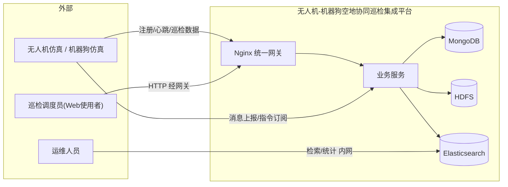
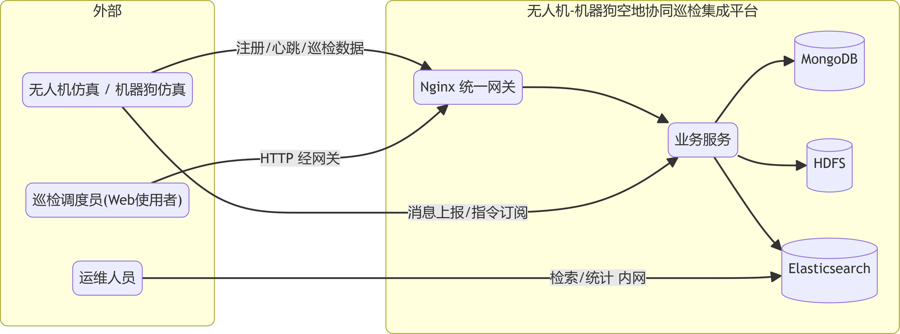
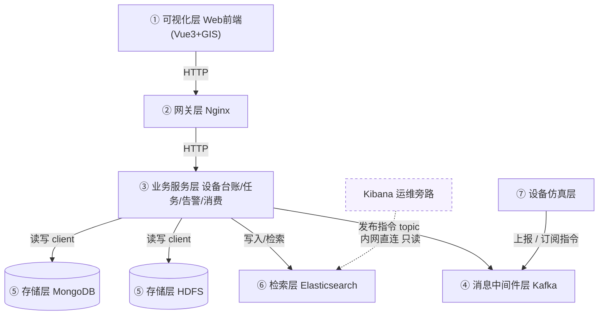
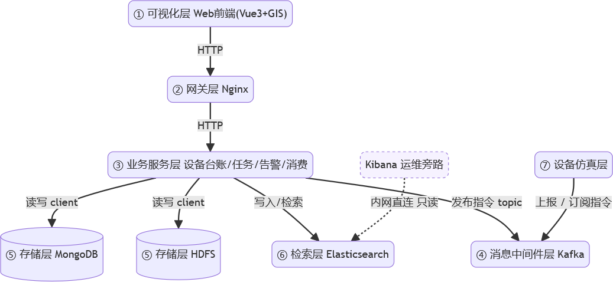
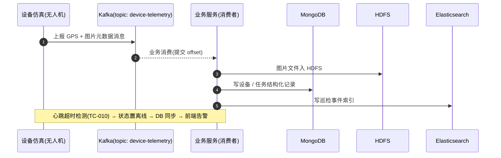
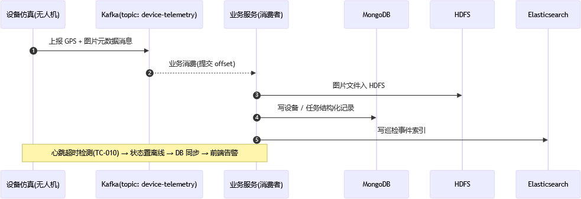
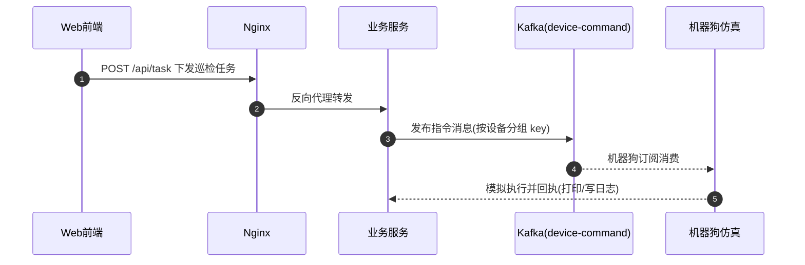
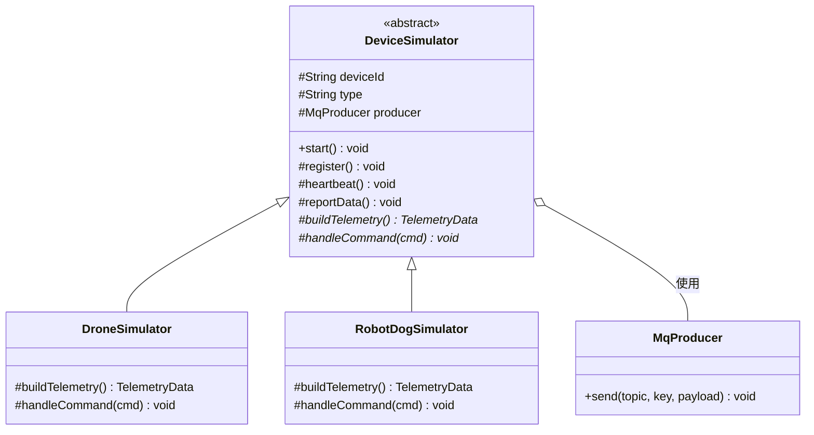
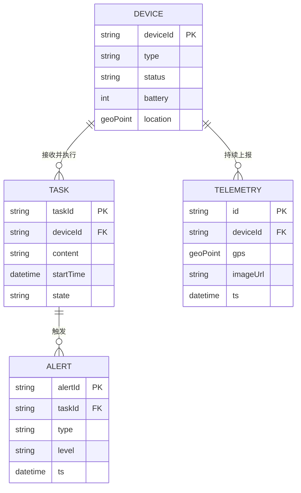
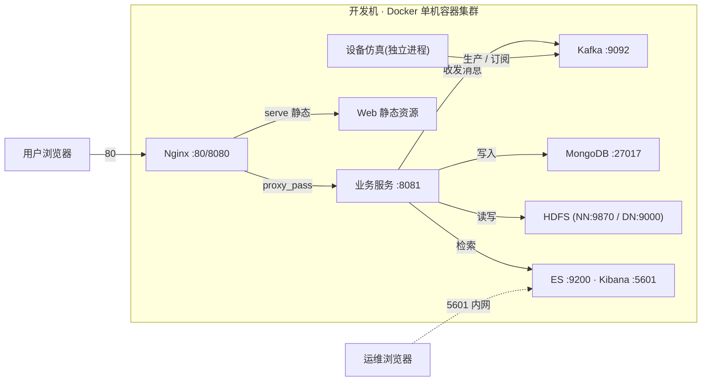

# 软件架构图详解 —— 是什么、怎么分类、何时用哪种（附本项目全套示例）

> 定位：面向本项目小组的架构表达学习资料。以“无人机-机器狗空地协同巡检集成平台”为例，讲清架构图的本质、分类框架与选图方法。所有示例图均可直接粘贴到 **Typora / VSCode(安装 Mermaid 插件) / GitHub** 渲染查看。
>
> 配套：`需求分析与总体架构技术选型.md`（其中 2.2 分层图即为本文第 4 章 C2 容器图示例）。

---

## 1 架构图是什么

一句话：**架构图是用“图”这种载体，把系统的某一方面（组成、关系、约束）表达出来的一种视图。**

记住三个关键点：

1. **没有“一张万能架构图”**。一个系统的架构信息量巨大，任何单张图只能表达一部分。实际会画一组图，各回答一类问题。
2. **每张图都在回答一个具体问题**。选图 = 选问题。问“系统有哪些部分组成”与问“设备上报时消息怎么走”是两个问题 → 两张不同的图。
3. **图和“代码/真相”是映射关系，不是装饰**。好架构图的每一根线都能在代码或配置里找到对应物（一个依赖、一次调用、一个 topic、一个容器端口）。

---

## 2 分类的第一性：按【关注点 / 视角】切分

架构图没有唯一天然分类，业界做法是**按“视角（viewpoint）”和“粒度”切分**。掌握两个主流框架，即可覆盖大多数分类方法。

### 2.1 框架一：4+1 视图模型（Kruchten）

把架构切成 **4 个视图 + 1 个场景**，每个视图面向一类读者、回答一类问题：

| 视图 | 面向问题 | 面向角色 |
| :--- | :--- | :--- |
| **逻辑视图（Logical）** | 系统有哪些功能组成？模块之间什么关系？ | 架构师、产品 |
| **过程视图（Process）** | 运行时功能如何协作？谁调谁、消息怎么走？ | 后端开发、集成 |
| **开发视图（Development）** | 代码怎么组织？包 / 模块 / 团队怎么分工？ | 开发、测试 |
| **物理视图（Physical）** | 软件装在哪些机器 / 容器上？端口网络如何？ | 运维、部署 |
| **场景 / 用例（Scenario）** | 关键业务怎么从头到尾走通？（串联以上四视图） | 所有人 |

### 2.2 框架二：C4 模型（粒度缩放）

C4 解决“放大镜调到几倍”——同一系统可画 4 个粒度的图：

| 层级 | 画的是 | 类比 | 对应“观众”一眼能懂的东西 |
| :--- | :--- | :--- | :--- |
| **C1 上下文** | 系统与外部世界的边界（谁在用、和外部系统什么关系） | 一张城市地图 | 本系统只有一个框 |
| **C2 容器** | 系统内部可独立部署的运行单元（进程 / 服务 / 存储）及相互通信 | 城市里的区 | 进程级部署单元，标清协议 |
| **C3 组件** | 每个容器内部的功能模块 / 组件 | 区里的街道 | 模块与调用关系 |
| **C4 代码** | 具体类 / 接口（一般可省，用类图替代） | 街道上的楼 | 类图即可 |

> **三者关系**：4+1 决定**“从哪几个视角看”**，C4 决定**“放大到什么粒度”**，UML 只是**“用什么符号画”**。三者叠加就是完整的“如何分类”。

### 2.3 UML 层面的最粗二分

- **结构图（Structure）**：描述**静态组成** —— 类图、组件图、部署图、对象图、ER 图……
- **行为图（Behavior）**：描述**动态协作** —— 用例图、时序图、活动图、状态图……

```text
结构图 = 名词（是谁、由什么构成、装在哪）
行为图 = 动词（做什么、怎么跑、谁先谁后）
```

---

## 3 本项目何时需要何种架构图

| 阶段 / 报告章节 | 要回答的问题 | 该用哪种图（粒度·视角） | 本项目内容 |
| :--- | :--- | :--- | :--- |
| 需求分析（第 3 章） | 谁在用系统？有哪些业务场景？ | **用例图**（C1·逻辑） | 调度员 / 设备 / 运维用例 |
| 需求分析（第 3 章） | 核心业务怎么一步步走？ | **活动图 / 泳道图**（行为） | 巡检“上报→复核→处置”流程 |
| 总体架构（第 4 章） | 系统由哪些部署单元组成、怎么分层、谁依赖谁 | **架构分层图 = C2 容器图** | 七层图（见第 4 章 4.2） |
| 总体架构（第 4 章） | 模块怎么划分、按团队怎么分工 | **组件图 / 包图**（C3·开发视图） | 设备仿真 / 业务服务 / Nginx 等模块 |
| 数据库设计（第 4 章） | 数据实体及关系 | **ER 图**（结构） | device / task / telemetry / alert |
| 关键流程讲解 | 上报、下发的运行时序 | **时序图**（过程视图） | 设备→Kafka→业务→ES / DB |
| 详细设计 | 仿真模块的对象结构 | **类图**（C4·代码） | `DeviceSimulator` + 无人机 / 机器狗 |
| 部署方案 | 装在哪、端口、网络 | **部署图**（物理视图） | Docker 各容器与端口 |
| 答辩开场 | 让人 30 秒懂整体 | **上下文图（C1）** | 系统边界 |

> **一句话口诀**：
> 需求阶段用**用例图 / 活动图**问“干什么”；架构阶段用**容器图**问“有哪些部署单元”；设计阶段用**组件图 / 类图**问“内部怎么拆”；协作细节用**时序图**；交给运维用**部署图**。

---

## 4 本项目全套示例（代码图）

### 4.1 C1 上下文图 —— 系统与外界边界



### 4.2 C2 容器 / 分层图 —— 系统组成与依赖（= 选型文档 2.2）



> **读图要点**：本图是**依赖视图**，箭头 = 谁依赖 / 调用谁，只画调用方向不画响应，因此是无环 DAG。设备仿真只指向 MQ（不依赖业务、不碰数据库），业务是写入中枢，Kibana 是旁路。

### 4.3 时序图 —— “设备上报”一次完整链路（过程视图）



### 4.4 时序图 —— “任务下发”下行链路



### 4.5 类图 —— 设备仿真模块对象结构（C4·代码）



### 4.6 ER 图 —— 结构化数据实体（MongoDB 集合）



### 4.7 部署图（物理视图 · 用 flowchart 表达）



---

## 5 常见误区（挑图时容易犯的错）

1. **拿一张分层图讲所有事**：只回答了“有哪些容器”，没回答“怎么跑”——答辩常栽在这，补一张时序图即可。
2. **把响应画成依赖、画满双向箭头**：图会“看起来像循环依赖”。约定：图要么只画调用方向，要么明确标注“请求 vs 数据流”（详见选型文档 2.2.1）。
3. **代码图和现实脱节**：答辩被追问“这一层在哪段代码里”答不上。画的每一根线最好都能指到源码 / 配置 / topic。
4. **不分粒度**：把 C1~C4 的画法混在一张图里，信息过载。降维：先 C1 让人秒懂，再 C2 讲组成，细节交给 C3 / C4 或时序图。

---

## 附：Mermaid 语法速记（本项目常用）

| 图类型 | Mermaid 关键词 | 本项目用途 |
| :--- | :--- | :--- |
| 流程图（含泳道 / 框图） | `flowchart LR / TD` | C1 上下文、C2 容器、部署图 |
| 时序图 | `sequenceDiagram` | 上报 / 下发 / 离线流程 |
| 类图 | `classDiagram` | 仿真模块对象结构 |
| ER 图 | `erDiagram` | MongoDB 集合关系 |
| 状态图 | `stateDiagram-v2` | 设备在线↔离线（可选） |

> 说明：UML 的**用例图、部署图**在 Mermaid 中无专属语法，常用 `flowchart` 近似表达；正式报告如需严格 UML 符号，可用 draw.io / PlantUML 绘制后导出图片。
