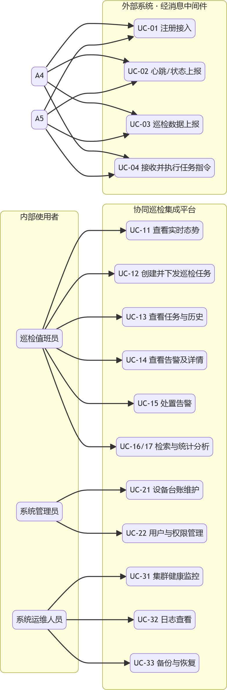
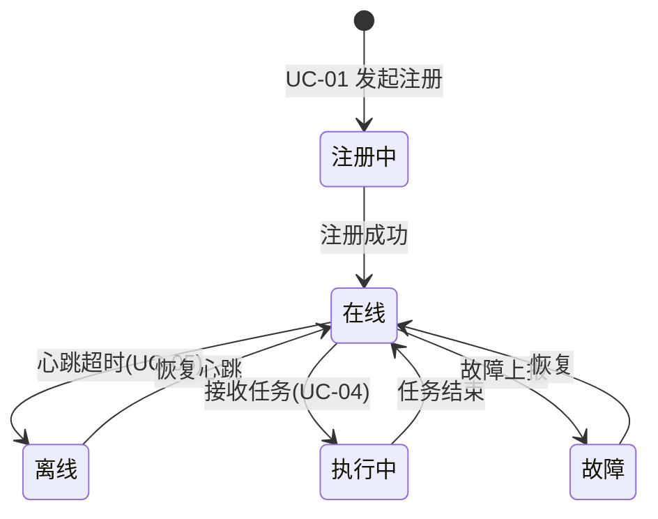

# 无人机-机器狗空地协同巡检集成平台 —— 需求分析、总体架构与技术选型（合订本）

> **合订说明**：本文档为三部分合订（V1.1），其中 **需求分析** 部分以《需求分析文档.md》（参与者驱动版）为准并整体并入（参与者 A1~A5、用例 UC-01~UC-41、模块 M1~M7 / T1~T4）；**总体架构** 与 **技术选型** 部分承接上述需求口径。
>
> **对应选题**：园区安防空地协同巡检集成平台（指导说明书「三、项目选题与可选子课题」· 选题 1，推荐基础题）。
>
> **标注说明**：带 `★` 的内容为需小组最终拍板/填写的开放项。文档中图片位于 `doc/images/`，请保持目录结构完整以便渲染。

---

## 目录

1. 第一部分 需求分析（引言 / 参与者 / 系统边界 / 用例 / 核心用例规格 / 模块划分 / 业务规则 / 非功能 / 衔接）
2. 第二部分 系统总体架构（设计原则 / 分层架构 / 各层职责 / 模块与实现单元 / 部署方案 / 数据流）
3. 第三部分 技术选型及理由（选型总览 / 各类组件理由 / 生态一致性 / 风险对策）
4. 第四部分 技术选型确认与待补充项

---

## 第一部分 需求分析

> 来源：由《需求分析文档.md》（参与者驱动版，V1.0）整段并入，取代早期零散的需求章节；参与者 A1~A5、用例 UC-01~UC-41、功能模块 M1~M7 / 技术支撑 T1~T4 为全文统一口径。

### 1 引言

#### 1.1 目的与范围

本文档定义“无人机-机器狗空地协同巡检集成平台”的功能性需求与模块划分。系统面向园区安防场景：**无人机高空巡查发现线索 → 机器狗地面抵近复核**，平台完成设备接入、任务下发、消息流转、数据存储、检索分析与可视化。

- 系统为**软件仿真实践项目**，无实体硬件；无人机、机器狗由**仿真模块**扮演，按真实设备语义接入。
- 平台对外只暴露唯一 Web 入口；仿真设备经**消息中间件**与平台交互，不直连业务接口与数据库。

#### 1.2 术语

| 术语 | 含义 |
| :--- | :--- |
| 仿真设备 | 以软件程序扮演的无人机 / 机器狗，作为数据源与指令执行端 |
| 在线状态 | 设备在规定心跳间隔内有上报，否则视为离线 |
| 巡检任务 | 平台向某台 / 某组设备下发的飞行 / 地面复核指令集合 |
| 告警 | 由设备故障、心跳超时或预设规则触发的需关注事件 |
| 台账 | 设备基础档案（编号、类型、区域、状态） |
| 复核 | 机器狗对无人机发现的可疑点位进行现场抵近确认 |

---

### 2 参与者（Actor）

| 编号 | 参与者 | 类型 | 说明 | 主要目标 |
| :--- | :--- | :--- | :--- | :--- |
| A1 | 巡检值班员 | 人（系统主用户） | 安防监控 / 巡检业务日常执行者 | 查看实时态势、创建任务、处置告警、检索分析 |
| A2 | 系统管理员 | 人 | 平台配置与权限管理者 | 设备台账维护、用户与权限管理 |
| A3 | 系统运维人员 | 人 | 中间件与集群运维者 | 集群健康监控、日志查看、备份恢复、Kibana 分析 |
| A4 | 无人机仿真模块 | 外部软件系统 | 仿真无人机的数据源与指令执行端 | 注册接入、上报数据、执行飞行巡检任务 |
| A5 | 机器狗仿真模块 | 外部软件系统 | 仿真机器狗的数据源与指令执行端 | 注册接入、上报数据、执行地面复核任务 |

参与者性质界定：

- **A1、A2、A3 为平台内部使用者**，通过 Web 界面操作；
- **A4、A5 为外部参与者（软硬件系统）**，不登录 Web，仅通过**消息中间件**完成“上报数据”与“接收指令”两类交互；
- 三类人之间通常**职责分离**：值班员只管业务、管理员管配置与账号、运维员管运行。

---

### 3 系统边界与总体用例图

#### 3.1 系统边界

```text
             ┌───────────────────────────────────────────────┐
             │         无人机-机器狗空地协同巡检集成平台          │
  值班员 A1 ──┤  ① Web 前端（态势/任务/告警/检索）               │
  管理员 A2 ──┤  ② Nginx 网关（唯一对外入口）                    │
  运维员 A3 ──┤  ③ 业务服务（任务/台账/告警/消费）               │
             │  ④ 存储·检索·消息支撑（Mongo/HDFS/ES/Kafka）    │
             └───────▲───────────────────────────────────────┘
                     │ 消息中间件（上报 / 指令，不直连业务接口）
         ┌───────────┴───────────┐
   A4 无人机仿真模块      A5 机器狗仿真模块   （外部系统参与者）
```

#### 3.2 总体用例图（Mermaid 近似；渲染于 Typora / VSCode）


> 说明：Mermaid 无 UML 用例图原生语法，此处用流程图近似表达“参与者—用例”关系；正式报告如需标准符号，可在 draw.io / PlantUML 绘制后插入。

---

### 4 用例清单（总表）

| 编号 | 用例名称 | 主要参与者 | 类型 | 优先级 | 说明 |
| :--- | :--- | :--- | :--- | :--- | :--- |
| UC-01 | 设备注册接入 | A4 / A5 | 外部接入 | 高 | 仿真设备启动后向平台注册（编号、类型、初始状态） |
| UC-02 | 心跳与在线状态上报 | A4 / A5 | 外部接入 | 高 | 周期上报心跳，维持在线状态（含电量/状态字段） |
| UC-03 | 巡检数据上报 | A4 / A5 | 外部接入 | 高 | 上报 GPS、图片元数据 / 传感数据 |
| UC-04 | 接收并执行巡检任务指令 | A4 / A5 | 外部接入 | 高 | 订阅指令，执行并回执结果 |
| UC-05 | 设备离线检测与状态更新 | 系统（后台） | 系统能力 | 高 | 心跳超时判定 → 状态置离线 → 通知 |
| UC-11 | 查看实时态势 | A1 | 人机交互 | 高 | 设备状态、GIS 分布、任务、告警实时刷新 |
| UC-12 | 创建并下发巡检任务 | A1 | 人机交互 | 高 | 选设备 / 区域 / 类型，经消息下发指令 |
| UC-13 | 查看任务执行过程与历史 | A1 | 人机交互 | 高 | 任务进度、执行结果、历史查询 |
| UC-14 | 查看告警及详情 | A1 | 人机交互 | 高 | 告警列表、详情（关联设备 / 位置 / 图片） |
| UC-15 | 处置告警 | A1 | 人机交互 | 高 | 确认 / 指派复核 / 关闭，留处置记录 |
| UC-16 | 检索巡检事件 / 告警 | A1 | 人机交互 | 中高 | 按地点 / 时间 / 告警类型 / 设备检索 |
| UC-17 | 查看统计分析报表 | A1 | 人机交互 | 中 | 告警趋势、设备统计、巡检统计 ★可主要由 Kibana 承担 |
| UC-21 | 设备台账维护 | A2 | 人机交互 | 高 | 设备新增 / 修改 / 停用，维护基础档案 |
| UC-22 | 用户与权限管理 | A2 | 人机交互 | 中 | 用户增删、角色分配（★基础版可简化） |
| UC-23 | 巡检区域与基础字典维护 | A2 | 人机交互 | 低 | 巡检区域、设备分组等配置（★可选） |
| UC-31 | 集群与中间件健康监控 | A3 | 人机交互 | 高 | 各组件运行状态、容器健康查看 |
| UC-32 | 日志查看与排错 | A3 | 人机交互 | 高 | 组件 / 业务日志检索定位 |
| UC-33 | 数据备份与恢复 | A3 | 人机交互 | 中 | HDFS / 数据库备份与恢复演示（★选做） |
| UC-34 | Kibana 检索与统计分析 | A3 | 人机交互 | 低 | 运维视角的检索与仪表盘（★选做） |
| UC-41 | 告警自动生成 | 系统（后台） | 系统能力 | 高 | 依据规则（心跳超时 / 故障 / 上报异常）自动生成告警 |

> 用例间关系（简）：UC-12 由 “UC-11 实时态势” 发起并 **include** “UC-13 任务跟踪” 与消息下发；UC-15 处置“指派复核”时 **include** 向机器狗发起一次 “UC-04 复核指令”；UC-14 展示的告警由 **UC-41** 产生。

---

### 5 核心用例规格（详细描述）

> 模板字段：用例名 / 参与者 / 前置条件 / 主流程 / 备选流 / 后置条件 / 验收要点。未列出的用例以后续详细设计补充。

#### UC-12 创建并下发巡检任务

- **参与者**：巡检值班员（A1）
- **前置**：值班员已登录；存在在线可用设备；实时态势页可达
- **主流程**：
  1. 值班员在态势页点击“新建巡检任务”；
  2. 系统列出可选设备（含状态）与区域；
  3. 值班员选择目标设备（无人机 / 机器狗）与任务类型（空中巡查 / 地面复核），填写区域与说明；
  4. 值班员提交；系统生成任务记录并写入存储；
  5. 系统将任务指令投递至消息中间件对应设备指令 topic；
  6. 系统提示“已下发”，任务状态置为“执行中”。
- **备选流**：
  - 所选设备已离线 → 系统阻止下发并提示；
  - 设备回执超时 → 任务停留“执行中”，可重发或取消。
- **后置**：任务状态、下发时间可追踪；执行结果回执可被 UC-13 查询。
- **验收要点**：前端可完整走通“创建→下发”，平台、消息中间件、仿真设备三端日志一致（对应用例 TC-004）。

#### UC-03 巡检数据上报

- **参与者**：无人机 / 机器狗仿真模块（A4 / A5）
- **前置**：仿真设备已完成注册（UC-01）且在线；消息中间件 topic 存在
- **主流程**：
  1. 仿真设备按上报周期采集 / 生成一条数据（无人机：GPS+航拍图片元数据；机器狗：传感 + 位置）；
  2. 设备将数据序列化为消息发送至上报 topic；
  3. 业务服务作为消费者接收并校验；
  4. 业务服务将图片文件写入 HDFS、结构化记录写入分布式数据库，并将事件写入检索引擎；
  5. 系统确认消息被持久化，无丢失。
- **备选流**：消息格式 / 序列化异常 → 记入消费失败日志，不阻塞后续消息。
- **后置**：数据可用于实时态势、检索与统计分析。
- **验收要点**：端到端消息可达且持久化（对应用例 TC-003）；图片文件可在 HDFS 查询到（TC-005）。

#### UC-04 接收并执行巡检任务指令

- **参与者**：无人机 / 机器狗仿真模块（A4 / A5）
- **前置**：已注册在线；已订阅本设备指令 topic
- **主流程**：
  1. 平台向指令 topic 下发任务消息；
  2. 仿真设备消费消息并解析任务内容；
  3. 设备模拟执行（如按坐标生成巡检轨迹 / 传感读数）；
  4. 设备回执执行结果（成功 / 异常）。
- **备选流**：指令与设备能力不符 → 回执“不支持”。
- **后置**：平台可更新任务状态。
- **验收要点**：设备收到并回执，内容与下发一致（对应 TC-004）。

#### UC-15 处置告警

- **参与者**：巡检值班员（A1）
- **前置**：存在未处置告警（来自 UC-41）
- **主流程**：
  1. 值班员打开告警详情（含类型、位置、图片、关联设备）；
  2. 值班员选择处置动作：
     - 直接**确认并关闭**，填写备注；
     - 或**指派复核**：系统向指定机器狗下发一次地面复核指令（include UC-04）；
  3. 系统记录处置人 / 时间 / 结果，告警状态置为“已处置”。
- **备选流**：告警误报 → 关闭并标记“误报”。
- **后置**：处置留痕，可检索。
- **验收要点**：处置动作与“高空发现→地面复核”闭环一致，记录完整（对应 TC-007 / TC-010 链路）。

#### UC-11 查看实时态势

- **参与者**：巡检值班员（A1）
- **前置**：已登录
- **主流程**：
  1. 值班员进入态势首页；
  2. 系统以 GIS 地图展示设备分布与状态，列表展示在线 / 离线、电量；
  3. 系统推送实时告警与任务动态；
  4. 值班员可下钻查看单台设备详情。
- **后置**：无（只读）。
- **验收要点**：页面随心跳 / 上报数据自动刷新（对应 TC-002、TC-009）。

#### UC-01 设备注册接入

- **参与者**：无人机 / 机器狗仿真模块（A4 / A5）
- **前置**：消息中间件正常；网络可达
- **主流程**：
  1. 仿真设备启动；
  2. 设备发送注册请求 / 注册消息（编号、类型、初始状态）；
  3. 平台校验并在台账登记（或更新），状态置“在线”。
- **备选流**：编号已存在且状态冲突 → 按规则做版本覆盖或拒绝并提示。
- **后置**：设备可在台账与态势页可见。
- **验收要点**：注册后台账出现该设备且类型 / 编号正确（对应 TC-001）。

---

### 6 模块划分

按【参与者 + 用例聚类 + 技术支撑】划分为 7 个业务功能模块 + 4 个技术支撑模块。

#### 6.1 业务功能模块

| 模块 | 覆盖用例 | 面向参与者 | 主要职责 | 交付形态 |
| :--- | :--- | :--- | :--- | :--- |
| M1 设备接入与监控 | UC-01/02/03/05、UC-11 | A1、A4、A5 | 设备注册、心跳状态、上报接收、离线检测；实时态势展示 | 仿真模块 + 接入服务 + 前端态势页 |
| M2 巡检任务管理 | UC-12/13、UC-04 | A1、A4、A5 | 任务创建下发、指令投递、执行跟踪、历史查询 | 后端任务服务 + 前端任务页 |
| M3 告警中心 | UC-14/15、UC-41 | A1 | 告警自动生成、展示、处置与留痕 | 后端告警服务 + 前端告警页 |
| M4 检索与统计分析 | UC-16/17、UC-34 | A1、A3 | 事件 / 告警检索、统计报表 | 检索接口 + 前端 + Kibana |
| M5 台账与权限管理 | UC-21/22/23 | A2 | 设备台账、用户角色、基础字典 | 管理后台 |
| M6 运维支撑 | UC-31/32/33 | A3 | 健康监控、日志、备份恢复 | 运维入口 / 脚本 + Kibana |
| M7 可视化大屏 | UC-11（联动） | A1 | GIS 地图、态势大屏整合 | 前端大屏 |

#### 6.2 技术支撑模块（跨模块复用）

| 模块 | 职责 | 对应用例 |
| :--- | :--- | :--- |
| T1 消息接入与流转 | topic 规划、生产者消费者、持久化、指令投递 | UC-01/02/03/04/05 |
| T2 分布式存储 | HDFS 大文件；MongoDB 结构化（设备 / 任务 / 告警） | UC-03/12/41 数据落库 |
| T3 检索分析接入 | ES 索引、检索接口、聚合统计 | UC-16/17/34 |
| T4 网关与访问控制 | Nginx 反代、负载均衡、基础安全 | 全局 |

#### 6.3 用例 → 模块映射（简表）

```text
A1 值班员：UC-11/12/13/14/15/16/17 ──► M1/M2/M3/M4/M7
A2 管理员：UC-21/22/23          ──► M5
A3 运维员：UC-31/32/33/34       ──► M6/M4(部分)
A4/A5 仿真设备：UC-01/02/03/04 ──► M1/M2（经 T1 消息接入）
系统后台：UC-05/41             ──► M1/M3（自动任务）
```

---

### 7 关键业务概念与规则

#### 7.1 设备状态机



#### 7.2 任务状态

`已下发` → `执行中` →（`已完成` / `失败` / `已取消`）

#### 7.3 告警规则（UC-41 触发来源）

| 触发类型 | 说明 | 建议级别 |
| :--- | :--- | :--- |
| 心跳超时 | 设备超时未上报 → 离线告警 | 一般 |
| 设备故障 | 上报状态字段含故障 | 严重 |
| 上报异常 / 预设规则 | 传感越界、图片缺失等 | 提示 / 一般 ★规则可配置 |

> 告警级别、超时时长等参数 ★ 待小组在详细设计时确定；演示数据请贴合园区安防场景（如“区域入侵 / 可疑目标”类告警类型）。

---

### 8 非功能性需求

| 类别 | 需求 |
| :--- | :--- |
| 性能 | 支撑 ≥10 台仿真设备并发上报，消息消费无明显积压；检索结果可交互 |
| 可靠性 | 消息不丢失、可持久化；心跳超时状态自动更新；告警 / 任务记录完整 |
| 可扩展性 | 按 topic 解耦，可新增设备类型与业务模块；组件可集群化扩展 |
| 易用性 | 值班员可在 1~2 次点击内完成建单 / 处置；界面中文、语义清晰 |
| 安全 | 对外仅暴露网关；用户登录与角色隔离（★基础版可简化为固定账号） |
| 兼容性 | 统一 Docker 镜像固定版本，规避组件版本冲突 |
| 合规 | 如实记录问题与测试结果，不虚构数据 |

---

### 9 后续工作衔接

1. 本用例清单与模块划分可作为**架构设计**（模块服务划分）、**数据库设计**（任务 / 告警 / 设备实体）与**测试用例**（UC 逐条验收）的输入；
2. ★ 待确认：用户权限是否纳入基础版、统计分析由自研前端还是 Kibana 承担、告警类型与阈值清单。


---

## 第二部分 系统总体架构

### 2.1 架构设计原则

1. **分层解耦**：设备、消息、业务、存储、展示分层独立，层间以消息 / 接口交互，降低耦合；
2. **数据驱动**：以“数据上报 → 消息流转 → 分布式存储 / 检索 → 可视化”为主线设计系统；
3. **组件即课程**：架构须完整覆盖课程强制 6 类组件（HDFS、MongoDB/HBase、Kafka/RocketMQ、Nginx、Elasticsearch、Docker），体现企业应用集成学习目标；
4. **面向扩展**：topic 按业务划分、存储读写接口化，便于后续新增设备类型与业务；
5. **仿真优先、真实贴近**：设备以仿真 SDK 模拟，但数据格式、消息协议、接口语义贴近真实系统。

### 2.2 分层架构总览

> **箭头语义**：本图是**依赖视图**，箭头 = “前者依赖/调用后者的接口”，**只画调用方向，不画响应返回**。据此全图为**无环 DAG**，不存在循环依赖（“数据流的业务闭环”见下方 2.2.1 说明）。


**阅读器的纯文本等价（无 mermaid 时）：**

```text
Web 前端 ─HTTP→ Nginx 网关 ─HTTP→ 业务服务 ─读写client→ MongoDB / HDFS / Elasticsearch
业务服务 ─MQ client→ 消息中间件；设备仿真 ─MQ client→ 消息中间件   （均只指向 MQ，无回指）
Kibana ──(内网直连旁路)──→ Elasticsearch
```

#### 2.2.1 为何“有闭环、却不是循环依赖”

图中出现回环感来自**业务上的两条异步消息链**：

- **上报链**：设备仿真 →(生产) MQ →(消费) 业务服务；
- **下发链**：业务服务 →(发布指令) MQ →(订阅) 设备仿真。

两条合并为巡检业务闭环，但它们在**代码依赖上各自只指向消息中间件**（设备仿真持 MQ 客户端、业务服务持 MQ 客户端），**两端模块互不持有对方接口**，因此不构成循环依赖；MQ 在此的作用正是把“上报—下发”这个环从直接调用中**切开**。

> **反面教材**：若把“任务下发”做成业务服务**同步 HTTP 直调设备仿真端**，业务依赖设备接口、设备又回调业务，才会形成真正的依赖环。本设计用消息中间件规避了它。
>
> 另外两点刻意澄清（对应原图两处易误读点）：
> 1. 业务服务与检索层之间**只有** `业务→ES` 的写入/查询，ES 不反向调用业务，故不画双向箭头；
> 2. Kibana 为 ES 的**运维分析旁路**（内网直连），不经过 Nginx 业务网关，不属于 Web 访问链路。

### 2.3 各层职责与技术要素

| 层次 | 职责 | 承载技术组件 | 关键进出数据 |
| :--- | :--- | :--- | :--- |
| 设备仿真层 | 模拟无人机 / 机器狗注册、心跳、状态、传感器与图像元数据产生，作为消息生产者；接收任务指令 | 无人机 / 机器狗仿真模块（自研，SDK 式） | GPS、传感值、图片元数据、状态上报；任务指令接收 |
| 消息中间件层 | 接收设备上报、下发平台指令；消息生产 / 消费 / 持久化 / 路由 / 分区 | Kafka / RocketMQ | 上报消息、指令消息 |
| 业务服务层 | 设备台账、任务解析与下发、告警处理、消息消费、业务逻辑 | 后端业务服务 | 结构化业务数据、指令消息 |
| 分布式存储层 | 图片大文件存储；结构化数据存储读写 | HDFS；MongoDB / HBase | 巡检影像文件；设备 / 任务 / 状态记录 |
| 检索分析层 | 事件 / 告警索引建立、全文检索、地理检索、聚合统计 | Elasticsearch；Kibana（运维旁路仪表盘，内网直连 ES，不经业务网关） | 索引文档、统计结果 |
| 网关接入层 | 统一对外入口、反向代理、负载均衡、基础安全 / 限流 | Nginx | HTTP 请求转发 |
| 可视化展示层 | 设备 GIS 分布、状态、任务、告警、检索结果展示 | Web 前端（Vue3，经 Nginx 网关访问后端接口） | 业务 JSON、图表 |

### 2.4 模块划分与职责边界

本节的“实现单元”与第一部分需求分析第 6 章的功能模块（M1~M7）与技术支撑模块（T1~T4）对齐：

| 架构 / 实现单元 | 需求模块映射 | 覆盖用例 | 对应责任人（见分工表） | 主要职责 |
| :--- | :--- | :--- | :--- | :--- |
| 设备仿真模块 | M1 | UC-01/02/03/04 | 仿真与数据处理负责人 | 无人机 / 机器狗数据仿真生成与指令响应 |
| 设备接入服务 | M1 | UC-01/02/05 | 后端业务开发负责人 | 注册、心跳消费、在线 / 离线维护 |
| 任务服务 | M2 | UC-12/13、UC-04 | 后端业务开发负责人 | 任务创建下发、指令投递、进度跟踪 |
| 告警服务 | M3 | UC-14/15、UC-41 | 后端业务开发负责人 | 告警生成、展示、处置与留痕 |
| 检索服务 | M4 | UC-16/17、UC-34 | 中间件运维 + 后端开发 | ES 索引、检索接口、聚合统计 |
| 台账 / 权限 | M5 | UC-21/22/23 | 后端业务开发负责人 | 台账维护、用户与角色管理 |
| 可视化前端 | M7 | UC-11/13/14/16 | 前端可视化负责人 | 页面、GIS 地图、告警可视化 |
| 消息 / 存储 / 检索 / 网关接入 | T1 / T2 / T3 / T4 | 对应 M 模块用例 | 中间件部署运维负责人 | topic 规划、HDFS/DB 读写、ES、Nginx |
| 测试与文档 | — | 全部用例 | 测试与文档负责人 | 用例、测试报告、全套文档汇总 |

> 提示：实现单元之间以 **REST 接口 + 消息 topic 约定** 为契约解耦，便于多人并行开发（分工表见 `小组分工安排.md`）。

### 2.5 部署架构方案（Docker 单机容器集群仿真）

> 依据指导说明书 4.2 说明：**不要求物理多机集群，单机 Docker 容器模拟多节点集群即可**，推荐统一使用 Docker 镜像固定版本规避组件版本冲突。

| 容器 / 组件 | 集群角色 | 典型暴露端口（★ 以实际配置为准） | 说明 |
| :--- | :--- | :--- | :--- |
| Hadoop HDFS | NameNode + DataNode | 9870 / 9000 | 巡检图片存储；可只跑伪分布式单节点 |
| MongoDB | 单副本（可副本集） | 27017 | 设备 / 任务 / 状态结构化数据 |
| Kafka（或 RocketMQ） | Broker + Zookeeper | 9092（2181） | 消息生产 / 消费 / 持久化 |
| Elasticsearch + Kibana | 单节点 ES + Kibana | 9200 / 5601 | 检索与可视化仪表盘 |
| Nginx | 反向代理网关 | 80 / 8080 | 统一入口、负载均衡 |
| 后端业务服务 | 1~2 实例 | ★ 自定（如 8081/8082） | 负载均衡后端节点，供 Nginx 分发 |
| Web 前端 | 静态站 / Node 服务 | ★ 自定 | 浏览器访问，经 Nginx 代理 |

部署顺序建议（依赖导向）：**基础镜像 → HDFS → 分布式数据库 → 消息中间件 → ES → 业务服务 → Nginx → 前端**，与课程阶段二（16 学时）工作内容一致。

### 2.6 数据流设计要点

- **上行（数据采集）**：仿真设备上报 → 消息中间件 topic（按设备 / 业务划分）→ 业务消费端消费 → 图片文件落 HDFS、结构化数据落分布式数据库、事件 / 告警写 ES → 前端 / Kibana 展示。
- **下行（任务指令）**：前端 → Nginx → 业务服务生成指令 → 消息中间件指令 topic → 仿真设备消费执行（模拟回执）。
- **异常流**：设备心跳超时 → 平台检测（定时 / 超时机制）→ 状态置离线 → 数据库同步 → 前端告警提示（对应用例 TC-010）。

---

## 第三部分 技术选型及理由

### 3.1 选型总览

| 技术域 | 最终选定 | 备选方案（已评估） | 选型要点（一句话） |
| :--- | :--- | :--- | :--- |
| 容器化部署 | **Docker** | 裸机 / 虚拟机 | 镜像隔离、一键部署、固定版本规避冲突、单机模拟集群 |
| 分布式文件系统 | **Hadoop HDFS** | MinIO / 对象存储 | 课程强制、专为大文件（巡检图片）设计、与大数据生态一体 |
| 分布式数据库 | **MongoDB** | HBase | 文档模型灵活、查询语义匹配、部署轻量，见 3.2.3 |
| 消息中间件 | **Kafka** | RocketMQ | 高吞吐、持久化可靠、生态资料丰富，见 3.2.4 |
| 检索引擎 | **Elasticsearch + Kibana** | —（强制） | 全文检索 + 聚合 + 可视化一体，行业标准 |
| 负载均衡 / 网关 | **Nginx** | —（强制） | 反向代理、负载均衡、高并发成熟可靠 |
| 后端开发语言 | **Java（Spring Boot）** | Python（FastAPI） | 与中间件同生态、客户端 / 工程化成熟，见 3.2.7 |
| 前端 | **Vue3 + Element Plus + ECharts + 地图库** | HTML+JS（纯静态） | 组件化开发快、可视化图表 / 地图生态强，见 3.2.8 |

### 3.2 各类组件选型理由

#### 3.2.1 容器化：Docker
- **理由**：① 本项目涉及 HDFS、MongoDB、Kafka/RocketMQ、ES、Nginx 等多组件，各自依赖复杂、版本敏感，容器镜像自带运行环境，避免“在我机器上能跑”的问题；② 单机多容器即可模拟集群（HDFS 伪分布式、Kafka+Zookeeper 多 broker 均可容器化），契合课程“不要求物理多机”的要求；③ 删除重建成本低，便于反复排错与重置；④ 指导说明书明确建议“统一使用 Docker 镜像规避版本冲突”。

#### 3.2.2 分布式文件系统：Hadoop HDFS
- **候选**：HDFS、MinIO、FastDFS、普通文件系统 + 本地盘。
- **选定理由**：① 课程强制要求并映射“大文件（巡检图片）存储、备份恢复”知识点；② 巡检影像为典型**大文件、写后读为主**的场景，符合 HDFS“一次写入、多次读取、高吞吐顺序访问”的定位；③ 与检索、分析等大数据生态天然衔接；④ 备份 / 容错（副本机制）可同时覆盖“数据备份恢复”拓展项。
- **备选说明**：MinIO 部署更轻，但偏离课程目标与考核组件清单，故不作首选。

#### 3.2.3 分布式数据库：MongoDB（对比 HBase）
| 维度 | MongoDB（选定） | HBase（未采用） |
| :--- | :--- | :--- |
| 数据模型 | 文档（BSON），字段灵活 | 宽表（列族），需预先设计 schema |
| 查询能力 | 支持按字段 / 条件 / 范围 / 聚合查询，语义直观 | 主键 / 范围扫描为主，复杂查询弱 |
| 开发迭代 | 快速，适合业务频繁调整 | 较重，适合超大规模型 |
| 部署复杂度 | 单节点 / 副本集即可运行 | 强依赖 HDFS + ZooKeeper，部署重 |
| 与本项目匹配度 | 设备 / 任务 / 状态查询（按编号、时间）直接映射 | 数据量未达海量级，优势难发挥 |

- **结论**：本项目结构化数据体量适中（仿真规模），需求以“按设备 / 任务编号、时间查询”为主，**MongoDB 文档模型与查询能力更贴合、开发更快**，故选 MongoDB；HBase 保留为备选，若后续数据量急剧增长可平滑替换，上层读写接口可抽象屏蔽差异。

#### 3.2.4 消息中间件：Kafka（对比 RocketMQ）
| 维度 | Kafka（选定） | RocketMQ（备选） |
| :--- | :--- | :--- |
| 吞吐量 | 极高，分布式日志式设计 | 高 |
| 持久化与顺序 | 分区内有序、磁盘顺序写、可靠性成熟 | 支持消息轨迹 / 延迟 / 事务消息 |
| 生态与资料 | Apache 生态，与 HDFS/ES/大数据组件协作资料多 | 阿里系，中文文档友好 |
| 部署形态 | 依赖 ZooKeeper（KRaft 可免） | 内置 NameServer，部署相对简单 |

- **结论**：课程考核对两者二选一，二者均可达成需求。**本项目推荐 Kafka**：① 设备高频心跳 + 巡检数据上报是典型**高吞吐流式数据**场景，与 Kafka 设计目标契合；② 消息持久化、分区内有序能很好支撑“上报不丢失、指令按序”的需求（对应需求 UC-03 数据上报、UC-04/12 指令下发的吞吐与持久化，验收对 TC-003/004）；③ Kafka 与 HDFS、ES 同属 Apache / 大数据生态，集成与资料丰富；④ 单机容器部署简单。
- **最终结论**：小组已确认消息中间件统一采用 **Kafka**（对应需求 UC-03/04/12 上报与下发的吞吐、持久化诉求），并已在任务书“技术栈要求”固定。**RocketMQ 保留为备选**：若后续需要消息轨迹、事务 / 延迟消息等特性可低成本替换，二者生产者 / 消费者模型一致，架构与业务代码不受影响。

#### 3.2.5 网关与负载均衡：Nginx
- **理由**：① 成熟、稳定、高并发下资源占用低，是反向代理与负载均衡的事实标准；② 一个入口对外统一暴露后端与前端，天然承担“统一网关、请求分发、基础安全”角色（需求文档 T4 网关模块：统一入口、负载均衡用例）；③ 配置简单（`location`/`upstream`），便于演示负载均衡策略；④ 课程强制组件。

#### 3.2.6 检索引擎：Elasticsearch + Kibana
- **理由**：① 分布式全文检索引擎，天然支持按设备编号、时间、告警类型、地理位置的检索与聚合（需求 UC-11 历史检索），其中**地理检索**对应巡检 GIS 场景；② 自带 Kibana 可视化仪表盘，可与自有前端互为印证，覆盖“统计分析可视化”需求（需求 UC-12/17 统计分析可视化）；③ 与消息链路（业务消费写 ES）对接顺畅，扩展分词、聚合能力无需自研。

#### 3.2.7 后端开发语言：Java + Spring Boot（已确认）
- **理由**：① 本项目核心组件（HDFS / Kafka / Elasticsearch 官方 SDK、MongoDB 驱动）均为 **Java 一等公民**，客户端支持最成熟，联调文档多；② Spring Boot 生态提供 Web、消息（spring-kafka / RocketMQ 客户端）、数据（Spring Data MongoDB / ES）一体化，快速搭建微服务；③ 课程要求工程化、可读性高，Java 强类型利于多人协作与代码规范考核；④ 对应用例 TC 所涉接口（注册、存储读写、检索、任务）均易实现。
- **最终结论**：小组已确认后端统一采用 **Java + Spring Boot**，与 Kafka / HDFS / Elasticsearch / MongoDB 的官方客户端同生态，形成“上报→消费→存储→检索”一条 Java 技术链；**FastAPI（Python）仅作理论备选**，架构与消息 / 存储对接方式不受影响。

#### 3.2.8 前端：Vue3 + Element Plus + ECharts + 地图组件
- **理由**：① Vue3 + Element Plus 组件化开发效率高、中文社区与教程多，适合课程周期内完成多页面（设备台账、任务、告警、大屏）；② **ECharts** 负责图表可视化（电量、告警统计等），**地图组件**（OpenLayers / Leaflet，或叠加 ECharts 地理坐标系）承载设备 GIS 分布展示（需求 UC-11 实时态势/GIS 展示，验收对 TC-009）；③ 静态资源经 Nginx 反向代理访问，与后端分离清晰。

### 3.3 技术选型协同说明（生态一致性）

- 选定技术整体呈 **Apache / Java / 大数据技术栈**：Kafka、HDFS、Elasticsearch 均为 Java 实现并有官方 Java 客户端，后端采用 Java + Spring Boot 可实现**从设备上报、消息消费、存储写入到检索查询的一条 Java 技术链**，大幅降低跨语言集成成本与排错难度；
- 所有中间件统一以 **Docker 镜像**交付并固定版本，规避多组件版本兼容风险（指导说明书第十四节难点提示亦作此建议）；
- 存储与检索、消息的衔接点统一收敛在**业务服务层**，前端仅经 **Nginx** 访问，保证访问路径清晰可控。

### 3.4 版本兼容与风险对策（依据指导说明书常见难点）

| 风险 / 难点 | 对策 |
| :--- | :--- |
| 多中间件版本兼容冲突 | 统一 Docker 镜像并固定版本，避免混装 |
| 消息生产者-消费者调试难 | 先定位 topic 配置、网络连通、序列化，再排查业务 |
| ES 索引 / 地理数据设计 | 预留 index mapping 设计（类型 keyword/text、geo_point 字段） |
| Nginx 反代跨域 / 策略 | 配置 `proxy_pass`、`location`、限流与安全头 |
| HDFS 权限 / 客户端连接 | 校验收发配置与端口、用户权限 |

---

## 第四部分 技术选型确认与待补充项

### 4.1 技术选型已确认（按本文件推荐方案执行）

| 技术域 | 已确认方案 |
| :--- | :--- |
| 容器化 | Docker（镜像固定版本） |
| 分布式文件系统 | Hadoop HDFS |
| 分布式数据库 | MongoDB |
| 消息中间件 | Kafka |
| 检索引擎 | Elasticsearch + Kibana |
| 网关 | Nginx |
| 后端 | Java + Spring Boot |
| 前端 | Vue3 + Element Plus + ECharts + GIS 地图组件 |

### 4.2 待补充细节

1. 具体技术**版本号**：以统一 Docker 镜像版本锁定（如 Kafka 3.x、ES 8.x 等，★ 待定）；
2. 任务书 / 分工表：**组员姓名、学号、角色对应**（见 `小组分工安排.md`）；
3. 开发契约：各层端口、topic 命名、接口字段约定（多人并行开发前先约定）。
