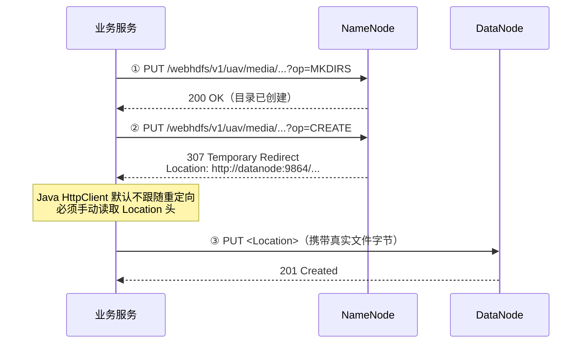

# HDFS 实现说明

> **本文结构**：作用 → 实现方式 → 步骤与代码 → 设计决策 → 原理 → 不足
> **配套**：其他组件见同目录《Elasticsearch 实现说明》《Kafka 实现说明》《MongoDB 实现说明》《Nginx 实现说明》

---

## 一、在项目中做什么

HDFS 承担**巡检影像大文件**的存储。

无人机航拍与机器狗红外拍摄产生的图片文件，具有"**一次写入、多次读取、单文件较大**"的特征，与 HDFS"高吞吐顺序访问大文件"的设计定位高度契合。

### 1.1 职责边界：写入由设备负责，读取由平台负责

> **这是一个重要的设计分界，也是本组件文档理解的前提。**

| 方向 | 由谁负责 | 实现位置 |
| :--- | :--- | :--- |
| **写入** | **设备**（仿真端） | `device-simulator` 的 `storage/StorageClient.java` |
| **读取** | **平台**（业务服务） | `platform-service` 的 `service/HdfsService.java` |

**为什么这样分工**：改造前是"设备发本地路径 → 平台读文件 → 平台上传"，这隐含了
"平台能访问设备文件系统"这一**不成立的前提**（现实中设备与平台只有网络相连），
还迫使平台靠"正则剥离路径前缀"绕过环境差异。

改造后影像由设备自己上传，消息中只携带 `storageRef`（存储引用）。
**详细分析与演进方案见《[../架构分析/影像文件通道设计.md](../架构分析/影像文件通道设计.md)》。**

**表 1-1 影像数据的分离存储**

| 数据 | 存储位置 | 说明 |
| :--- | :--- | :--- |
| 影像**元数据**（编号、类型、大小、拍摄位置、拍摄时间） | **MongoDB** `media_meta` | 结构化、需按条件查询 |
| 影像**文件本体** | **HDFS** `/uav/media/` | 二进制大文件 |
| 两者的关联 | `fileId` + `storageRef` | 元数据中记录文件在存储中的引用 |

**存储路径规范**：

```text
/uav/media/{设备编号}/{yyyyMMdd}/{fileId}.jpg

例如：/uav/media/DOG-001/20260918/IR-DOG-001-1789610393814.jpg
```

---

## 二、实现方式

### 2.1 技术选择：WebHDFS REST

接入 HDFS 有三条路，本项目选择了**第三条**：

| 方式 | 是否采用 | 原因 |
| :--- | :--- | :--- |
| `docker exec` 调用 `hdfs dfs` 命令 | ❌ | 容器化后，业务服务容器内**没有 docker 客户端**，无法从容器内指挥宿主机 |
| Hadoop Java Client（`hadoop-client` + `FileSystem.get()`） | ❌ | 需引入数十 MB 的依赖树、配置 `core-site.xml`；而项目只需"上传/下载"两个功能，过重 |
| **WebHDFS REST** | ✅ **采用** | 标准 HTTP 协议、语言无关、不依赖任何命令行工具、不引入额外依赖 |

### 2.2 用到的三个 REST 操作

| 操作 | HTTP 方法 | 路径 | 用途 |
| :--- | :--- | :--- | :--- |
| `op=MKDIRS` | PUT | `/webhdfs/v1{dir}?op=MKDIRS` | 创建目录 |
| `op=CREATE` | PUT | `/webhdfs/v1{path}?op=CREATE` | 创建/写入文件（**返回 307**） |
| `op=OPEN` | GET | `/webhdfs/v1{path}?op=OPEN` | 读取文件（**可能返回 307**） |

**URL 结构**：

```text
http://{namenode}:9870/webhdfs/v1{路径}?op={操作}
```

| 部分 | 说明 |
| :--- | :--- |
| `9870` | NameNode 的 **HTTP 端口**（Web UI 与 WebHDFS 共用） |
| `/webhdfs/v1` | 固定前缀 |
| `?op=` | 操作名 |

> **端口辨析**：HDFS 有两个端口容易混淆——
> **8020** 是 RPC 端口，供 Hadoop Java Client 使用；**9870** 是 HTTP 端口，供 Web UI 与 WebHDFS 使用。
> 项目 `docker-compose.yml` 中的 `9000:8020` 映射，是为了让宿主机程序能通过 RPC 访问。

---

## 三、步骤与代码

### 步骤 1：部署 NameNode 与 DataNode

```yaml
# docker-compose.yml
hadoop-namenode:
  image: bde2020/hadoop-namenode:2.0.0-hadoop3.2.1-java8
  container_name: hadoop-namenode
  environment:
    - CLUSTER_NAME=cluster1
    - CORE_CONF_fs_defaultFS=hdfs://hadoop-namenode:8020
    - HDFS_CONF_dfs_replication=1                          # 副本数（单机设为 1）
    - HDFS_CONF_dfs_permissions_enabled=false              # 关闭权限校验，便于开发
    - HDFS_CONF_dfs_namenode_datanode_registration_ip___hostname___check=false
  ports:
    - "9870:9870"     # WebUI + WebHDFS
    - "9000:8020"     # RPC

hadoop-datanode:
  image: bde2020/hadoop-datanode:2.0.0-hadoop3.2.1-java8
  environment:
    - CORE_CONF_fs_defaultFS=hdfs://hadoop-namenode:8020
    - HDFS_CONF_dfs_replication=1
    - SERVICE_PRECONDITION=hadoop-namenode:9870           # 等 NameNode 就绪再启动
  ports:
    - "9864:9864"     # DataNode WebUI
```

> **注意**：NameNode 与 DataNode 是**两个独立容器**，这本身就是 HDFS 分布式架构的体现——元数据节点与数据节点分离部署、跨进程通信。

### 步骤 2：配置访问地址

```properties
# application.properties（本地开发）
hdfs.webhdfs-base=http://localhost:9870
```

```yaml
# 容器内通过环境变量覆盖为服务名
HDFS_WEBHDFS_BASE: http://hadoop-namenode:9870
```

> 这就是"**同一份代码、两套地址**"策略的又一体现：本地连 `localhost`，容器内连服务名，代码无需改动。

### 步骤 3：创建目录（`op=MKDIRS`）

```java
/** WebHDFS 创建目录（op=MKDIRS） */
private boolean mkdirs(String dir) throws Exception {
    HttpRequest req = HttpRequest.newBuilder()
            .uri(URI.create(webhdfsBase + "/webhdfs/v1" + dir + "?op=MKDIRS"))
            .PUT(HttpRequest.BodyPublishers.noBody())
            .build();
    HttpResponse<String> resp = httpClient.send(req, HttpResponse.BodyHandlers.ofString());
    return resp.statusCode() == 200;      // 成功返回 200
}
```

### 步骤 4：上传文件（核心：307 重定向）

**图 3-1 WebHDFS 文件写入时序图**



```java
public boolean upload(String localPath, String deviceNo, String fileId) {
    try {
        String day = LocalDate.now().format(DAY);                      // yyyyMMdd
        String dir = BASE_DIR + "/" + deviceNo + "/" + day;            // /uav/media/DOG-001/20260918
        String hdfsPath = dir + "/" + fileId + ".jpg";

        // ① 创建目录（op=MKDIRS）
        if (!mkdirs(dir)) {
            log.error("[HDFS] 创建目录失败: {}", dir);
            return false;
        }

        // ② 读取本地文件，请求创建（op=CREATE）
        byte[] data = Files.readAllBytes(Paths.get(localPath));

        HttpRequest createReq = HttpRequest.newBuilder()
                .uri(URI.create(webhdfsBase + "/webhdfs/v1" + hdfsPath + "?op=CREATE&overwrite=true"))
                .PUT(HttpRequest.BodyPublishers.noBody())
                .build();

        HttpResponse<String> createResp = httpClient.send(createReq, HttpResponse.BodyHandlers.ofString());
        if (createResp.statusCode() != 307) {
            log.error("[HDFS] CREATE 未返回重定向: {} - {}", createResp.statusCode(), createResp.body());
            return false;
        }

        // ③ 手动读取 Location 头，把真实数据 PUT 到 DataNode
        String location = createResp.headers().firstValue("Location")
                .orElseThrow(() -> new IllegalStateException("响应缺少 Location 头"));

        HttpRequest putReq = HttpRequest.newBuilder()
                .uri(URI.create(location))
                .PUT(HttpRequest.BodyPublishers.ofByteArray(data))
                .build();

        HttpResponse<String> putResp = httpClient.send(putReq, HttpResponse.BodyHandlers.ofString());
        if (putResp.statusCode() != 201) {                             // 成功返回 201
            log.error("[HDFS] 数据上传失败: {} - {}", putResp.statusCode(), putResp.body());
            return false;
        }

        log.info("[HDFS] 上传成功: {} ({} 字节)", hdfsPath, data.length);
        return true;

    } catch (Exception e) {
        log.error("[HDFS] 上传异常: {}", e.getMessage());
        return false;
    }
}
```

**状态码辨析**：`MKDIRS` 成功返回 **200**，`CREATE` 最终写入成功返回 **201**，两者不同。

**为什么必须手动跟随重定向**：Java 的 `HttpClient.newHttpClient()` 默认 `followRedirects = NEVER`。

### 步骤 5：读取文件（`op=OPEN`）

读取与写入对称——NameNode 同样可能返回 307，需要手动跟随：

```java
public byte[] download(String hdfsPath) {
    try {
        HttpRequest openReq = HttpRequest.newBuilder()
                .uri(URI.create(webhdfsBase + "/webhdfs/v1" + hdfsPath + "?op=OPEN"))
                .GET()
                .build();

        HttpResponse<byte[]> resp = httpClient.send(openReq, HttpResponse.BodyHandlers.ofByteArray());

        // 直接返回内容
        if (resp.statusCode() == 200) {
            return resp.body();
        }

        // 307：跟随重定向到 DataNode 再取
        if (resp.statusCode() == 307) {
            String location = resp.headers().firstValue("Location").orElse(null);
            if (location == null) return null;

            HttpRequest dataReq = HttpRequest.newBuilder()
                    .uri(URI.create(location))
                    .GET()
                    .build();
            HttpResponse<byte[]> dataResp = httpClient.send(dataReq, HttpResponse.BodyHandlers.ofByteArray());
            return dataResp.statusCode() == 200 ? dataResp.body() : null;
        }

        log.error("[HDFS] 读取失败，状态码 {}", resp.statusCode());
        return null;

    } catch (Exception e) {
        log.error("[HDFS] 读取异常 {}: {}", hdfsPath, e.getMessage());
        return null;
    }
}
```

### 步骤 6：与元数据关联（业务层编排）

```java
public void handleMediaMeta(MediaMetaMessage msg) {
    MediaDoc doc = toDoc(msg);
    doc.setUploaded(false);
    mediaRepository.save(doc);                    // ① 先落库，保证元数据不丢

    if (hdfsService.upload(realPath, msg.deviceNo(), msg.fileId())) {
        doc.setHdfsPath("/uav/media/.../" + msg.fileId() + ".jpg");
        doc.setUploaded(true);
        mediaRepository.save(doc);                // ② 上传成功后回填路径
    } else {
        log.warn("[影像入库] {} 上传 HDFS 失败，元数据已保存待重传", doc.getFileId());
    }
}
```

---

## 四、设计决策

### 决策 1：为什么用 WebHDFS 而不是 Hadoop Java Client

除了第二章列出的三点（容器内无 docker 客户端、Java Client 依赖重、只需两个功能），还有一条工程上的考虑：

**WebHDFS 是标准 HTTP 协议**，这意味着任何语言、任何环境都能接入，且请求内容可用 curl 直接复现，排查问题时不必依赖特定的客户端库。

### 决策 2：为什么按"设备 / 日期"两级分区

HDFS 的 NameNode 将整个目录树的元数据**常驻内存**。若所有文件堆积在单一目录下：

- 百万级目录条目会耗尽 NameNode 内存；
- 列举目录操作极其缓慢。

按 `设备 / 日期` 分区后：

| 收益 | 说明 |
| :--- | :--- |
| 单目录文件数可控 | 避免元数据膨胀 |
| 清理便捷 | 按日期整目录删除即可 |
| 排查方便 | 从路径即可读出数据来源与时间 |

> 这是分布式文件系统的通用实践——**分区是应对规模增长的基本手段**。

### 决策 3：上传成功才发消息（避免"有元数据、无文件"）

```text
设备端：
  ① 生成影像，本地暂存
  ② 上传到 HDFS
     ├─ 失败 → 【不发消息】，本次跳过（记日志）
     └─ 成功 → ③ 发消息（含 storageRef）
平台端：
  ④ 消费消息 → 直接写元数据（uploaded 恒为 true）
```

**为什么这样设计**：若先发消息后上传，一旦上传失败，平台就会留下
"有元数据、无文件"的记录——检索时能看到这条影像，点开却读不到文件。
**把顺序反过来，就让这种不一致状态无法产生。**

> **与旧设计的对比**：改造前是"平台先落库（`uploaded=false`）→ 平台上传 → 回填"，
> 需要 2 次数据库写 + 3 次 HDFS 请求，且失败记录会留在库里等人重传。
> 现在**由上传方（设备）保证顺序**，平台侧一次写入即可，逻辑更简单也更可靠。

### 决策 4：为什么图片不走消息中间件

这是本项目最重要的一个设计决策：

> 图片是 MB 级大文件，若通过消息中间件传递，会严重拖垮中间件（消息体积、磁盘占用、网络带宽都会被挤占）。
>
> 因此采用"**元数据走消息通道、文件走文件通道**"的分离方案，两者通过 `fileId` 与 `storageRef` 关联。

**注意这里的"两条通道"具体是什么**：

| 通道 | 承载 | 协议 |
| :--- | :--- | :--- |
| **消息通道** | 元数据、状态、指令 | Kafka |
| **文件通道** | 影像本体（大文件） | WebHDFS（设备直传） |

**两条通道分离的意义**：不只是"大文件不挤占消息"，更在于**两者的故障域被隔开了**——
消息通道拥堵不影响影像上传，存储故障也不影响状态上报。

---

## 五、原理层面

### 5.1 主从架构

| 节点 | 职责 |
| :--- | :--- |
| **NameNode** | 元数据管理者：目录树、文件与数据块的映射、数据块所在位置。**全部元数据常驻内存** |
| **DataNode** | 数据存储者：文件被切分为固定大小的数据块（默认 128 MB），每块以副本形式存储 |

### 5.2 为什么客户端要直连 DataNode（307 的本质）

这是理解 WebHDFS 307 重定向的关键。

```text
写文件：
  ① 客户端 → NameNode：请求创建文件
  ② NameNode → 客户端：返回可用的 DataNode 地址（307）
  ③ 客户端 → DataNode：直接写入数据块
  ④ DataNode → 客户端：确认写入成功
```

**为什么不让 NameNode 中转数据**：

> 文件数据量远大于元数据量。若所有数据都经 NameNode 转发，NameNode 会立即成为整个集群的瓶颈与单点故障。
>
> 让客户端直连 DataNode，NameNode 只需处理轻量的元数据请求，从而具备管理数亿文件的能力。

**因此，307 重定向不是实现细节，而是 HDFS 架构设计的必然结果。**

### 5.3 副本机制

数据块以副本形式存储在多台 DataNode 上（生产环境默认 3 副本），提供容错能力。本项目因单机部署，副本数设为 1。

---

## 六、当前不足与优化方向

| # | 不足 | 影响 | 优化方向 |
| :--- | :--- | :--- | :--- |
| 1 | **每次上传都执行 MKDIRS** | 目录已存在仍多一次 NameNode 往返 | 本地缓存已创建的目录，跳过重复请求 |
| 2 | **整文件读入堆内存** | `Files.readAllBytes()` 对大文件会 OOM，无流式上传 | 改用 `BodyPublishers.ofFile()` 流式上传 |
| 3 | **上传在消费线程中同步执行** | 一条影像 = 2 次数据库写 + **3 次 HTTP**，消费线程全程阻塞 | 改为异步上传 |
| 4 | **HttpClient 无超时配置** | 默认无限等待，HDFS 卡住会拖死消费线程 | 配置 connectTimeout 与 requestTimeout |
| 5 | **副本数为 1** | 无容错能力，DataNode 故障即数据丢失 | 多节点部署并提高副本数 |
| 6 | **无重传机制** | `uploaded = false` 的记录不会自动重试 | 增加定时扫描重传任务 |
| 7 | **无文件清理策略** | 影像文件持续增长 | 配置生命周期策略或定期归档 |

---

## 附：一页速记

```text
【作用】巡检影像大文件存储；元数据在 MongoDB、文件在 HDFS，用 fileId 关联
【方式】WebHDFS REST（不用 Java Client，不用 docker exec）
【路径】/uav/media/{设备编号}/{yyyyMMdd}/{fileId}.jpg
【三步】① PUT ?op=MKDIRS        → 200
        ② PUT ?op=CREATE        → 307 + Location 头
        ③ PUT <Location> 带字节 → 201        ← 必须手动跟随重定向
【读取】GET ?op=OPEN            → 200 直接返回，或 307 跟随
【关键】· 307 是 HDFS 架构的必然结果：元数据与数据分离，客户端直连 DataNode
        · Java HttpClient 默认不跟随重定向，必须手动取 Location 头
        · 先落库(uploaded=false) → 上传 → 回填(uploaded=true)
【不足】重复 MKDIRS、整文件入堆、同步阻塞、无超时、副本数 1、无重传
```
