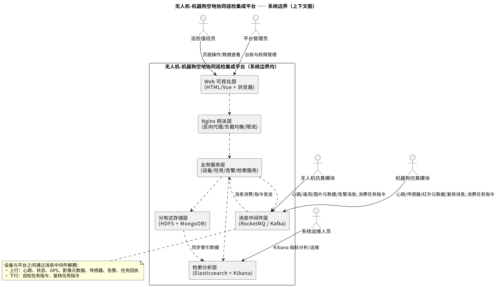
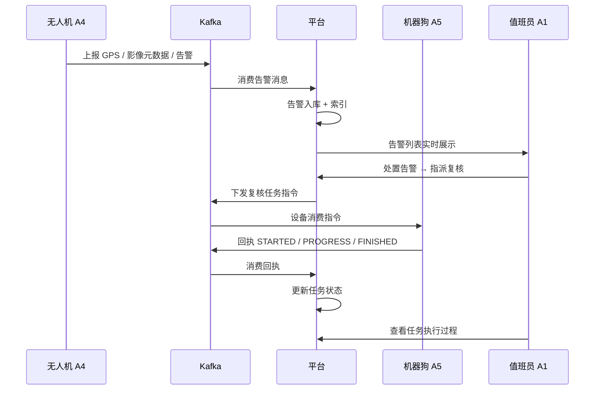
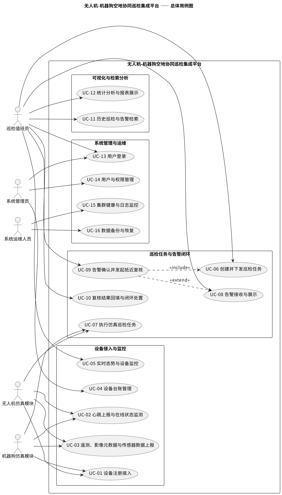
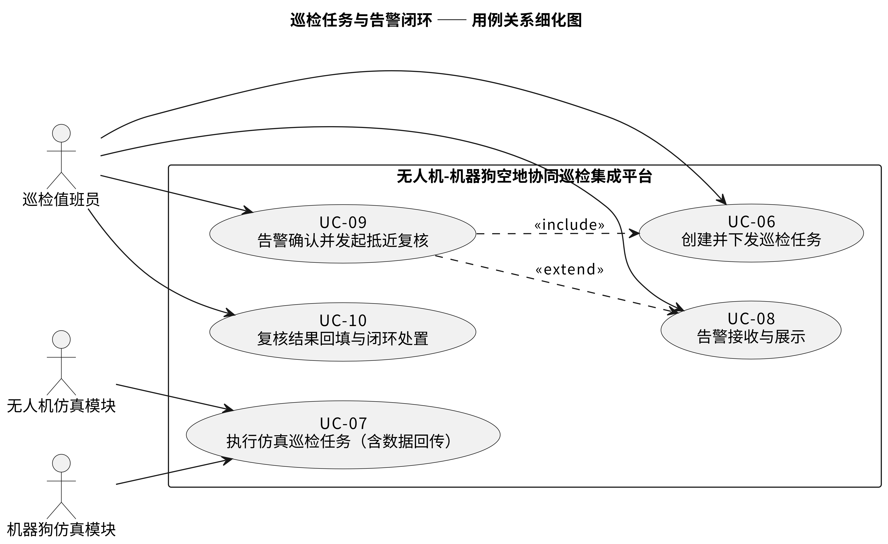

# 第 3 章 系统需求分析

## 3.1 业务场景描述

### 3.1.1 业务背景

本系统面向**园区安防巡检**场景。园区内存在围墙外侧、建筑楼道、设备夹层等人员难以到达或存在安全风险的区域，传统人工巡检存在覆盖不全、效率低下的问题。

系统采用"空地协同"的巡检模式：

```text
┌──────────────────────────────────────────────────────────┐
│  第一阶段：空中广域巡查                                    │
│    无人机沿预置路线高空飞行，采集航拍影像与 GPS 坐标         │
│    通过图像识别发现区域入侵、可疑目标等异常 → 产生告警        │
└────────────────────────┬─────────────────────────────────┘
                         │ 平台生成复核任务并下发
                         ▼
┌──────────────────────────────────────────────────────────┐
│  第二阶段：地面抵近复核                                    │
│    机器狗进入楼道、围墙死角等区域，采集红外影像与环境数据     │
│    对告警点位进行现场确认 → 回执执行结果 → 闭环              │
└──────────────────────────────────────────────────────────┘
```

两级联动的方式兼顾了**覆盖广度**（无人机）与**确认精度**（机器狗），形成完整的"发现—复核—处置"业务闭环。

### 3.1.2 系统定位与边界

**系统性质**：本项目为软件集成仿真实践项目，无实体硬件。无人机与机器狗由**软件仿真模块**扮演，按真实设备的语义接入平台。

**图 3-1 系统边界与上下文图**



**系统边界（文字等价表达）**：

```text
             ┌───────────────────────────────────────────────┐
             │         无人机-机器狗空地协同巡检集成平台          │
  值班员 A1 ──┤  ① Web 前端（态势 / 任务 / 告警 / 检索）         │
  管理员 A2 ──┤  ② Nginx 网关（唯一对外入口）                    │
  运维员 A3 ──┤  ③ 业务服务（任务 / 台账 / 告警 / 消费）          │
             │  ④ 存储·检索·消息支撑（Mongo / HDFS / ES / Kafka）│
             └───────▲───────────────────────────────────────┘
                     │ ① 消息通道：上报数据 / 接收指令（Kafka）
                     │ ② 文件通道：上传影像本体（设备直传存储）
         ┌───────────┴───────────┐
   A4 无人机仿真模块      A5 机器狗仿真模块   （外部系统参与者）
```

**关键边界约定**：平台对外只暴露唯一 Web 入口（Nginx）；仿真设备**不登录 Web、不调用业务接口、不直连数据库**，仅通过消息中间件与平台交互。这一约定保证了"设备作为外部参与者"的语义真实性。

### 3.1.3 参与者识别

**表 3-1 系统参与者**

| 编号 | 参与者 | 类型 | 说明 | 主要目标 |
| :--- | :--- | :--- | :--- | :--- |
| A1 | 巡检值班员 | 人（系统主用户） | 安防监控与巡检业务日常执行者 | 查看实时态势、创建任务、处置告警、检索分析 |
| A2 | 系统管理员 | 人 | 平台配置与权限管理者 | 设备台账维护、用户与权限管理 |
| A3 | 系统运维人员 | 人 | 中间件与集群运维者 | 集群健康监控、日志查看、备份恢复、Kibana 分析 |
| A4 | 无人机仿真模块 | 外部软件系统 | 仿真无人机的数据源与指令执行端 | 注册接入、上报数据、执行飞行巡检任务 |
| A5 | 机器狗仿真模块 | 外部软件系统 | 仿真机器狗的数据源与指令执行端 | 注册接入、上报数据、执行地面复核任务 |

**参与者性质界定**：

- **A1、A2、A3 为平台内部使用者**，通过 Web 界面操作，三类人之间职责分离——值班员只管业务、管理员管配置与账号、运维员管运行；
- **A4、A5 为外部参与者（软硬件系统）**，不登录 Web，仅通过消息中间件完成"上报数据"与"接收指令"两类交互。

### 3.1.4 术语约定

**表 3-2 关键术语**

| 术语 | 含义 |
| :--- | :--- |
| 仿真设备 | 以软件程序扮演的无人机 / 机器狗，作为数据源与指令执行端 |
| 在线状态 | 设备在规定心跳间隔内有上报，否则视为离线 |
| 巡检任务 | 平台向某台设备下发的飞行或地面复核指令 |
| 告警 | 由设备故障、传感越界或预设规则触发的需关注事件 |
| 台账 | 设备基础档案（编号、类型、区域、状态） |
| 复核 | 机器狗对无人机发现的可疑点位进行现场抵近确认 |

---

## 3.2 功能性需求

### 3.2.1 设备仿真接入需求

**需求描述**：仿真设备需能够模拟真实设备的接入行为，包括注册、心跳维持与状态上报。

| 编号 | 需求 | 说明 |
| :--- | :--- | :--- |
| F-1.1 | 设备注册接入 | 设备首次上报时自动完成注册，在平台建立台账（编号、类型、初始状态） |
| F-1.2 | 心跳与在线状态上报 | 设备按固定周期上报心跳，携带电量与运行状态 |
| F-1.3 | 离线自动检测 | 平台依据心跳超时自动将设备判定为离线，恢复心跳后自动回到在线 |
| F-1.4 | 位置轨迹上报 | 设备按周期上报经纬度坐标，形成巡检轨迹 |
| F-1.5 | 环境传感上报 | 机器狗上报温度、湿度、气体浓度、设备温度等环境数据 |
| F-1.6 | 影像元数据上报 | 设备上报影像文件的标识、类型、大小、拍摄位置等元数据 |
| F-1.7 | 告警事件上报 | 传感数据越界或识别到异常时自动产生告警事件 |

### 3.2.2 消息数据流转需求

**需求描述**：设备与平台之间通过消息中间件完成数据上报与指令下发，实现双向解耦通信。

| 编号 | 需求 | 说明 |
| :--- | :--- | :--- |
| F-2.1 | 设备数据上报流转 | 仿真设备作为生产者上报数据，业务服务作为消费者接收并处理 |
| F-2.2 | 任务指令下行 | 平台向指定设备下发任务指令，设备消费并执行 |
| F-2.3 | 执行结果回执 | 设备执行任务后分阶段上报执行状态与进度 |
| F-2.4 | 消息持久化 | 消息在中间件中持久化，消费者重启后不丢失 |
| F-2.5 | 同源消息有序 | 同一设备的消息保持先后顺序 |
| F-2.6 | 指令幂等 | 重复投递的指令不被重复执行 |

### 3.2.3 分布式存储需求

**需求描述**：系统需按数据形态采用差异化存储策略，实现结构化数据与影像大文件的分离存储。

| 编号 | 需求 | 说明 |
| :--- | :--- | :--- |
| F-3.1 | 结构化数据存储 | 设备状态、任务、告警、影像元数据等结构化数据入库，支持按编号与时间查询 |
| F-3.2 | 海量遥测数据存储 | 位置与传感数据持续增长，需支持高吞吐写入并具备自动过期清理能力 |
| F-3.3 | 影像大文件存储 | 巡检影像文件存入分布式文件系统，按设备与日期组织目录 |
| F-3.4 | 元数据与文件关联 | 影像元数据存于数据库、文件本体存于文件系统，通过文件标识关联 |
| F-3.5 | 影像读取与下载 | 支持从文件系统读取影像内容并供前端预览、下载 |

### 3.2.4 检索分析可视化需求

**需求描述**：系统需支持对告警事件的多维度检索与统计分析，并以图表形式可视化呈现。

| 编号 | 需求 | 说明 |
| :--- | :--- | :--- |
| F-4.1 | 告警多条件检索 | 支持按处置状态、设备、类型、级别、时间范围组合筛选 |
| F-4.2 | 服务端分页 | 检索结果分页返回，避免大数据量响应导致前端卡顿 |
| F-4.3 | 告警聚合统计 | 按告警类型、级别分组统计，按时间分桶统计趋势 |
| F-4.4 | 设备态势可视化 | 以 GIS 地图展示设备实时分布与状态 |
| F-4.5 | 统计报表 | 以 KPI 卡片与图表展示设备数、告警数、影像数等关键指标 |

### 3.2.5 网关与访问控制需求

**需求描述**：系统需通过统一的网关对外提供服务，并实现基本的访问控制。

| 编号 | 需求 | 说明 |
| :--- | :--- | :--- |
| F-5.1 | 统一入口 | 前端与后端服务统一经网关访问，静态资源与 API 分流 |
| F-5.2 | 反向代理 | API 请求经网关转发至后端服务 |
| F-5.3 | 负载均衡 | 网关支持后端多实例的请求分发 |
| F-5.4 | 用户登录认证 | 用户凭账号密码登录，登录态通过令牌维持 |
| F-5.5 | 角色权限隔离 | 按角色控制功能可见性与操作权限 |
| F-5.6 | 密码安全存储 | 用户密码不以明文存储 |

---

## 3.3 非功能性需求

**表 3-3 非功能性需求**

| 类别 | 需求 |
| :--- | :--- |
| **性能** | 支撑不少于 10 台仿真设备并发上报，消息消费无明显积压；检索结果可交互（分页响应） |
| **可靠性** | 消息不丢失、可持久化；心跳超时状态自动更新；告警与任务记录完整可追溯；重复消息不产生重复数据 |
| **可扩展性** | 按主题解耦，可新增设备类型与业务模块；存储与检索组件可集群化扩展 |
| **易用性** | 值班员可在 1~2 次点击内完成建单或告警处置；界面为中文、语义清晰 |
| **安全性** | 对外仅暴露网关；用户登录与角色隔离；密码加密存储；接口层强制鉴权 |
| **兼容性** | 统一 Docker 镜像固定版本，规避多组件版本冲突 |
| **可维护性** | 代码分层清晰、职责单一；配置外置，同一份代码可适配本地与容器两套环境 |
| **合规性** | 如实记录问题与测试结果，不虚构数据 |

---

## 3.4 可行性分析

### 3.4.1 技术可行性

**组件成熟度**：项目所需的六类组件（HDFS、MongoDB、Kafka、Nginx、Elasticsearch、Docker）均为业界成熟的开源产品，具备完善的官方文档与社区资料，可有效降低技术风险。

**技术栈一致性**：Kafka、HDFS、Elasticsearch 均为 Java 实现并提供官方 Java 客户端，后端采用 Java + Spring Boot 可形成"设备上报 → 消息消费 → 存储写入 → 检索查询"的一条 Java 技术链，大幅降低跨语言集成成本。

**环境可行性**：指导说明书明确"不要求物理多机集群，单机容器模拟多节点集群即可"。本项目采用 Docker Compose 在单机部署 10 个容器（含 2 个业务服务实例），硬件要求可控。

**关键风险与对策**：

| 风险 | 对策 |
| :--- | :--- |
| 多中间件版本兼容冲突 | 统一使用 Docker 镜像并固定版本 |
| 容器内外服务寻址 | Kafka 配置双 listener，区分容器内与宿主机地址 |
| 组件间接口调试困难 | 遵循"先定位主题配置与网络连通、再排查业务逻辑"的排查顺序 |

### 3.4.2 经济可行性

项目全部采用开源软件，无软件许可成本。硬件方面，单台开发机即可承载全部 10 个容器（实测内存占用 **约 5.2 GB / 8 GB 配额**），无需额外采购服务器。部署与运行过程不产生云服务费用。

### 3.4.3 操作可行性

系统面向的三类用户均有明确的操作场景与界面划分。值班员操作集中在态势查看、任务创建与告警处置，流程符合其日常工作习惯；管理员操作限于台账与用户维护；运维人员通过容器编排命令与 Kibana 完成运维工作。

### 3.4.4 进度可行性

项目按指导说明书的三阶段推进：阶段一完成需求分析与方案设计（8 学时），阶段二完成环境部署、模块开发与系统联调（16 学时），阶段三完成测试优化与文档撰写（8 学时）。各阶段产出物明确，进度可控。

---

## 3.5 业务流程图与用例模型

### 3.5.1 核心业务流程

**图 3-1 空地协同巡检业务流程图**



### 3.5.2 系统用例图

**图 3-2 系统总体用例图**



**图 3-3 巡检任务与告警闭环用例细化图**



**参与者与用例的对应关系（文字表达）**：

```text
A1 巡检值班员  ──→  UC-11 查看实时态势
                    UC-12 创建并下发巡检任务
                    UC-13 查看任务执行过程与历史
                    UC-14 查看告警及详情
                    UC-15 处置告警
                    UC-16 检索巡检事件 / 告警
                    UC-17 查看统计分析报表

A2 系统管理员  ──→  UC-21 设备台账维护
                    UC-22 用户与权限管理

A3 系统运维人员 ──→  UC-31 集群与中间件健康监控
                    UC-32 日志查看与排错
                    UC-34 Kibana 检索与统计分析

A4 无人机仿真模块 ─┐
A5 机器狗仿真模块 ─┴→ UC-01 设备注册接入
                     UC-02 心跳与在线状态上报
                     UC-03 巡检数据上报
                     UC-04 接收并执行巡检任务指令

系统（后台）    ──→  UC-05 设备离线检测与状态更新
                     UC-41 告警自动生成
```

**表 3-4 用例清单**

| 编号 | 用例名称 | 主要参与者 | 优先级 | 说明 |
| :--- | :--- | :--- | :--- | :--- |
| UC-01 | 设备注册接入 | A4 / A5 | 高 | 仿真设备启动后向平台注册（编号、类型、初始状态） |
| UC-02 | 心跳与在线状态上报 | A4 / A5 | 高 | 周期上报心跳，维持在线状态 |
| UC-03 | 巡检数据上报 | A4 / A5 | 高 | 上报 GPS、图片元数据 / 传感数据 |
| UC-04 | 接收并执行巡检任务指令 | A4 / A5 | 高 | 订阅指令，执行并回执结果 |
| UC-05 | 设备离线检测与状态更新 | 系统 | 高 | 心跳超时判定 → 状态置离线 |
| UC-11 | 查看实时态势 | A1 | 高 | 设备状态、GIS 分布、任务、告警实时刷新 |
| UC-12 | 创建并下发巡检任务 | A1 | 高 | 选设备 / 区域 / 类型，经消息下发指令 |
| UC-13 | 查看任务执行过程与历史 | A1 | 高 | 任务进度、执行结果、历史查询 |
| UC-14 | 查看告警及详情 | A1 | 高 | 告警列表、详情（关联设备 / 位置 / 图片） |
| UC-15 | 处置告警 | A1 | 高 | 确认 / 指派复核 / 关闭，留处置记录 |
| UC-16 | 检索巡检事件 / 告警 | A1 | 中高 | 按地点 / 时间 / 类型 / 设备检索 |
| UC-17 | 查看统计分析报表 | A1 | 中 | 告警趋势、设备统计 |
| UC-21 | 设备台账维护 | A2 | 高 | 设备新增 / 修改 / 停用 |
| UC-22 | 用户与权限管理 | A2 | 中 | 用户增删、角色分配 |
| UC-31 | 集群与中间件健康监控 | A3 | 高 | 各组件运行状态、容器健康查看 |
| UC-32 | 日志查看与排错 | A3 | 高 | 组件 / 业务日志检索定位 |
| UC-34 | Kibana 检索与统计分析 | A3 | 低 | 运维视角的检索与仪表盘 |
| UC-41 | 告警自动生成 | 系统 | 高 | 依据规则自动生成告警 |

### 3.5.3 核心用例规格

#### UC-12 创建并下发巡检任务

- **参与者**：巡检值班员（A1）
- **前置条件**：值班员已登录；存在在线可用设备
- **主流程**：
  1. 值班员在任务页点击"新建任务"；
  2. 系统列出可选设备（含状态）与任务类型；
  3. 值班员选择目标设备、任务类型、作业区域，填写任务说明；
  4. 值班员提交，系统生成任务记录并写入存储；
  5. 系统将任务指令投递至消息中间件指令主题；
  6. 系统提示"已下发"，任务状态置为"已下发"。
- **备选流**：
  - 所选设备已离线或已停用 → 系统阻止下发并提示原因；
  - 设备回执超时 → 任务判定为失败，可重发或取消。
- **后置条件**：任务状态与下发时间可追踪；执行结果回执可被 UC-13 查询。

#### UC-04 接收并执行巡检任务指令

- **参与者**：无人机 / 机器狗仿真模块（A4 / A5）
- **前置条件**：设备已注册且在线；已订阅指令主题
- **主流程**：
  1. 平台向指令主题下发任务消息；
  2. 设备消费消息并解析任务内容；
  3. 设备校验指令幂等性，避免重复执行；
  4. 设备模拟执行任务，分三个阶段回执（开始 / 进行中 / 完成）；
  5. 平台消费回执并更新任务状态。
- **备选流**：重复投递的指令 → 依据消息标识识别并忽略。
- **后置条件**：平台任务状态得到更新。

#### UC-05 设备离线检测与状态更新

- **参与者**：系统（后台任务）
- **前置条件**：设备已注册；存在心跳记录
- **主流程**：
  1. 平台定时扫描设备状态表；
  2. 对每台设备比较最后心跳时间与当前时间；
  3. 超过阈值（3 个心跳周期）则判定离线并更新状态；
  4. 设备恢复心跳后自动回到在线。
- **后置条件**：设备状态与前端展示同步更新。

---

## 3.6 本章小结

本章从业务场景出发，完成了系统的需求分析工作：

**业务层面**，明确了"无人机高空巡查发现线索、机器狗地面抵近复核"的两级联动模式，界定了系统边界与五类参与者，其中特别强调了仿真设备作为**外部参与者**不直连平台接口的边界约定。

**功能层面**，按设备仿真接入、消息数据流转、分布式存储、检索分析可视化、网关与访问控制五个方面梳理了功能性需求，共 27 项功能点。

**非功能层面**，明确了性能、可靠性、可扩展性、易用性、安全性、兼容性、可维护性与合规性八个维度的要求，其中"消息不丢失""重复消息不产生重复数据"等可靠性要求直接影响了后续的架构设计。

**可行性层面**，从技术、经济、操作、进度四个角度论证了项目的可行性，并识别了组件版本兼容与容器寻址两类关键风险及其对策。

本章的用例清单与功能需求，将作为第 4 章模块划分与第 5 章详细实现的输入依据。
