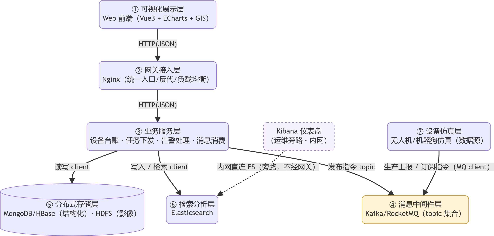
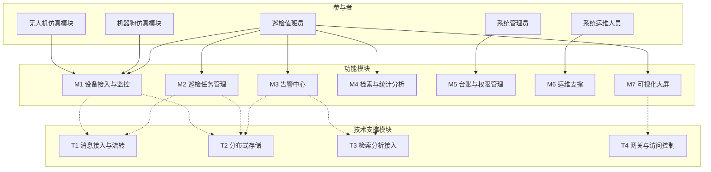
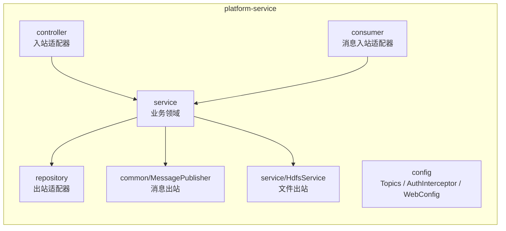
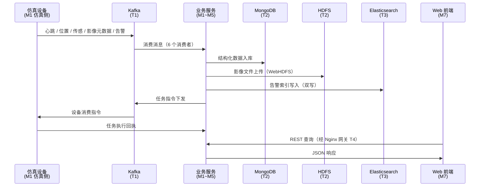
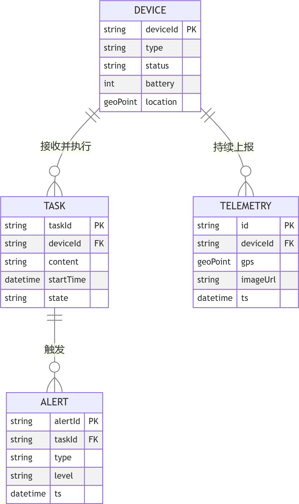
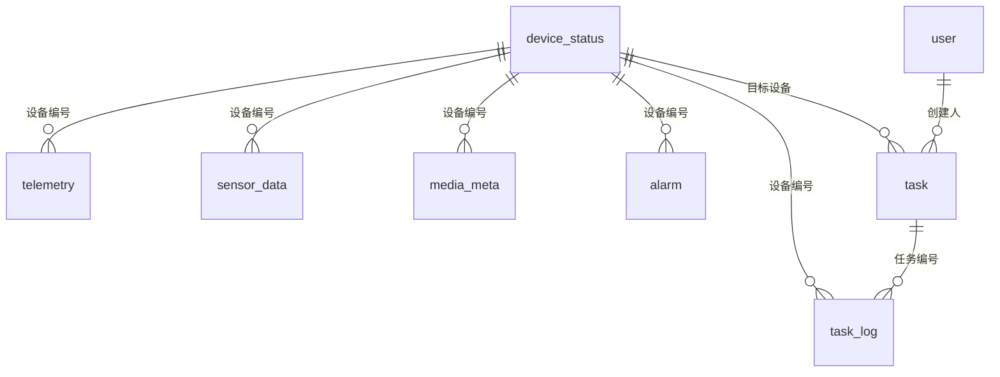
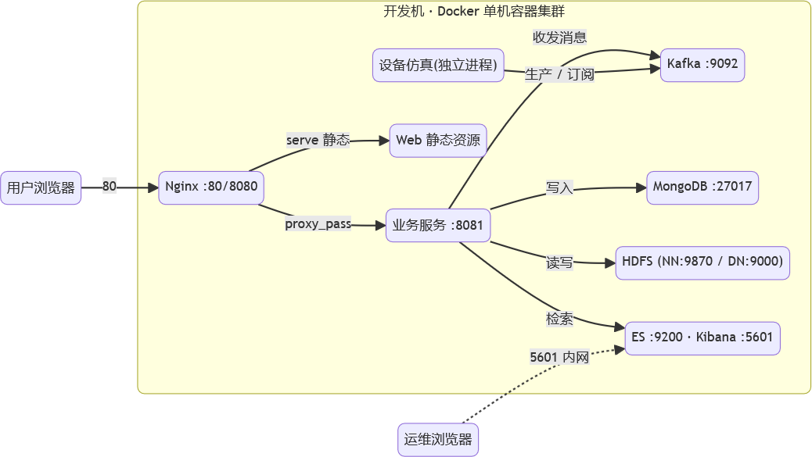

# 第 4 章 系统总体设计

## 4.1 系统设计原则

本系统的设计遵循以下五条原则。

**（1）分层解耦。** 设备仿真、消息中间件、业务服务、分布式存储、检索分析、网关接入与可视化展示各层职责独立，层间以消息或接口交互，不跨层直接调用，降低模块间耦合度。

**（2）数据驱动。** 以"数据上报 → 消息流转 → 分布式存储 / 检索 → 可视化展示"为主线设计系统结构，使数据流向决定组件划分，而非按技术偏好堆叠组件。

**（3）组件完整覆盖。** 架构须完整覆盖课程要求的六类强制组件（HDFS、MongoDB、Kafka、Nginx、Elasticsearch、Docker），体现企业应用集成的学习目标。

**（4）面向扩展。** 消息按业务主题划分、存储读写接口化，便于后续新增设备类型与业务模块；模块边界清晰，为向微服务演进预留空间。

**（5）仿真优先、贴近真实。** 设备以软件仿真实现，但数据格式、消息协议、接口语义贴近真实系统——仿真设备不因"是模拟的"而绕过消息中间件直连数据库。

---

## 4.2 系统总体架构设计

### 4.2.1 分层架构

**图 4-1 系统分层架构图**

> 图片来源：`doc/images/架构分析/分层架构图.png`



**图 4-2 分层架构的纯文本等价表达**

```text
Web 前端 ─HTTP→ Nginx 网关 ─HTTP→ 业务服务 ─读写client→ MongoDB / HDFS / Elasticsearch
业务服务 ─MQ client→ 消息中间件；设备仿真 ─MQ client→ 消息中间件   （均只指向 MQ，无回指）
Kibana ──(内网直连旁路)──→ Elasticsearch
```

**箭头语义说明**：上图是**依赖视图**，箭头表示"前者依赖或调用后者的接口"，只画调用方向、不画响应返回。据此全图为**无环有向图（DAG）**。

### 4.2.2 各层职责与技术要素

**表 4-1 各层职责与技术要素**

| 层次 | 职责 | 承载技术组件 | 关键进出数据 |
| :--- | :--- | :--- | :--- |
| **设备仿真层** | 模拟无人机 / 机器狗注册、心跳、状态、传感与图像元数据产生，作为消息生产者；接收任务指令 | 仿真模块（自研，独立进程） | GPS、传感值、影像元数据、状态上报；任务指令接收 |
| **消息中间件层** | 接收设备上报、下发平台指令；消息生产 / 消费 / 持久化 / 路由 / 分区 | Apache Kafka（KRaft） | 上报消息、指令消息 |
| **业务服务层** | 设备台账、任务解析与下发、告警处理、消息消费、业务逻辑 | Spring Boot 应用 | 结构化业务数据、指令消息 |
| **分布式存储层** | 影像大文件存储；结构化数据存储读写 | Hadoop HDFS；MongoDB | 巡检影像文件；设备 / 任务 / 状态记录 |
| **检索分析层** | 事件与告警索引建立、多条件检索、聚合统计 | Elasticsearch；Kibana（运维旁路） | 索引文档、统计结果 |
| **网关接入层** | 统一对外入口、反向代理、负载均衡、基础安全 | Nginx | HTTP 请求转发 |
| **可视化展示层** | 设备 GIS 分布、状态、任务、告警、检索结果展示 | React 前端（经 Nginx 网关访问） | 业务 JSON、图表 |

### 4.2.3 关于"存在业务闭环但不存在循环依赖"的说明

分层架构图中存在观感上的回环，来源是两条**异步消息链**：

- **上报链**：设备仿真 →（生产消息）→ 消息中间件 →（消费消息）→ 业务服务；
- **下发链**：业务服务 →（发布指令）→ 消息中间件 →（订阅指令）→ 设备仿真。

两条链合并构成了巡检业务的闭环，但在**代码依赖**上，设备仿真与业务服务**各自只持有消息中间件的客户端，互不持有对方接口**，因此不构成循环依赖。消息中间件在此的作用正是把"上报—下发"这个环从直接调用中**切开**。

> **反面说明**：若将"任务下发"实现为业务服务**同步 HTTP 直调**设备仿真端，则业务依赖设备接口、设备又回调业务接口，才会形成真正的依赖环。本设计通过引入消息中间件规避了这一问题。

另外两点需要澄清：

1. 业务服务与检索层之间**只有**"业务服务 → Elasticsearch"的写入与查询方向，Elasticsearch 不反向调用业务服务，故不画双向箭头；
2. Kibana 是 Elasticsearch 的**运维分析旁路**（内网直连），不经过 Nginx 业务网关，不属于 Web 访问链路。

---

## 4.3 技术选型说明

### 4.3.1 选型总览

**表 4-2 技术选型总览**

| 技术域 | 最终选定 | 备选方案（已评估） | 选型要点 |
| :--- | :--- | :--- | :--- |
| 容器化部署 | **Docker Compose** | 裸机 / 虚拟机 | 镜像隔离、一键部署、固定版本规避冲突、单机模拟集群 |
| 分布式文件系统 | **Hadoop HDFS** | MinIO / 对象存储 | 课程强制；专为大文件设计；与大数据生态一体 |
| 分布式数据库 | **MongoDB** | HBase | 文档模型灵活、查询语义贴合、部署轻量 |
| 消息中间件 | **Apache Kafka** | RocketMQ | 高吞吐、持久化可靠、生态资料丰富 |
| 检索引擎 | **Elasticsearch + Kibana** | —（强制） | 全文检索 + 聚合 + 可视化一体 |
| 负载均衡 / 网关 | **Nginx** | —（强制） | 反向代理、负载均衡、高并发成熟可靠 |
| 后端语言 | **Java + Spring Boot** | Python（FastAPI） | 与中间件同生态、客户端与工程化成熟 |
| 前端框架 | **React + Vite + Ant Design + ECharts + Leaflet** | 纯 HTML + JS | 生态最大、企业级组件库成熟、图表与地图能力完整 |

### 4.3.2 关键技术域选型理由

**（1）消息中间件：Kafka 对比 RocketMQ**

| 维度 | Kafka（选定） | RocketMQ（备选） |
| :--- | :--- | :--- |
| 吞吐量 | 极高，分布式日志式设计 | 高 |
| 持久化与顺序 | 分区内有序、磁盘顺序写 | 支持消息轨迹 / 延迟 / 事务消息 |
| 生态与资料 | Apache 生态，与 HDFS / ES 协作资料多 | 阿里系，中文文档友好 |
| 部署形态 | 依赖 ZooKeeper，KRaft 模式可免除 | 内置 NameServer，部署相对简单 |

**选定 Kafka 的理由**：① 设备高频心跳与巡检数据上报是典型的**高吞吐流式数据**场景，契合 Kafka 的设计目标；② 消息持久化与分区内有序能支撑"上报不丢失、指令按序"的需求；③ Kafka 与 HDFS、Elasticsearch 同属 Apache 大数据生态，集成资料丰富；④ KRaft 模式免去 ZooKeeper 依赖，简化单机容器部署。

**（2）分布式数据库：MongoDB 对比 HBase**

| 维度 | MongoDB（选定） | HBase（备选） |
| :--- | :--- | :--- |
| 数据模型 | 文档（BSON），字段灵活 | 宽表（列族），需预先设计 Schema |
| 查询能力 | 支持条件 / 范围 / 聚合查询 | 主键与范围扫描为主，复杂查询弱 |
| 开发迭代 | 快速，适合业务频繁调整 | 较重，适合超大规模型 |
| 部署复杂度 | 单节点或副本集即可运行 | 强依赖 HDFS + ZooKeeper，部署重 |
| 与本项目匹配度 | 按编号 / 时间查询直接映射 | 数据量未达海量级，优势难发挥 |

**选定 MongoDB 的理由**：本项目结构化数据体量适中，查询以"按设备编号、时间范围"为主，MongoDB 的文档模型与查询能力更贴合，开发效率更高。此外 MongoDB 5.0 起提供的**时序集合**特性，恰好解决了遥测数据的存储优化与自动过期问题，这是 HBase 不具备的便利。

**（3）分布式文件系统：HDFS**

巡检影像属于典型的**大文件、写后读为主**场景，符合 HDFS"一次写入、多次读取、高吞吐顺序访问"的定位。MinIO 部署更轻量，但偏离课程考核组件范围，故不作首选。

**（4）后端：Java + Spring Boot**

Kafka、HDFS、Elasticsearch 的官方客户端均为 Java 一等公民，MongoDB 驱动同样成熟。统一采用 Java 技术栈可形成"设备上报 → 消息消费 → 存储写入 → 检索查询"的**一条 Java 技术链**，大幅降低跨语言集成成本与排错难度。

**（5）前端：React 技术栈**

React 生态最大、组件库与资料最丰富；Ant Design 提供企业级后台组件（表格、表单、标签、分页），与设备台账、告警列表等管理场景高度契合；ECharts 负责统计图表；Leaflet 承载设备 GIS 分布展示，可接入高德瓦片底图。

### 4.3.3 生态一致性说明

选定技术整体呈 **Apache / Java / 大数据技术栈**：Kafka、HDFS、Elasticsearch 均为 Java 实现并提供官方 Java 客户端；所有中间件统一以 Docker 镜像交付并固定版本，规避多组件版本兼容风险；存储与检索、消息的衔接点统一收敛在业务服务层，前端仅经 Nginx 访问，保证访问路径清晰可控。

---

## 4.4 模块划分

### 4.4.1 划分依据与方法

本系统按【参与者 + 用例聚类 + 技术支撑】三个维度划分模块，划分遵循两条原则：

**原则一：模块是逻辑单位，不要求是物理单位。** 模块划分回答的是"系统由哪些职责单元构成"，而非"要部署几个进程"。一个模块可以对应一个独立工程，也可以对应一个工程内的若干包——**取决于该模块是否需要独立构建与部署**。

**原则二：按"变化与伸缩的原因"划分，而非按技术种类划分。** 若按技术分层拆分为"消息模块 / 存储模块 / 检索模块"，则每次业务变更都需同时修改多个模块，跨模块联调成本成倍放大。因此本系统以**业务领域**为主线划分模块，技术组件作为跨模块的**支撑层**存在。

据此，系统划分为 **7 个功能模块**（M1~M7）与 **4 个技术支撑模块**（T1~T4）。

### 4.4.2 系统模块划分

**图 4-3 系统模块划分图**



**表 4-3 功能模块划分表**

| 模块 | 覆盖用例 | 面向参与者 | 主要职责 | 交付形态 |
| :--- | :--- | :--- | :--- | :--- |
| **M1 设备接入与监控** | UC-01/02/03/05、UC-11 | A1、A4、A5 | 设备注册、心跳状态维护、上报数据接收、离线检测；实时态势展示 | 仿真模块 + 接入服务 + 前端态势页 |
| **M2 巡检任务管理** | UC-12/13、UC-04 | A1、A4、A5 | 任务创建下发、指令投递、执行跟踪、历史查询 | 后端任务服务 + 前端任务页 |
| **M3 告警中心** | UC-14/15、UC-41 | A1 | 告警自动生成、展示、处置与留痕 | 后端告警服务 + 前端告警页 |
| **M4 检索与统计分析** | UC-16/17、UC-34 | A1、A3 | 事件与告警检索、统计报表 | 检索接口 + 前端 + Kibana |
| **M5 台账与权限管理** | UC-21/22 | A2 | 设备台账、用户角色管理 | 管理后台 |
| **M6 运维支撑** | UC-31/32 | A3 | 健康监控、日志查看 | 运维入口 / 脚本 + Kibana |
| **M7 可视化大屏** | UC-11（联动） | A1 | GIS 地图、态势大屏整合 | 前端大屏 |

**表 4-4 技术支撑模块划分表**

| 模块 | 职责 | 对应用例 |
| :--- | :--- | :--- |
| **T1 消息接入与流转** | 主题规划、生产者与消费者、消息持久化、指令下行 | UC-01/02/03/04/05 |
| **T2 分布式存储** | HDFS 存储大文件；MongoDB 存储结构化数据 | UC-03/12/41 数据落库 |
| **T3 检索分析接入** | ES 索引建立、检索接口、聚合统计 | UC-16/17/34 |
| **T4 网关与访问控制** | Nginx 反向代理、负载均衡、基础安全 | 全局 |

### 4.4.3 模块与实现单元的对应关系

本节说明模块划分如何落到工程结构上，这是理解本系统架构的关键。

**表 4-5 模块与物理实现单元对应表**

| 模块 | 物理实现单元 | 形态 | 说明 |
| :--- | :--- | :--- | :--- |
| **M1 设备接入与监控** | `backend/device-simulator/`（仿真侧）<br>`platform-service` 的 `consumer/`、`service/DeviceService`、`service/TelemetryService`（平台侧） | 独立工程 + 包 | 仿真端代表**系统外部设备**，必须独立进程运行 |
| **M2 巡检任务管理** | `platform-service` 的 `service/TaskService`、`controller/TaskController` | 包 | 平台内部能力 |
| **M3 告警中心** | `platform-service` 的 `service/AlarmService`、`consumer/AlarmConsumer` | 包 | 平台内部能力 |
| **M4 检索与统计分析** | `platform-service` 的 `service/StatsService`、`AlarmService`（ES 部分） | 包 | 平台内部能力 |
| **M5 台账与权限管理** | `platform-service` 的 `service/UserService`、`service/AuthService`、`common/JwtUtil`、`config/AuthInterceptor` | 包 | 平台内部能力 |
| **M6 运维支撑** | `deploy/`（编排与初始化脚本）、`docker-compose.yml` | 配置 | 由容器编排与第三方组件承担 |
| **M7 可视化大屏** | `frontend/` | 独立工程 | 独立构建产物，由 Nginx 托管 |
| **T1 消息接入与流转** | `platform-service` 的 `consumer/`、`common/MessagePublisher`、`config/Topics`；Kafka 容器 | 包 + 容器 | 跨模块支撑 |
| **T2 分布式存储** | `platform-service` 的 `repository/`、`service/HdfsService`；`deploy/init/mongo-init.js`；MongoDB 与 HDFS 容器 | 包 + 容器 + 配置 | 跨模块支撑 |
| **T3 检索分析接入** | `platform-service` 的 `service/AlarmService`（索引）、`service/StatsService`；ES 容器 | 包 + 容器 | 跨模块支撑 |
| **T4 网关与访问控制** | `deploy/nginx/conf.d/default.conf`；nginx 容器 | 配置 + 容器 | 第三方组件，仅需配置 |

> **说明**：7 个功能模块中，**M1（仿真侧）与 M7 为独立工程**，其余以 Spring Boot 应用内的**包结构**落地；技术支撑模块以**包 + 容器 + 配置**形式落地。判断依据是**该模块是否需要独立构建与独立部署**：
>
> - **设备仿真模块必须独立进程**——它代表系统外部参与者（A4/A5），若与平台同一进程，则"设备经消息中间件接入平台"的架构设定不成立；
> - **消息接入、分布式存储、检索分析不独立进程**——它们是平台自身的能力，属于同一业务服务的内部组成，通过包结构区分职责即可。

**图 4-4 平台侧工程内部包结构**



### 4.4.4 模块间依赖关系与数据流

**图 4-5 模块间数据流图**



**依赖方向原则**：功能模块依赖技术支撑模块，**反向不依赖**。即 T1~T4 不感知具体业务，仅提供通用能力（消息收发、数据持久化、索引检索、请求转发），因此可被所有功能模块复用。

### 4.4.5 关于服务拆分粒度的设计说明

本系统业务服务层采用**模块化单体（Modular Monolith）** 架构：单个 Spring Boot 应用，内部按业务领域划分为设备、任务、告警、影像、统计、认证等子模块，模块间通过接口调用解耦，**具备向微服务演进的基础**。

不拆分为独立微服务进程的工程依据如下：

**（1）拆分判据。** 服务拆分的判据是模块间**伸缩特征、变化速率、可靠性诉求**存在显著差异，而非技术种类不同。就当前系统规模而言，各业务模块的上述特征尚未分化到需要独立部署的程度。

**（2）性能实测依据。** 本项目完成的容量压测实验表明：系统的实际瓶颈位于**消息中间件的分区数**（所有业务主题分区数为 1，消费并行度被物理限制为 1），而非业务服务的计算能力。**在当前瓶颈未消除前，拆分业务服务并不能提升系统吞吐。**

**（3）演进策略。** 业界主流实践主张先确立正确的模块边界，再依据实际压力逐步物理拆分。模块化单体阶段的核心任务是把边界画对——边界正确时，后续拆分是"搬迁代码"；边界错误时，拆分等同于"重写"。

**（4）演进路径。** 系统后续的微服务化路径、拆分优先级，以及配套需解决的治理问题（分区倾斜、背压流控、网络超时与熔断、幂等机制升级），已纳入本报告第 7 章"后续改进与展望"。

---

## 4.5 数据库设计

### 4.5.1 MongoDB 数据表设计

项目在 MongoDB 中建立 `uav_platform` 数据库，共 9 个集合，按数据特征分为三类。

**图 4-6 数据库 ER 图**



**ER 关系的 Mermaid 表达**（便于编辑维护）：



**表 4-6 集合设计总表**

| 集合名 | 类型 | 用途 | 关键字段 | 主要索引 | TTL |
| :--- | :--- | :--- | :--- | :--- | :--- |
| `device_status` | 普通 | 设备台账与最新状态 | `_id`(deviceNo)、deviceType、status、battery、lastHeartbeatTime、onlineSinceTime、enabled | `{status:1}` | 无 |
| `telemetry` | **时序** | 巡检轨迹（GPS） | eventTime(Date)、deviceNo(meta)、lat、lng、altitude、speed、heading | 时序自动索引 | 7 天 |
| `sensor_data` | **时序** | 环境传感器读数 | eventTime(Date)、deviceNo(meta)、temperature、humidity、gasValue、deviceTemp | 时序自动索引 | 7 天 |
| `task_log` | **时序** | 任务回执流水 | eventTime(Date)、deviceNo(meta)、taskId、stage、progress、remark | `{taskId:1}` | 7 天 |
| `alarm` | 普通 | 告警明细（权威数据） | `_id`(alarmId)、deviceNo、alarmType、level、lat、lng、handleStatus、eventTime | `{alarmType:1,eventTime:-1}`、`{handleStatus:1}` | 无 |
| `media_meta` | 普通 | 影像元数据 | `_id`(fileId)、deviceNo、fileType、size、hdfsPath、uploaded、lat、lng、eventTime | `{uploaded:1}` | 无 |
| `task` | 普通 | 任务台账（当前状态） | `_id`(taskId)、taskType、deviceNo、status、progress、createBy、dispatchTime、dispatchCount | `{status:1,createTime:-1}`、`{deviceNo:1,createTime:-1}` | 无 |
| `user` | 普通 | 用户与角色 | `_id`(username)、passwordHash、realName、role、enabled | 无 | 无 |
| `counter` | 普通 | 原子计数器（编号生成） | `_id`(如 `task-20260917`)、seq | 无 | 无 |

**关键设计说明**：

**（1）时序集合用于遥测类数据。** `telemetry`、`sensor_data`、`task_log` 三个集合采用时序集合，指定 `timeField=eventTime`、`metaField=deviceNo`、`granularity=seconds`，并配置 7 天 TTL 自动过期。其收益在于：同设备相邻时间的数据被压缩存于同一"桶"中，显著降低存储占用与索引体积；TTL 机制使历史数据无需人工清理。

**（2）台账与流水分离。** `task` 与 `task_log` 分别承载"任务的当前状态"与"任务执行的历史流水"。前者会被频繁更新（进度推进、状态流转），适合普通集合；后者是只追加的时间序列，适合时序集合并可自动过期。这一分离体现了读写模型分离（CQRS）的简化实践。

**（3）编号由数据库原子生成。** `task` 集合的主键 `taskId` 采用 `TASK-{日期}-{当日序号}` 格式，序号由 `counter` 集合通过 `findAndModify` 原子自增生成。相比使用时间戳，该方案可保证跨进程、跨重启的唯一性，避免并发场景下的编号碰撞。

**（4）索引按查询模式设计。** `alarm` 集合建立 `{alarmType:1, eventTime:-1}` 复合索引以支撑"按类型筛选 + 按时间排序"；`task` 集合建立 `{status:1, createTime:-1}` 与 `{deviceNo:1, createTime:-1}` 支撑列表页的常见筛选组合。

### 4.5.2 Elasticsearch 索引设计

**表 4-7 ES 索引设计表**

| 项 | 设计 |
| :--- | :--- |
| 索引命名 | `alarm-YYYY.MM.dd`（如 `alarm-2026.09.16`） |
| 滚动策略 | **按天滚动**，每日自动创建新索引 |
| 文档主键 | `_id = alarmId`（与 MongoDB 中的告警编号一致） |
| 检索方式 | `bool.filter` + `term` 组合（过滤型检索，不计算相关性得分） |
| 聚合方式 | `terms`（按类型 / 级别分组）、`date_histogram`（按时间分桶） |

**字段设计**：

| 字段 | 建议类型 | 说明 |
| :--- | :--- | :--- |
| alarmId | keyword | 告警编号（作为 `_id`） |
| deviceNo | keyword | 设备编号 |
| alarmType | keyword | 告警类型（INTRUSION / SUSPICIOUS / ENV / OVERHEAT / FAULT / FENCE） |
| level | keyword | 告警级别（INFO / WARN / CRITICAL） |
| description | text | 告警描述 |
| lat / lng | geo_point | 地理坐标（需通过索引模板显式定义） |
| eventTime | date | 发生时间 |
| handleStatus | keyword | 处置状态 |

**设计说明**：

**（1）按天滚动索引的收益。** 告警数据随时间持续增长，若集中在单一索引中会导致体积膨胀、查询性能下降且不便清理。按天切分后，单个索引体积可控，历史数据可按时间范围整体归档或删除。

**（2）`_id` 设为告警编号的意义。** 由于 `_id` 在索引内唯一，重复写入同一 `alarmId` 会执行为**覆盖更新**而非新增。这使得 ES 写入天然具备幂等性——即便消息被重复消费，也不会产生重复的检索文档。

**（3）MongoDB 与 ES 的分工。** 两者采用**双写**策略，但定位不同：MongoDB 存权威明细，负责告警处置状态的更新；Elasticsearch 存检索副本，负责多条件检索与聚合统计。**以 MongoDB 为准，ES 数据可随时重建**——这一约定明确了冲突时的处理原则。系统坚持"业务查询走 MongoDB、聚合统计走 Elasticsearch"，使两者各展所长。

---

## 4.6 部署方案设计

### 4.6.1 部署形态

依据课程指导说明"不要求物理多机集群，单机 Docker 容器模拟多节点集群即可"，本项目采用 **Docker Compose 单机容器编排**。

**部署形态的关键特征：设备侧与平台侧分离**——仿真端代表园区中真实的无人机与机器狗（系统外部设备），在宿主机上作为独立进程运行；平台侧则以 Docker Compose 统一编排。

**图 4-7 部署拓扑图**



**部署拓扑（文字等价表达）**：

```text
═══════════════ 设备侧（宿主机独立运行）═══════════════
   device-simulator  仿真端（Java 进程）
    ├─ 3 台无人机：心跳 / GPS 轨迹 / 航拍影像元数据 / 告警
    └─ 3 台机器狗：心跳 / 位置 / 环境传感器 / 红外影像 / 告警
                          │
                     Kafka（7 个主题）
                          ▼
═══════════════ 平台侧（Docker Compose 编排，8 容器）═══════════════
   Nginx(80) ──┬── 前端静态资源（React 构建产物）
               └── /api ──→ platform-service(8080)
                                  │
                    ┌─────────────┼──────────────┬─────────────┐
                    ▼             ▼              ▼             ▼
                MongoDB      Elasticsearch      HDFS        Kafka
              （明细/状态）   （告警索引检索）  （影像文件）  （消费消息）
                    │
                    └── task     任务台账（当前状态，可更新）
                        task_log 回执流水（时序集合，只追加）
```

### 4.6.2 容器清单

**表 4-8 容器清单**

| 容器名 | 镜像 / 构建 | 集群角色 | 端口映射 | 说明 |
| :--- | :--- | :--- | :--- | :--- |
| `hadoop-namenode` | `bde2020/hadoop-namenode:3.2.1` | NameNode | 9870、9000→8020 | 影像存储的元数据节点 |
| `hadoop-datanode` | `bde2020/hadoop-datanode:3.2.1` | DataNode | 9864 | 影像数据节点（副本数 1） |
| `mongodb` | `mongo:8.3.9` | 单节点（可扩副本集） | 27017 | 结构化数据存储 |
| `kafka` | `apache/kafka:4.3.1` | Broker + Controller（KRaft） | 19092→9092 | 消息中间件，配置双 listener |
| `elasticsearch` | `elasticsearch:9.5.3` | 单节点 | 9200 | 告警索引与检索 |
| `kibana` | `kibana:9.5.3` | 单实例 | 5601 | 检索可视化（运维旁路） |
| `platform-service` | 本项目 Dockerfile 构建 | 业务服务 | 仅容器内 8080 | 消息消费 + 存储写入 + REST 接口 |
| `nginx-gateway` | `nginx:1.30-alpine` | 反向代理 / 静态托管 | 80 | 统一对外入口 |
| （设备仿真端） | 宿主机 Java 进程 | — | 无 | **不容器化**，代表外部设备 |

### 4.6.3 配置策略：同一份代码、两套地址

系统采用"**同一份代码、两套地址**"的配置策略：

- **本地开发**使用配置文件中的默认值（`localhost:xxxx`），便于在 IDE 中直接调试；
- **容器运行**通过环境变量覆盖为**服务名**（`kafka:9092`、`mongodb:27017`、`hadoop-namenode:9870`），由 Docker 内建 DNS 完成解析。

这一策略使平台服务无需为不同环境维护两套代码或两套配置文件。

**表 4-9 环境变量覆盖清单**

| 环境变量 | 本地默认值 | 容器内取值 |
| :--- | :--- | :--- |
| `SPRING_MONGODB_URI` | `mongodb://localhost:27017/uav_platform` | `mongodb://mongodb:27017/uav_platform` |
| `SPRING_KAFKA_BOOTSTRAP_SERVERS` | `localhost:19092` | `kafka:9092` |
| `ES_BASE_URL` | `http://localhost:9200` | `http://elasticsearch:9200` |
| `HDFS_WEBHDFS_BASE` | `http://localhost:9870` | `http://hadoop-namenode:9870` |

### 4.6.4 启动顺序

启动顺序按依赖导向组织：

```text
HDFS / MongoDB / Kafka / Elasticsearch  →  platform-service  →  Nginx
        （基础设施）                          （业务服务）      （网关与前端）
```

`docker-compose.yml` 中已通过 `depends_on` 声明主要依赖关系。

---

## 4.7 本章小结

本章完成了系统的总体设计：

**架构设计**，采用七层分层架构，明确了各层职责与技术要素。特别说明了架构中"存在业务闭环但不存在循环依赖"的原因——消息中间件将"上报—下发"这个环从直接调用中切开，使得设备侧与平台侧在代码依赖上互不持有对方接口，全图构成无环有向图。

**技术选型**，对容器化、文件系统、数据库、消息中间件、检索引擎、网关、后端语言、前端框架逐项进行了方案比选，并说明了选型的生态一致性考量——形成一条完整的 Java 技术链。

**模块划分**，按【参与者 + 用例聚类 + 技术支撑】划分了 7 个功能模块与 4 个技术支撑模块，并阐明了"模块是逻辑单位而非物理单位"的原则，给出了模块与物理实现单元的对应关系。

**数据库设计**，设计了 MongoDB 的 9 个集合（含 3 个时序集合）与 Elasticsearch 的按天滚动索引，并说明了台账与流水分离、编号原子生成、MongoDB 与 ES 双写分工等关键设计取舍。

**部署方案**，采用 Docker Compose 单机编排 8 个容器，明确了设备侧与平台侧分离的部署形态，以及"同一份代码、两套地址"的配置策略。
