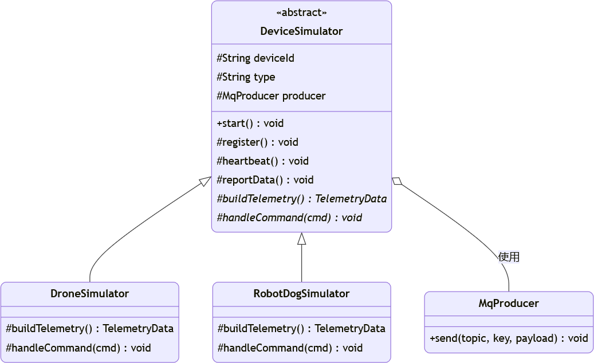
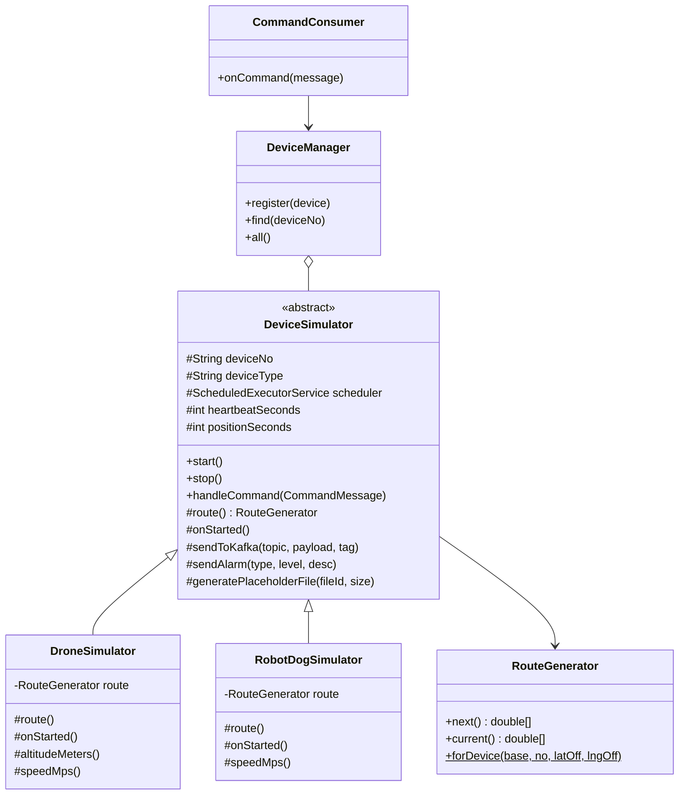
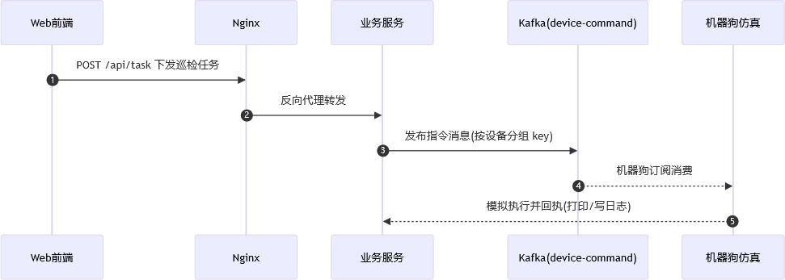
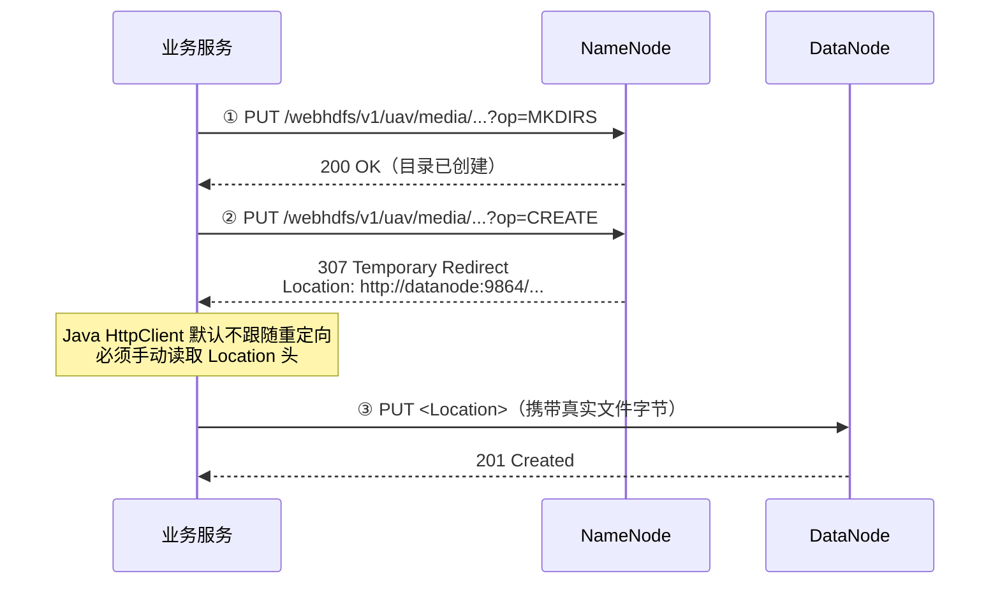
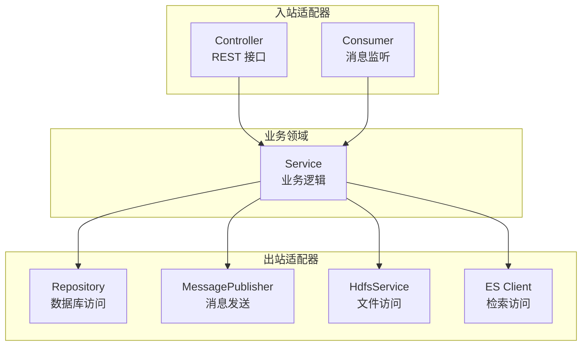
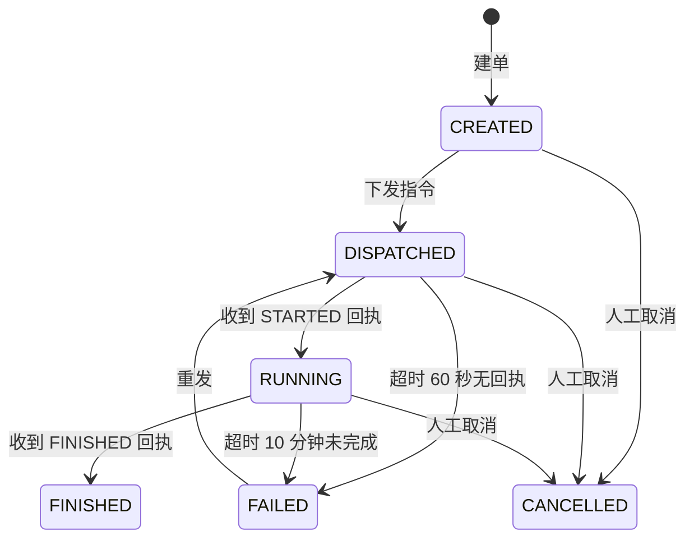

# 第 5 章 系统详细设计与实现

## 5.1 开发与运行环境说明

**表 5-1 开发与运行环境**

| 类别 | 项目 | 版本 / 配置 |
| :--- | :--- | :--- |
| **开发环境** | 操作系统 | Windows 11 |
| | JDK | OpenJDK 17 |
| | 构建工具 | Maven（Maven Wrapper） |
| | IDE | IntelliJ IDEA |
| | Node.js | 18+（前端构建） |
| **运行环境** | 容器引擎 | Docker Desktop（WSL2 后端） |
| | 容器编排 | Docker Compose |
| | 主机配置 | 20 物理核 / 28 逻辑核 / 15.8 GB 内存 |
| | Docker 资源配额 | 28 CPU + 8 GB 内存 |
| **组件版本** | 消息中间件 | Apache Kafka 4.3.1（KRaft 模式） |
| | 分布式数据库 | MongoDB 8.3.9 |
| | 分布式文件系统 | Hadoop 3.2.1（NameNode + DataNode） |
| | 检索引擎 | Elasticsearch 9.5.3 + Kibana 9.5.3 |
| | 网关 | Nginx 1.30-alpine |
| **框架版本** | 后端框架 | Spring Boot 4.0.7（Java 17） |
| | 前端框架 | React 19 + Vite + Ant Design 6 |
| | 可视化库 | ECharts、Leaflet（高德瓦片底图） |

---

## 5.2 各模块详细实现

### 5.2.1 无人机、机器狗仿真模块实现

#### （1）模块结构

仿真模块是一个独立运行的 Spring Boot 应用，代表系统外部的无人机与机器狗设备。其类结构采用**模板方法模式**：

**图 5-1 设备仿真模块类图**



**类结构的 Mermaid 表达**（便于编辑维护）：



**设计要点**：父类 `DeviceSimulator` 定义了所有设备的**共性骨架**——身份信息、生命周期、心跳、位置、告警、指令处理与回执；子类只需实现**个性部分**——`route()` 提供路线、`onStarted()` 注册特色任务、`altitudeMeters()` 与 `speedMps()` 提供运动参数。这一设计使得新增设备类型（如固定摄像头）只需实现少量方法。

#### （2）生命周期与任务调度

设备的"存活"本质上是若干周期性任务在持续触发。调度骨架如下：

```java
public void start() {
    log.info("设备 {} ({}) 启动：心跳 {} 秒 / 位置 {} 秒",
            deviceNo, deviceType, heartbeatSeconds, positionSeconds);

    schedule(this::safeSendHeartbeat, 0, heartbeatSeconds);   // 心跳
    schedule(this::safeSendPosition, 1, positionSeconds);     // 位置

    onStarted();      // 子类注册特色任务（传感器 / 影像）
}

/** 周期任务统一登记，便于 stop() 精确取消 */
protected void schedule(Runnable task, long initialDelaySeconds, long periodSeconds) {
    periodicTasks.add(scheduler.scheduleAtFixedRate(
            task, initialDelaySeconds, periodSeconds, TimeUnit.SECONDS));
}
```

各设备的任务数量与周期：

**表 5-2 设备任务与消息速率**

| 设备类型 | 任务数 | 心跳 | 位置 | 传感器 | 影像 | 单台速率 |
| :--- | ---: | ---: | ---: | ---: | ---: | ---: |
| 无人机 | 3 | 5 s | 2 s | — | 10 s | 0.80 条/秒 |
| 机器狗 | 4 | 5 s | 3 s | 3 s | 12 s | 0.95 条/秒 |

**关键设计：全局共享线程池。** 项目初期每台设备在构造时各自创建一个 4 线程池，导致**线程数随设备数线性增长**——500 台设备将产生约 1750 个平台线程，仅线程栈就占用约 1.75 GB 虚拟内存，上下文切换开销先于业务瓶颈把机器拖垮。

改造后采用**全局共享调度池**：

```java
@Bean(destroyMethod = "shutdown")
public ScheduledExecutorService deviceScheduler(SimulatorSettings settings) {
    int threads = settings.getSchedulerThreads() > 0
            ? settings.getSchedulerThreads()
            : Math.max(4, Runtime.getRuntime().availableProcessors());

    return Executors.newScheduledThreadPool(threads, runnable -> {
        Thread t = new Thread(runnable, "sim-sched-" + seq.getAndIncrement());
        t.setDaemon(false);      // 非守护：保证设备任务在跑时 JVM 不退出
        return t;
    });
}
```

**表 5-3 共享线程池改造前后对比**

| 设备总数 | 任务总数 | 改造前线程数 | 改造后线程数 |
| ---: | ---: | ---: | ---: |
| 6 | 21 | 21 | 28（恒定） |
| 100 | 350 | 350 | 28 |
| 500 | 1750 | **1750** | **28** |

> **注意**：共享池的线程必须设为**非守护线程**。本工程不是 Web 应用（不监听端口），JVM 的存活完全依赖调度池中的线程；若线程全部为守护线程，主线程结束后 JVM 会立即退出。
>
> **另一个设计要点**：`stop()` 方法**只取消本设备登记的任务**，绝不能调用共享池的 `shutdown()`——否则会停掉所有其他设备。

#### （3）指令接收与幂等处理

设备订阅下行指令主题，收到任务指令后分三个阶段模拟执行并回执：

```java
public void handleCommand(CommandMessage cmd) {
    // 幂等保护：同一条指令（msgId）只执行一次
    if (!processedMsgIds.add(cmd.msgId())) {
        log.warn("[{}] 指令 {} 已执行过，忽略重复投递", deviceNo, cmd.msgId());
        return;
    }

    scheduleOnce(() -> sendTaskAck(cmd.taskId(), "STARTED",  0, "任务开始执行"), 1);
    scheduleOnce(() -> sendTaskAck(cmd.taskId(), "PROGRESS", 50, "执行中"),       4);
    scheduleOnce(() -> sendTaskAck(cmd.taskId(), "FINISHED", 100, "任务执行完成"), 8);
}
```

**为什么需要幂等**：消息中间件只保证"至少一次"投递语义，消费者重启、网络重试都可能导致同一条指令被投递多次。若不加保护，设备会重复执行同一任务。此处以 `msgId` 作为去重键，用线程安全的集合实现——**这是"幂等设计本身正确，但依赖 ID 唯一性"的典型场景**（相关缺陷见 5.3 节问题 7）。

#### （4）路线生成与设备分散

若所有设备使用同一条路线，会出现坐标完全重叠的问题。`RouteGenerator.forDevice()` 通过**网格化偏移**解决：

```java
private static final int GRID_COLUMNS = 32;

public static RouteGenerator forDevice(double[][] baseRoute, String deviceNo,
                                       double latOffsetPerDevice, double lngOffsetPerDevice) {
    int idx = parseSeq(deviceNo) - 1;
    int row = idx / GRID_COLUMNS;
    int col = idx % GRID_COLUMNS;
    return new RouteGenerator(shift(baseRoute,
            row * latOffsetPerDevice, col * lngOffsetPerDevice), idx);
}
```

**为什么用网格而非线性偏移**：初期实现使用 `(序号-1) × 偏移量`，偏移量随编号线性增长——1000 号设备的纬度偏移达到 `999 × 0.0015° ≈ 166 km`，设备会被"撒"到几百公里外，地图上完全看不到园区。改为网格后，最大偏移恒定在 32 格以内（约 5 km，园区周边范围）。

---

### 5.2.2 消息中间件生产者消费者实现

#### （1）主题规划

**图 5-5 消息生产消费时序图**



系统共规划 7 个主题，按业务用途划分：

**表 5-4 主题设计表**

| # | 主题名 | 方向 | 消息内容 | 分区数 | 可靠性要求 |
| :--- | :--- | :--- | :--- | ---: | :--- |
| 1 | `topic_device_heartbeat` | 上行 | 心跳（电量、状态） | 1 | 中 |
| 2 | `topic_device_gps` | 上行 | 位置坐标 | 1 | 低（允许偶发丢失） |
| 3 | `topic_device_sensor` | 上行 | 环境传感读数 | 1 | 中 |
| 4 | `topic_device_media_meta` | 上行 | 影像元数据 | 1 | 中 |
| 5 | `topic_device_alarm` | 上行 | 告警事件 | 1 | **高** |
| 6 | `topic_device_task_ack` | 上行 | 任务执行回执 | 1 | **高** |
| 7 | `topic_platform_command` | **下行** | 任务指令 | 3 | **高** |

**分区键设计**：所有消息以 `deviceNo` 作为分区键。消息中间件只保证**分区内有序**，以设备编号作键可确保同一设备的消息路由至固定分区，从而实现"同源消息有序"。

#### （2）生产者：统一出口

平台侧所有下行消息通过统一出口发送，集中处理序列化、发送、日志与异常：

```java
@Component
public class MessagePublisher {
    public void publish(String topic, String key, Object payload) {
        try {
            String json = jsonMapper.writeValueAsString(payload);
            kafkaTemplate.send(topic, key, json);
            log.info("[MQ] → {} | key={}", topic, key);
        } catch (Exception e) {
            log.error("[MQ] 发送失败 {}: {}", topic, e.getMessage());
            throw new IllegalStateException("消息发送失败: " + topic, e);
        }
    }
}
```

设备侧的生产统一走 `sendToKafka()`，序列化后以 `deviceNo` 为键发送。

#### （3）消费者：入站适配器

平台侧共 6 个消费者类，每个监听一个上行主题，职责是"解析消息 → 交给对应的业务服务"：

```java
@KafkaListener(topics = Topics.DEVICE_TASK_ACK)
public void onTaskAck(String message) {
    try {
        TaskAckMessage msg = jsonMapper.readValue(message, TaskAckMessage.class);
        taskLogService.add(msg);          // ① 追加回执流水（时序集合）
        taskService.applyAck(msg);        // ② 推进任务状态机
    } catch (Exception e) {
        log.error("[任务回执消费] 处理失败: {}", e.getMessage());
    }
}
```

**设计要点**：消费者只做协议转换与路由，不含业务逻辑——业务处理全部下沉至 Service 层。这样做的收益是：消费逻辑与业务逻辑可独立测试，且更换消息中间件时只需改造消费者。

#### （4）海量遥测数据的攒批写入

对于高频遥测数据，逐条写入数据库会产生大量网络往返。系统采用**攒批 + 超时兜底**模式：

```java
private static final int BATCH_SIZE = 100;        // 攒够 100 条写一次
private final List<TelemetryDoc> buffer = new ArrayList<>(BATCH_SIZE);

public synchronized void add(GpsMessage gps) {
    TelemetryDoc doc = toDoc(gps);
    buffer.add(doc);
    if (buffer.size() >= BATCH_SIZE) {
        flush();
    }
}

/** 定时兜底：每 2 秒把缓冲区剩余数据写掉，避免低峰期长期不落库 */
@Scheduled(fixedRate = 2000)
public synchronized void flushByTime() {
    flush();
}

private void flush() {
    if (buffer.isEmpty()) return;
    int size = buffer.size();
    mongoTemplate.insert(buffer, TelemetryDoc.class);   // 一次往返写 N 条
    buffer.clear();
    log.info("[批量写入] 轨迹数据 {} 条已入库", size);
}
```

**双保险设计的意义**：仅有批量阈值时，低峰期数据会长时间停留内存；加上定时兜底后，无论消息量高低，数据都能在 2 秒内落库。`synchronized` 保证多线程消费下缓冲区的安全。

---

### 5.2.3 HDFS 文件存储实现

#### （0）职责划分：设备负责写入，平台负责读取

本项目对影像的读写作了明确分工：

| 方向 | 由谁负责 | 实现位置 |
| :--- | :--- | :--- |
| **写入** | **设备**（仿真端） | `device-simulator` 的 `storage/StorageClient.java` |
| **读取** | **平台**（业务服务） | `platform-service` 的 `service/HdfsService.java` |

**为什么这样分工**：项目初期采用"设备上报本地路径 → 平台读文件 → 平台上传"的方式，
这隐含了"平台能访问设备文件系统"这一**不成立的前提**——现实中设备与平台只有网络相连。
该设计迫使平台靠"正则剥离路径前缀"绕过环境差异（详见 5.3 节问题 5）。

改造后影像**由设备自己上传**，消息中只携带 `storageRef`（存储引用），平台不再接触任何
设备本地路径。**详细分析见《[../架构分析/影像文件通道设计.md](../架构分析/影像文件通道设计.md)》。**

> **两条通道分离**：设备通过**消息通道**上报元数据、通过**文件通道**上传影像本体。
> 分离的意义不只是"大文件不挤占消息通道"，更在于**两者的故障域被隔开**——
> 消息通道拥堵不影响影像上传，存储故障也不影响状态上报。

#### （1）技术选择：WebHDFS 而非 Hadoop Java Client

HDFS 提供三类访问方式，本项目选择 **WebHDFS REST**：

| 方式 | 本项目是否采用 | 原因 |
| :--- | :--- | :--- |
| `docker exec` 命令行 | ❌ 已废弃 | 容器化后业务服务容器内**没有 docker 客户端**，无法从容器内指挥宿主机 |
| Hadoop Java Client | ❌ 未采用 | 需引入 `hadoop-client`（数十 MB 依赖树）并配置 `core-site.xml`，对只需"上传/下载"两个功能的场景过重 |
| **WebHDFS REST** | ✅ **采用** | 标准 HTTP 协议、语言无关、不依赖任何命令行工具 |

#### （2）核心实现：307 重定向的处理

WebHDFS 的写入过程体现了 HDFS **元数据与数据分离**的架构特征：

**图 5-2 WebHDFS 文件写入时序图**



**关键代码**：

```java
// ② 请求创建文件，期望得到 307
HttpRequest createReq = HttpRequest.newBuilder()
        .uri(URI.create(webhdfsBase + "/webhdfs/v1" + hdfsPath + "?op=CREATE&overwrite=true"))
        .PUT(HttpRequest.BodyPublishers.noBody())
        .build();
HttpResponse<String> createResp = httpClient.send(createReq, HttpResponse.BodyHandlers.ofString());
if (createResp.statusCode() != 307) {
    log.error("[HDFS] CREATE 未返回重定向: {}", createResp.statusCode());
    return false;
}

// ③ 手动读取 Location 头，把真实数据 PUT 到 DataNode
String location = createResp.headers().firstValue("Location")
        .orElseThrow(() -> new IllegalStateException("响应缺少 Location 头"));
HttpRequest putReq = HttpRequest.newBuilder()
        .uri(URI.create(location))
        .PUT(HttpRequest.BodyPublishers.ofByteArray(data))
        .build();
HttpResponse<String> putResp = httpClient.send(putReq, HttpResponse.BodyHandlers.ofString());
return putResp.statusCode() == 201;
```

**为什么必须手动跟随重定向**：Java 的 `HttpClient.newHttpClient()` 默认 `followRedirects = NEVER`。更重要的是，**这个 307 并非实现细节，而是 HDFS 架构的必然结果**——NameNode 只负责元数据，数据必须由客户端直接写入 DataNode，否则 NameNode 将成为整个集群的瓶颈与单点。

#### （3）存储路径规范

```java
private static final String BASE_DIR = "/uav/media";
// 最终路径：/uav/media/{设备编号}/{yyyyMMdd}/{fileId}.jpg
```

**为什么按设备与日期分区**：HDFS 的 NameNode 将整个目录树元数据存放在内存中。若所有文件堆积在单一目录下，百万级条目会耗尽 NameNode 内存，且列目录操作极其缓慢。按 `设备 / 日期` 两级分区后，单目录文件数可控；清理时可整目录删除；排查时也可直接从路径读出数据来源与时间。

#### （4）元数据与文件的关联

影像采用"**元数据入数据库、文件入存储**"的分离存储。**上传成功后才发送消息**，因此平台侧只需一次写入：

**设备端**（`StorageClient` + `DroneSimulator.sendMediaMeta()`）：

```java
// ① 生成影像，本地暂存
String localPath = generatePlaceholderFile(fileId, size);

// ② 设备自己上传到存储，拿到存储引用
String storageRef = storageClient.upload(localPath, deviceNo, fileId);
if (storageRef == null) {
    log.warn("[{}] 影像上传失败，本次跳过上报", deviceNo);
    return;                      // ← 上传失败则不发消息
}

// ③ 发消息：只带存储引用，不含任何本地路径
MediaMetaMessage msg = new MediaMetaMessage(
        "MED-" + deviceNo + "-" + now, deviceNo, fileId, "JPG",
        size, storageRef, point[0], point[1], now);
sendToKafka(TOPIC_MEDIA_META, msg, "航拍影像元数据已上报");
```

**平台端**（`MediaService.handleMediaMeta()`）：

```java
public void handleMediaMeta(MediaMetaMessage msg) {
    MediaDoc doc = new MediaDoc();
    doc.setFileId(msg.fileId());
    doc.setDeviceNo(msg.deviceNo());
    doc.setStorageRef(msg.storageRef());     // 直接采用设备给出的存储引用
    // ……其余字段
    doc.setUploaded(true);                   // 设备上传成功才会发消息
    mediaRepository.save(doc);               // 只写一次，无 HDFS 调用
}
```

**设计要点——为什么"先上传、后发消息"**：

> 若先发消息后上传，一旦上传失败，平台就会留下"**有元数据、无文件**"的记录——
> 检索时能看到这条影像，点开却读不到文件。
> **把顺序反过来，就让这种不一致状态无法产生。**

这相较改造前的"平台先落库（`uploaded=false`）→ 平台上传 → 回填"方案，
**由上传方（设备）保证顺序**，平台侧一次写入即可，逻辑更简单也更可靠。

**为什么图片不走消息中间件**：图片是 MB 级大文件，若通过消息传递会严重拖垮中间件
（消息体积、磁盘占用、网络带宽都会被挤占）。因此采用"**元数据走消息通道、文件走文件通道**"
的分离方案，两者通过 `fileId` 与 `storageRef` 关联——这是本项目最重要的设计决策之一。

---

### 5.2.4 分布式数据库业务数据读写实现

#### （1）时序集合的创建

遥测类数据采用 MongoDB 时序集合，通过初始化脚本创建：

```javascript
db.createCollection('telemetry', {
  timeseries: {
    timeField: 'eventTime',     // 时间字段（必须是 Date 类型）
    metaField: 'deviceNo',      // 元数据字段（同设备归一组，便于压缩）
    granularity: 'seconds'
  },
  expireAfterSeconds: 604800    // 7 天后自动删除
});
```

**三个参数的作用**：

| 参数 | 作用 |
| :--- | :--- |
| `timeField` | 指定时间字段，**必须是 BSON Date 类型**，是分桶的依据 |
| `metaField` | 指定归组字段，同源数据被压缩进同一批桶中 |
| `granularity` | 声明数据点的时间粒度，影响分桶的时间跨度 |
| `expireAfterSeconds` | 文档自动过期时长，免去人工清理 |

**踩坑提示**：`timeField` 必须是 `Date` 类型。若写入 long 型时间戳，会报错 `'eventTime' must be present and contain a valid BSON UTC datetime value`。因此入库前需做类型转换：

```java
doc.setEventTime(new Date(msg.eventTime()));   // long → Date
```

#### （2）批量写入

如 5.2.2 节所述，遥测数据采用"攒批 + 超时兜底"写入。相比逐条 `save()`，批量 `insert()` 将 N 次网络往返压缩为 1 次，是高吞吐场景的关键优化。

#### （3）多条件动态查询

告警列表支持状态、设备、类型、级别、时间范围五个条件的任意组合。实现上使用动态条件拼接：

```java
public Map<String, Object> queryAlarms(String status, String deviceNo, String alarmType,
                                       String level, Long startTime, Long endTime,
                                       int page, int size) {
    List<Criteria> conditions = new ArrayList<>();

    if (status != null && !status.isBlank() && !"ALL".equals(status)) {
        conditions.add(Criteria.where("handleStatus").is(status));
    }
    if (deviceNo != null && !deviceNo.isBlank()) {
        conditions.add(Criteria.where("deviceNo").is(deviceNo));
    }
    if (alarmType != null && !alarmType.isBlank()) {
        conditions.add(Criteria.where("alarmType").is(alarmType));
    }
    if (startTime != null) {
        conditions.add(Criteria.where("eventTime").gte(startTime));
    }
    if (endTime != null) {
        conditions.add(Criteria.where("eventTime").lte(endTime));
    }

    Query query = new Query();
    if (!conditions.isEmpty()) {
        query.addCriteria(new Criteria().andOperator(conditions.toArray(new Criteria[0])));
    }

    long total = mongoTemplate.count(query, AlarmDoc.class);
    query.with(Sort.by(Sort.Direction.DESC, "eventTime"))
         .skip((long) Math.max(page - 1, 0) * size)
         .limit(size);

    Map<String, Object> resp = new LinkedHashMap<>();
    resp.put("total", total);
    resp.put("items", mongoTemplate.find(query, AlarmDoc.class));
    return resp;
}
```

**设计要点**：

- **动态条件拼接**：只把非空条件加入 `andOperator`，避免为每种条件组合编写独立的查询方法；
- **服务端分页**：采用 `skip/limit` 分页并返回总数。项目初期曾一次性返回全部告警（1600+ 条），导致响应体达 352 KB、前端渲染卡顿，改为服务端分页后解决；
- **配套索引**：为 `handleStatus`、`alarmType + eventTime` 建立了索引支撑上述查询（见 4.5.1 节）。

#### （4）台账与流水分离

任务数据分为两个集合：

| 集合 | 性质 | 操作模式 | 存储类型 |
| :--- | :--- | :--- | :--- |
| `task` | 任务**当前状态**，一个任务一份 | 频繁更新（状态流转、进度推进） | 普通集合 |
| `task_log` | 任务**执行流水**，只追加 | 只插入 | 时序集合（7 天 TTL） |

**为什么分离**：两者的读写模式完全不同——任务台账需要频繁更新单个文档（进度 0→50→100），适合普通集合；执行流水是只追加的时间序列，适合时序集合并能自动过期。若混在一张表中，就不得不在时序集合上执行更新操作，既低效又违背其设计初衷。这一分离是**读写模型分离（CQRS）** 思想的简化实践。

---

### 5.2.5 Elasticsearch 检索接口实现

#### （1）按天滚动索引与幂等写入

告警写入 Elasticsearch 时采用按天滚动索引，并以告警编号作为文档主键：

```java
/** 索引名按天滚动：alarm-2026.09.16 */
private String indexName() {
    return "alarm-" + LocalDate.now().format(DateTimeFormatter.ofPattern("yyyy.MM.dd"));
}

private void indexToEs(AlarmDoc doc) {
    String url = esBase + "/" + indexName() + "/_doc/" + doc.getAlarmId();
    HttpRequest req = HttpRequest.newBuilder()
            .uri(URI.create(url))
            .PUT(HttpRequest.BodyPublishers.ofString(jsonMapper.writeValueAsString(buildEsDoc(doc))))
            .header("Content-Type", "application/json")
            .build();
    httpClient.send(req, HttpResponse.BodyHandlers.ofString());
}
```

**两个设计要点**：

- **按天滚动**：告警数据随时间持续增长，集中在单一索引会导致体积膨胀、查询变慢且不便清理。按天切分后，单索引体积可控、历史数据可整体归档；
- **`_id` 设为告警编号**：由于 `_id` 在索引内唯一，重复写入同一编号会执行为**覆盖更新**而非新增，使 ES 写入天然具备幂等性。

#### （2）聚合统计分析

统计分析接口使用 Elasticsearch 的聚合能力，而非在应用层做内存计算：

```java
/** 按告警类型分组统计 */
private Map<String, Long> alarmTypeDistribution() {
    String body = """
        {"size":0,"aggs":{"by_type":{"terms":{"field":"alarmType","size":20}}}}
        """;
    // POST /alarm-*/_search，取 aggregations.by_type.buckets
}

/** 按时间分桶统计告警趋势 */
private List<Map<String, Object>> alarmTrend(String interval) {
    String body = """
        {"size":0,"aggs":{"trend":{"date_histogram":{
            "field":"eventTime","fixed_interval":"%s"}}}}
        """.formatted(interval);
    // 取 aggregations.trend.buckets
}
```

**为什么聚合交给 Elasticsearch**：`terms`（按字段分组）与 `date_histogram`（按时间分桶）是 ES 的原生能力，在倒排索引与 doc_values 列式存储的支撑下效率极高。若在文档数据库中实现同样的"分组 + 分桶 + 计数"，需要全表扫描并在内存中计算，数据量增大后性能差距显著。

#### （3）业务查询与聚合统计的分工

系统坚持明确的分工：

| 场景 | 承载组件 | 理由 |
| :--- | :--- | :--- |
| **业务查询**（告警列表多条件筛选、分页） | **MongoDB** | 需要读取完整明细、支持处置状态更新，权威数据在 MongoDB |
| **聚合统计**（分组、分桶、KPI） | **Elasticsearch** | 这正是 ES 擅长而文档数据库不擅长的场景 |

---

### 5.2.6 Nginx 反向代理、负载均衡配置实现

#### （1）配置结构

Nginx 是系统唯一的对外入口，配置分为"后端集群定义"与"请求分流"两部分：

```nginx
# 后端服务集群
upstream backend_cluster {
    server platform-service:8080;
    # 扩展为多实例时在此追加 server 条目，Nginx 自动轮询
}

server {
    listen       80;
    server_name  localhost;
    root   /usr/share/nginx/html;
    index  index.html;

    # 前端静态资源（SPA：找不到的路径回退到 index.html）
    location / {
        try_files $uri $uri/ /index.html;
    }

    # 后端 API 反向代理
    location /api/ {
        proxy_pass http://backend_cluster;
        proxy_set_header Host              $host;
        proxy_set_header X-Real-IP         $remote_addr;
        proxy_set_header X-Forwarded-For   $proxy_add_x_forwarded_for;
        proxy_set_header X-Forwarded-Proto $scheme;
    }
}
```

#### （2）关键配置说明

**路径分流。** `/` 与 `/api/` 两个 `location` 分别处理静态资源与后端接口。前端构建产物以数据卷方式挂载至容器，Nginx 直接返回，无需经过后端服务。

**SPA 回退。** 单页应用的路由由前端处理，诸如 `/tasks` 这类路径在服务器上并不存在实际文件。`try_files $uri $uri/ /index.html` 的作用是：先尝试匹配实际文件，找不到则一律返回 `index.html`，交由前端路由处理。

**负载均衡。** `upstream` 块定义了后端服务集群。当前配置为单实例；扩展为多实例时只需追加 `server` 条目，Nginx 默认按轮询策略分发请求。

> **如实说明**：本项目已完成 `upstream` 负载均衡配置，但当前部署为单实例，多实例轮询未做演示。相关验证方式见 6.5 节。

**容器内服务发现。** `proxy_pass` 中的 `platform-service` 是容器服务名，由 Docker 内建 DNS 解析——这也是"同一份代码、两套地址"策略在网关层的体现。

---

### 5.2.7 Web 前端可视化功能实现

#### （1）页面结构

前端为单页应用，共 8 个功能页面：

**表 5-5 前端页面清单**

| 页面 | 功能 | 对应用例 |
| :--- | :--- | :--- |
| 登录页 | 用户认证 | — |
| 统计分析 | 6 个 KPI 卡片 + 3 个图表 | UC-17 |
| 设备列表 | 设备状态、电量、在线时长，5 秒自动刷新；管理员可增删改 | UC-01/02/11/21 |
| **巡检任务** | 建单、下发、重发、取消；进度条与回执时间轴 | UC-12/13 |
| 告警列表 | 多条件筛选、批量处置、服务端分页 | UC-14/15/16 |
| 设备地图 | Leaflet + 高德底图，5 秒自动刷新 | UC-11 |
| 巡检影像 | 影像列表、预览、下载 | UC-03 |
| 用户管理 | 用户增删改、重置密码（仅管理员可见） | UC-22 |

#### （2）请求拦截器

所有 HTTP 请求经统一的 axios 实例发出，通过拦截器集中处理令牌注入与登录失效：

```javascript
// src/api.js
const api = axios.create({ baseURL: '/api' })

// 请求拦截：自动附加令牌
api.interceptors.request.use(config => {
  const token = localStorage.getItem('token')
  if (token) config.headers.Authorization = `Bearer ${token}`
  return config
})

// 响应拦截：登录失效时清理状态并回到登录页
api.interceptors.response.use(
  res => res,
  err => {
    if (err.response?.status === 401) {
      localStorage.removeItem('token')
      localStorage.removeItem('user')
      window.location.reload()
    }
    return Promise.reject(err)
  }
)
```

**设计意义**：将认证逻辑收敛在一处，各页面无需关心令牌管理。这也是 5.2.8 节"横切关注点集中处理"思想在前端的对应实践。

#### （3）实时刷新与服务端分页

**轮询刷新**：设备列表与设备地图需要反映设备的实时状态，采用定时轮询实现：

```javascript
useEffect(() => {
  load()
  const timer = setInterval(load, 5000)      // 每 5 秒刷新一次
  return () => clearInterval(timer)          // 组件卸载时清理，避免内存泄漏
}, [filters, page, pageSize])
```

**服务端分页**：告警与任务列表采用服务端分页，避免一次性拉取全部数据。这一改动源于实际问题——初期接口一次性返回 1600+ 条告警，响应体达 352 KB，导致页面白屏。

#### （4）可视化的双层权限控制

前端的权限控制采取"**界面隐藏 + 后端强制校验**"双层设计：

```jsx
// 前端：按角色决定是否渲染管理入口
{user.role === 'ADMIN' && (
  <Button onClick={openCreate}>新建设备</Button>
)}
```

```java
// 后端：拦截器强制校验（详见 5.2.8 节）
if (path.startsWith("/api/devices") && isWrite) {
    return "ADMIN".equals(role);
}
```

**为什么需要双层**：前端隐藏仅改善体验，**不构成安全边界**——用户完全可以绕过界面直接构造请求。真正的权限保障必须在服务端完成。二者结合才能既保证易用性又保证安全性。

---

### 5.2.8 业务服务模块实现

> **说明**：本节对应 4.4.3 节中的"业务服务模块"。该模块在报告模板的 5.2 中未单列，但其作为系统业务逻辑的承载者，实现内容不可省略，故在此增补。

#### （1）分层结构

业务服务采用四层结构，每层职责单一、依赖方向自上而下：

**图 5-3 业务服务分层结构**



**表 5-6 分层职责**

| 层次 | 职责 | 典型类 |
| :--- | :--- | :--- |
| **Controller** | HTTP 入站适配：参数解析、调用服务、返回响应 | `DeviceController`、`TaskController`、`AlarmController` |
| **Consumer** | 消息入站适配：解析消息、路由到服务 | `HeartbeatConsumer`、`AlarmConsumer`、`TaskAckConsumer` |
| **Service** | 业务领域逻辑 | `DeviceService`、`TaskService`、`AlarmService` |
| **Repository** | 数据出站适配：数据库访问 | `DeviceStatusRepository`、`TaskRepository` |
| **Common** | 通用出站能力 | `MessagePublisher`、`HdfsService`、`JwtUtil` |

**为什么 Controller 与 Consumer 都属于"入站适配器"**：二者的本质相同——都是外部世界的输入进入系统的入口，区别仅在于输入协议（HTTP vs 消息）。将它们视为同层，可以清楚地看到"输入 → 业务 → 输出"的单向数据流。

#### （2）服务划分依据

服务按**业务领域**划分，而非按数据访问层划分：

| 服务 | 职责领域 | 依赖的仓储 |
| :--- | :--- | :--- |
| `DeviceService` | 设备注册、状态维护、离线检测、台账管理 | `DeviceStatusRepository` |
| `TaskService` | 任务创建、下发、状态流转、超时检测 | `TaskRepository` |
| `AlarmService` | 告警生成、处置、检索 | `AlarmRepository` |
| `MediaService` | 影像元数据与文件管理 | `MediaRepository` + `HdfsService` |
| `StatsService` | 统计聚合 | `MongoTemplate` + ES |
| `AuthService` / `UserService` | 认证与用户管理 | `UserRepository` |
| `TelemetryService` / `SensorService` / `TaskLogService` | 遥测类数据批量写入 | `MongoTemplate` |

**划分依据说明**：若按数据访问层划分（即按 Repository 划分），会出现"告警处置"这一业务动作散落在多个服务中的问题。按业务领域划分后，每个服务封装一个完整的业务能力，其内部的存储访问细节对外不可见——这正是"高内聚、低耦合"的体现。

#### （3）任务状态机

任务是系统中唯一具有完整生命周期管理的实体，其状态机设计如下：

**图 5-4 任务状态机**



**关键设计：为何"已下发"与"执行中"必须分开。**

> **消息投递成功 ≠ 设备已收到消息。**

`publish()` 方法返回成功，仅代表消息已进入消息中间件——设备可能离线、消费者可能未启动、指令可能因幂等被丢弃。**只有收到设备回传的 `STARTED` 回执，才能确认任务真正在执行。**

这一区分对应需求 UC-12 备选流中"设备回执超时 → 任务停留执行中"的描述：所谓"停留"，正是卡在 `DISPATCHED` 状态未被推进。

状态推进的核心实现：

```java
public void applyAck(TaskAckMessage ack) {
    TaskDoc task = taskRepository.findById(ack.taskId()).orElse(null);
    if (task == null) {
        log.warn("[任务回执] 任务不存在，已忽略: {}", ack.taskId());
        return;
    }

    // 已终结的任务不再接受迟到的回执，避免状态被"回退"
    if (TaskDoc.STATUS_FINISHED.equals(task.getStatus())
            || TaskDoc.STATUS_CANCELLED.equals(task.getStatus())
            || TaskDoc.STATUS_FAILED.equals(task.getStatus())) {
        return;
    }

    switch (ack.stage()) {
        case "STARTED"  -> { task.setStatus(TaskDoc.STATUS_RUNNING); task.setProgress(0); }
        case "PROGRESS" -> task.setProgress(ack.progress());       // 状态不变，只推进度
        case "FINISHED" -> { task.setStatus(TaskDoc.STATUS_FINISHED);
                             task.setProgress(100); task.setFinishTime(ack.eventTime()); }
        case "FAILED"   -> { task.setStatus(TaskDoc.STATUS_FAILED);
                             task.setFinishTime(ack.eventTime()); }
        default -> { log.warn("[任务回执] 未知阶段: {}", ack.stage()); return; }
    }
    task.setRemark(ack.remark());
    taskRepository.save(task);
}
```

**超时兜底**：若设备始终不回执，任务会永久停留在 `DISPATCHED`。因此设置定时任务扫描未终结任务：

```java
@Scheduled(fixedRate = 30_000)
public void detectTimeoutTasks() {
    List<TaskDoc> active = taskRepository.findByStatusIn(
            List.of(TaskDoc.STATUS_DISPATCHED, TaskDoc.STATUS_RUNNING));
    long now = System.currentTimeMillis();
    for (TaskDoc task : active) {
        long elapsed = now - task.getDispatchTime();
        boolean timeout = (DISPATCHED.equals(task.getStatus()) && elapsed > 60_000)
                       || (RUNNING.equals(task.getStatus()) && elapsed > 600_000);
        if (timeout) {
            task.setStatus(TaskDoc.STATUS_FAILED);
            task.setRemark("回执超时（等待 " + (elapsed / 1000) + " 秒无响应）");
            taskRepository.save(task);
        }
    }
}
```

#### （4）编号生成：原子计数器

任务编号需保证全局唯一。项目初期使用毫秒时间戳生成编号，存在并发碰撞缺陷（详见 5.3 节问题 7）。改进后采用数据库原子计数器：

```java
public String nextTaskId() {
    String day = LocalDate.now().format(DateTimeFormatter.ofPattern("yyyyMMdd"));
    CounterDoc counter = mongoTemplate.findAndModify(
            Query.query(Criteria.where("_id").is("task-" + day)),
            new Update().inc("seq", 1L),
            FindAndModifyOptions.options().upsert(true).returnNew(true),
            CounterDoc.class);

    long seq = (counter == null || counter.getSeq() == null) ? 1L : counter.getSeq();
    return "TASK-" + day + "-" + String.format("%04d", seq);      // TASK-20260917-0001
}
```

**为何不采用内存计数器**：JVM 重启后内存计数器会从 1 重新开始，与当天已存在的编号碰撞。数据库的 `findAndModify` 是原子操作，可保证**跨进程、跨重启**的唯一性。

#### （5）权限控制：横切关注点的集中处理

认证与鉴权属于**横切关注点**——几乎所有接口都需要，但不属于任何单一业务。若在每个 Controller 中重复编写校验代码，既冗余又容易遗漏。因此采用拦截器统一处理：

```java
@Component
public class AuthInterceptor implements HandlerInterceptor {

    @Override
    public boolean preHandle(HttpServletRequest request, HttpServletResponse response,
                             Object handler) throws Exception {
        if ("OPTIONS".equalsIgnoreCase(request.getMethod())) return true;   // CORS 预检放行

        String auth = request.getHeader("Authorization");
        if (auth == null || !auth.startsWith("Bearer ")) {
            return reject(response, 401, "未登录，请先登录");
        }

        Map<String, Object> claims = JwtUtil.parse(auth.substring(7));
        if (claims == null) {
            return reject(response, 401, "登录已过期，请重新登录");
        }

        String role = (String) claims.get("role");
        if (!hasPermission(request, role)) {
            return reject(response, 403, "当前角色无权执行该操作");
        }

        request.setAttribute("currentUser", claims.get("username"));
        request.setAttribute("currentRole", role);
        return true;
    }

    /** 角色权限规则 */
    private boolean hasPermission(HttpServletRequest req, String role) {
        String path = req.getRequestURI();
        boolean isWrite = !"GET".equalsIgnoreCase(req.getMethod());

        if (path.startsWith("/api/devices") && isWrite) return "ADMIN".equals(role);
        if (path.startsWith("/api/users"))              return "ADMIN".equals(role);
        return true;      // 其余接口对所有已登录用户开放
    }
}
```

**权限规则设计说明**：设备台账维护与用户管理属于管理员职责，故写操作限 `ADMIN`；而任务创建、告警处置等业务操作对应需求 UC-12/UC-15 的参与者**巡检值班员**，因此对全部已登录用户开放，**不设管理员限制**——这一点体现了权限设计须对齐需求中的参与者定义，而非一律"收紧"。

---

## 5.3 关键问题与解决方案

本节汇总项目实践过程中遇到的关键问题及其排查与解决过程。

### 问题 1：Spring Boot 4 中 MongoDB 连接失效

**现象**：容器化后业务服务无法连接 MongoDB，日志显示仍在尝试连接 `localhost:27017`，而配置文件中已写明服务名。

**排查**：确认环境变量已正确注入容器，但配置未生效。

**原因**：Spring Boot 4 变更了 MongoDB 的配置前缀——由 `spring.data.mongodb.*` 改为 `spring.mongodb.*`。旧前缀**不会报错，而是被静默忽略并回退为默认值** `localhost:27017`。

**解决**：改用新前缀 `spring.mongodb.uri`，环境变量相应改为 `SPRING_MONGODB_URI`。

**经验**：**配置文件"看起来对但不生效"时，优先怀疑属性名在版本升级中发生了变更。** 此类问题不会抛出异常，排查时容易被误导。

### 问题 2：Jackson 3 包名迁移导致编译失败

**现象**：`Cannot resolve symbol 'ObjectMapper'`。

**原因**：Spring Boot 4 采用 **Jackson 3**，核心包名由 `com.fasterxml.jackson.*` 迁移至 `tools.jackson.*`，核心类由 `ObjectMapper` 改为 `JsonMapper`（注解仍在 `com.fasterxml` 包下未变）。

**解决**：改用 `tools.jackson.databind.json.JsonMapper`。

### 问题 3：容器内生产者/消费者连不上 Kafka

**现象**：宿主机上的仿真端与容器内的业务服务都无法正常收发消息。

**原因**：Kafka 的**广告监听器（advertised.listeners）** 机制。Client 首次连接后，Broker 会返回其"对外广播的地址"，Client 后续按此地址重新连接。若只配置容器内地址，宿主机访问时会被引导至不可达的容器内地址——即常说的"门牌号"问题。

**解决**：配置**双 listener**，区分容器内与宿主机两个访问入口：

```yaml
KAFKA_LISTENERS: PLAINTEXT://:9092,CONTROLLER://:9093,EXTERNAL://:19092
KAFKA_ADVERTISED_LISTENERS: PLAINTEXT://kafka:9092,EXTERNAL://localhost:19092
```

容器内使用 `kafka:9092`，宿主机使用 `localhost:19092`。

### 问题 4：时序集合写入报错

**现象**：`'eventTime' must be present and contain a valid BSON UTC datetime value`。

**原因**：时序集合的 `timeField` **必须是 BSON Date 类型**，而设备上报的消息中 `eventTime` 是 long 型时间戳。

**解决**：入库前做类型转换 `new Date(msg.eventTime())`。

### 问题 5：HDFS 上传路径异常（**最终由架构改造根治**）

**现象**：HDFS 中出现形如 `/app/sim-files/D:\school\...` 的异常路径。

**原因**：仿真端运行在 Windows，上报的本地路径使用反斜杠分隔；而业务服务运行在 Linux 容器中，`Paths.get()` 遇到反斜杠会**将整个字符串当作文件名**处理。

**当时的解决**：用正则剥离所有目录前缀，只保留文件名，再用容器内挂载路径重新拼接：

```java
String fileName = msg.localPath().replaceAll("^.*[\\\\/]", "");   // 兼容 \ 与 / 两种分隔符
String realPath = simFilesDir + "/" + fileName;
```

**⚠ 后续的架构改造（根治）**：

上述正则只是**补丁**，它治标不治本——仍然依赖"平台能访问设备文件系统"这一前提
（靠 Docker 绑定挂载人工制造）。我们后来对这一环节做了**架构层面的重构**：

| | 改造前 | 改造后 |
| :--- | :--- | :--- |
| 谁上传文件 | **平台**（读设备本地文件再上传） | **设备自己**上传 |
| 消息携带什么 | `localPath`（本地绝对路径） | `storageRef`（存储引用） |
| 平台是否接触设备路径 | **是**（故需正则绕过环境差异） | **否** |
| "路径分隔符差异"问题 | 存在，需打补丁 | **不再有产生的土壤** |

**核心认知**：**跨系统契约应传递「标识」而不是「位置」。**
`localPath` 是设备端的环境相关信息，平台既无法解析也不该关心；
`storageRef` 是存储系统给出的引用，与环境无关，双方都能理解。

> **这次演进的意义**：**打补丁解决的是症状，改设计解决的是病因。**
> 当一个问题需要靠"特殊处理"才能绕过时，通常说明设计本身需要重新审视。
> 详见《[../架构分析/影像文件通道设计.md](../架构分析/影像文件通道设计.md)》。

### 问题 6：修改配置后容器行为未变

**现象**：执行 `docker compose up -d --build` 后，容器内的行为仍是旧版本。

**原因**：`--build` 只重建镜像，但不重建已存在的容器。

**解决**：使用 `docker compose up -d --build --force-recreate`。此外，Nginx 的配置文件是挂载进容器的，修改后需执行 `docker exec nginx-gateway nginx -s reload` 而非重启容器。

### 问题 7：批量处置告警时指令被静默丢弃 ★

**现象**：在告警列表中勾选 3 条告警并批量执行"指派机器狗抵近复核"，前端提示"已指派 3 条"，但设备端日志只显示收到 1 条指令。

**排查**：

1. 检查平台日志，确认 3 条指令均已发送；
2. 检查设备日志，发现仅有 1 条"收到任务指令"记录，其余 2 条被识别为"重复投递"并忽略；
3. 对比三条消息的 `msgId`，发现**完全相同**。

**原因**：任务编号生成方式为 `"TASK-" + System.currentTimeMillis()`，仅有毫秒精度。而批量处置是**循环调用单条处置逻辑**，一轮循环往往不到 1 毫秒，导致多个任务获得相同编号。指令标识 `msgId` 由任务编号派生，因此也重复；设备侧的幂等保护将重复标识的指令判定为"重复投递"并**静默丢弃**。

**解决**：改用数据库原子计数器生成任务编号（见 5.2.8 节第 4 点），并利用 `findAndModify` 的原子性保证唯一。

**经验总结**：

> **幂等设计本身是正确的，但它隐含了一个前提——标识必须唯一。当标识生成逻辑出错时，幂等保护会从"防重复"退化为"静默丢数据"，且不产生任何错误日志，排查难度很高。**

这一问题也印证了另一个设计判断：**任务需要独立的台账记录**。若任务只存在于消息中，事后将无从查证究竟下发了几个任务。

### 问题 8：Elasticsearch 地理字段未按预期建索引

**现象**：代码注释中说明"经纬度需为 `geo_point` 格式"，但实际索引中该字段被建为普通嵌套对象。

**原因**：项目未定义 Elasticsearch 索引模板（index template），字段类型完全依赖**动态映射**推断。动态映射无法从 `{lat, lng}` 对象推断出 `geo_point` 类型。

**解决（待实施）**：定义索引模板显式声明字段类型，包括将经纬度声明为 `geo_point` 以支持地理检索。此项已列入第 7 章"不足与展望"。

**经验**：依赖动态映射虽然便捷，但**关键字段的类型必须显式声明**，否则会出现"数据写进去了、查询却不符合预期"的情况。

### 问题 9：告警列表页面白屏

**现象**：进入告警列表页面后页面白屏，控制台报错 `can't access property "alarmId", c is null`。

**排查**：

1. 观察网络请求，发现 `/api/alarms` 响应体达 **352 KB**（1616 条记录）；
2. 前端一次性渲染大量数据导致渲染阻塞；
3. 同时发现 `useEffect` 的依赖数组写法存在缺陷，导致状态更新与渲染时序错乱。

**解决**：① 将接口改为**服务端分页**，每次只返回一页数据；② 修正 `useEffect` 依赖数组并增加空值防护。

**经验**：**"前端卡顿"的根因往往在接口设计**。列表类接口应默认分页，不应依赖前端截断。

---

## 5.4 系统运行效果截图

> **说明**：本节需插入系统实际运行截图，每张图需配图号与图注。以下列出建议截图清单。

**表 5-7 系统运行效果截图清单**

| 图号 | 截图内容 | 要点 |
| :--- | :--- | :--- |
| 图 5-5 | 登录页 | 体现系统入口 |
| 图 5-6 | 统计分析页 | 6 个 KPI 卡片 + 3 个统计图表 |
| 图 5-7 | 设备列表页 | 设备状态、电量、在线时长 |
| 图 5-8 | **巡检任务列表** | 任务状态、进度条 |
| 图 5-9 | **巡检任务详情** | 回执时间轴（三阶段） |
| 图 5-10 | 告警列表页 | 多条件筛选 + 批量处置 |
| 图 5-11 | 设备地图页 | Leaflet 地图 + 设备点位 |
| 图 5-12 | 巡检影像页 | 影像预览与下载 |
| 图 5-13 | 用户管理页 | 角色分配（仅管理员可见） |
| 图 5-14 | 仿真端控制台 | 消息发送日志 |
| 图 5-15 | Kafka 主题列表 | `kafka-topics --describe` 输出 |
| 图 5-16 | MongoDB 集合数据 | `mongosh` 查询结果 |
| 图 5-17 | HDFS WebUI | `/uav/media/` 目录树 |
| 图 5-18 | Elasticsearch 索引 | `_cat/indices` 输出 |
| 图 5-19 | 容器列表 | `docker compose ps` 显示 8 个容器 |

**图 5-5 登录页**


**图 5-6 统计分析页**


**图 5-7 设备列表页**


**图 5-8 巡检任务列表**


**图 5-9 巡检任务详情——回执时间轴**


**图 5-10 告警列表页**


**图 5-11 设备地图页**


**图 5-12 巡检影像页**


**图 5-13 用户管理页**


**图 5-14 仿真端控制台输出**


**图 5-15 Kafka 主题列表**


**图 5-16 MongoDB 集合数据**


**图 5-17 HDFS WebUI**


**图 5-18 Elasticsearch 索引列表**


**图 5-19 容器运行状态**


---

## 5.5 本章小结

本章按模块详细说明了系统的实现方案：

**设备仿真模块**采用模板方法模式实现设备共性骨架与个性行为分离，通过全局共享线程池将线程数从"随设备数线性增长"约束为常数，并通过 `msgId` 幂等保护避免指令重复执行。

**消息中间件模块**规划了 7 个主题，以设备编号为分区键保证同源消息有序，对高频遥测数据采用"攒批 + 超时兜底"双保险写入模式。

**HDFS 存储模块**采用 WebHDFS REST 接口，实现了 307 重定向的手动跟随，存储路径按设备与日期分区，并与数据库中的元数据通过文件标识关联。

**数据库模块**使用 MongoDB 时序集合存储遥测数据（分桶压缩 + TTL 过期），使用动态条件拼接实现多条件查询与服务端分页，并通过台账与流水分离实现读写模型分离。

**检索模块**采用按天滚动索引，以告警编号作为文档主键实现幂等写入，聚合统计交给 Elasticsearch 完成，业务查询仍走 MongoDB。

**网关模块**实现了静态资源托管与 API 反向代理的路径分流，并配置了后端集群的负载均衡。

**前端模块**通过 axios 拦截器集中处理认证，采用轮询实现实时刷新、服务端分页解决大数据量渲染问题，并与后端配合实现了"界面隐藏 + 后端强制校验"的双层权限控制。

**业务服务模块**采用四层分层结构，按业务领域划分服务，实现了六态任务状态机、数据库原子计数器编号生成与拦截器集中鉴权。

**关键问题方面**，本章记录了 9 个实践问题及其解决方案，其中问题 7（编号碰撞导致指令被静默丢弃）与问题 8（地理字段未按预期建索引）为本项目特有的发现，具有较高的参考价值。
