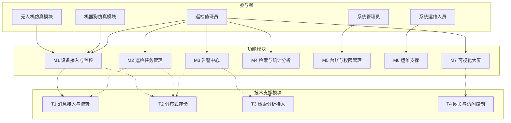
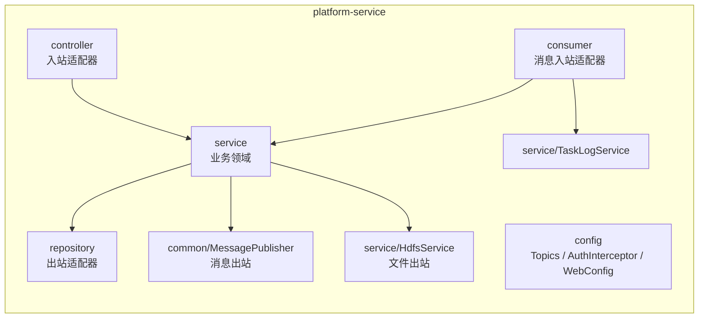
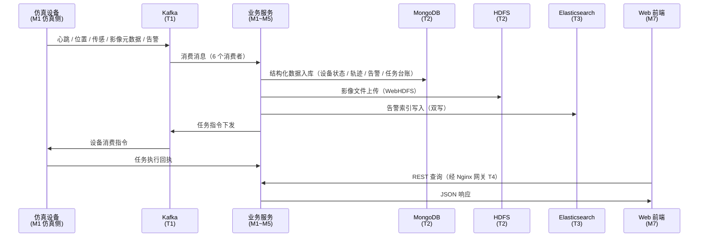

# 4.4 模块划分

> **本章用途**：可直接粘入《企业应用开发实践课程设计报告》第 4 章「系统总体设计」的 4.4 节。
> **配套**：4.1 设计原则、4.2 总体架构、4.3 技术选型参见《[../架构分析/需求分析与总体架构技术选型.md](../架构分析/需求分析与总体架构技术选型.md)》。

---

## 4.4.1 划分依据与方法

本系统按【**参与者 + 用例聚类 + 技术支撑**】三个维度划分模块，划分遵循两条原则：

**原则一：模块是逻辑单位，不要求是物理单位。**
模块划分回答的是"系统由哪些职责单元构成"，而非"要部署几个进程"。一个模块可以对应一个独立工程，也可以对应一个工程内的若干包——**取决于该模块是否需要独立构建与部署**。

**原则二：按"变化与伸缩的原因"划分，而非按技术种类划分。**
若按技术分层拆分为"消息模块 / 存储模块 / 检索模块"，则每次业务变更都需同时修改多个模块（例如告警新增阈值需同时改动消息、存储、检索三处），跨模块联调成本成倍放大。因此本系统以**业务领域**为主线划分模块，技术组件作为跨模块的**支撑层**存在。

据此，系统划分为 **7 个功能模块**（M1~M7）与 **4 个技术支撑模块**（T1~T4）。

---

## 4.4.2 系统模块划分

**图 4-4 系统模块划分图**

### 功能模块（M1~M7）

**表 4-2 功能模块划分表**

| 模块 | 覆盖用例 | 面向参与者 | 主要职责 | 交付形态 |
| :--- | :--- | :--- | :--- | :--- |
| **M1 设备接入与监控** | UC-01/02/03/05、UC-11 | A1、A4、A5 | 设备注册、心跳状态维护、上报数据接收、离线检测；实时态势展示 | 仿真模块 + 接入服务 + 前端态势页 |
| **M2 巡检任务管理** | UC-12/13、UC-04 | A1、A4、A5 | 任务创建下发、指令投递、执行跟踪、历史查询 | 后端任务服务 + 前端任务页 |
| **M3 告警中心** | UC-14/15、UC-41 | A1 | 告警自动生成、展示、处置与留痕 | 后端告警服务 + 前端告警页 |
| **M4 检索与统计分析** | UC-16/17、UC-34 | A1、A3 | 事件与告警检索、统计报表 | 检索接口 + 前端 + Kibana |
| **M5 台账与权限管理** | UC-21/22/23 | A2 | 设备台账、用户角色管理 | 管理后台 |
| **M6 运维支撑** | UC-31/32/33 | A3 | 健康监控、日志查看、备份恢复 | 运维入口 / 脚本 + Kibana |
| **M7 可视化大屏** | UC-11（联动） | A1 | GIS 地图、态势大屏整合 | 前端大屏 |

### 技术支撑模块（T1~T4）

**表 4-3 技术支撑模块划分表**

| 模块 | 职责 | 对应用例 |
| :--- | :--- | :--- |
| **T1 消息接入与流转** | topic 规划、生产者与消费者、消息持久化、指令下行 | UC-01/02/03/04/05 |
| **T2 分布式存储** | HDFS 存储大文件；MongoDB 存储结构化数据（设备 / 任务 / 告警 / 影像元数据） | UC-03/12/41 数据落库 |
| **T3 检索分析接入** | ES 索引建立、检索接口、聚合统计 | UC-16/17/34 |
| **T4 网关与访问控制** | Nginx 反向代理、负载均衡、基础安全 | 全局 |

---

## 4.4.3 模块与实现单元的对应关系

本节说明模块划分如何落到工程结构上，这是理解本系统架构的关键。

**表 4-4 模块与物理实现单元对应表**

| 模块 | 物理实现单元 | 形态 | 说明 |
| :--- | :--- | :--- | :--- |
| **M1 设备接入与监控** | `backend/device-simulator/`（仿真侧） `platform-service` 的 `consumer/`、`service/DeviceService`、`service/TelemetryService`（平台侧） | 独立工程 + 包 | 仿真端代表**系统外部设备**，必须独立进程运行 |
| **M2 巡检任务管理** | `platform-service` 的 `service/TaskService`、`controller/TaskController` | 包 | 平台内部能力 |
| **M3 告警中心** | `platform-service` 的 `service/AlarmService`、`consumer/AlarmConsumer` | 包 | 平台内部能力 |
| **M4 检索与统计分析** | `platform-service` 的 `service/StatsService`、`AlarmService`（ES 部分） | 包 | 平台内部能力 |
| **M5 台账与权限管理** | `platform-service` 的 `service/UserService`、`service/AuthService`、`common/JwtUtil`、`config/AuthInterceptor` | 包 | 平台内部能力 |
| **M6 运维支撑** | `deploy/`（编排与初始化脚本）、`docker-compose.yml` | 配置 | 由容器编排与第三方组件承担 |
| **M7 可视化大屏** | `frontend/` | 独立工程 | 独立构建产物，由 Nginx 托管 |
| **T1 消息接入与流转** | `platform-service` 的 `consumer/`、`common/MessagePublisher`、`config/Topics`；Kafka 容器 | 包 + 容器 | 跨模块支撑 |
| **T2 分布式存储** | `platform-service` 的 `repository/`、`service/HdfsService`；`deploy/init/mongo-init.js`；MongoDB 与 HDFS 容器 | 包 + 容器 + 配置 | 跨模块支撑 |
| **T3 检索分析接入** | `platform-service` 的 `service/AlarmService`（索引）、`service/StatsService`；ES 容器 | 包 + 容器 | 跨模块支撑 |
| **T4 网关与访问控制** | `deploy/nginx/conf.d/default.conf`；nginx 容器 | 配置 + 容器 | 第三方组件，仅需配置 |

> **说明**：7 个功能模块中，**M1（仿真侧）、M7 为独立工程**，其余以 Spring Boot 应用内的**包结构**落地；技术支撑模块以**包 + 容器 + 配置**形式落地。判断依据是**该模块是否需要独立构建与独立部署**：
>
> - **设备仿真模块必须独立进程**——它代表系统外部参与者（A4/A5），若与平台同一进程，则"设备经消息中间件接入平台"的架构设定不成立；
> - **消息接入、分布式存储、检索分析不独立进程**——它们是平台自身的能力，属于同一业务服务的内部组成，通过包结构区分职责即可。

**图 4-5 平台侧工程内部包结构**

---

## 4.4.4 模块间依赖关系与数据流

**图 4-6 模块间数据流图**

**依赖方向原则**：功能模块依赖技术支撑模块，**反向不依赖**。即 T1~T4 不感知具体业务，仅提供通用能力（消息收发、数据持久化、索引检索、请求转发），因此可被所有功能模块复用。

---

## 4.4.5 关于服务拆分粒度的设计说明

**本节回应"业务服务模块为何采用单体而非微服务"的问题。**

本系统业务服务层采用**模块化单体（Modular Monolith）** 架构：单个 Spring Boot 应用，内部按业务领域划分为设备、任务、告警、影像、统计、认证六个子模块，模块间通过接口调用解耦，**具备向微服务演进的基础**。

不拆分为独立微服务进程的工程依据如下：

**（1）拆分判据。** 服务拆分的判据是模块间**伸缩特征、变化速率、可靠性诉求**存在显著差异，而非技术种类不同。就当前系统规模而言，各业务模块的上述特征尚未分化到需要独立部署的程度。

**（2）性能实测依据。** 本项目完成的容量压测实验表明：系统的实际瓶颈位于**消息中间件的分区数**（所有业务 topic 分区数为 1，消费并行度被物理限制为 1），而非业务服务的计算能力。**在当前瓶颈未消除前，拆分业务服务并不能提升系统吞吐**。

**（3）演进策略。** 业界主流实践（Monolith First）主张先确立正确的模块边界，再依据实际压力逐步物理拆分。模块化单体阶段的核心任务是把边界画对——边界正确时，后续拆分是"搬迁代码"；边界错误时，拆分等同于"重写"。

**（4）演进路径。** 系统后续的微服务化路径、拆分优先级、以及配套需解决的治理问题（分区倾斜、背压流控、网络超时与熔断、幂等机制升级），详见《[../架构分析/微服务演进路线.md](../架构分析/微服务演进路线.md)》，并已纳入本报告第 7 章「后续改进与展望」。

---

## 4.4.6 本节小结

本节按【参与者 + 用例聚类 + 技术支撑】将系统划分为 7 个功能模块与 4 个技术支撑模块，并说明了模块划分与物理实现单元的对应关系。

核心结论：**模块是逻辑单位而非物理单位**。判断某模块是否需要独立进程的依据是"是否需要独立构建与部署"——设备仿真模块因代表系统外部参与者而必须独立，其余平台内部能力通过包结构区分职责。技术支撑模块对所有功能模块提供通用能力，依赖方向单一、可复用。
