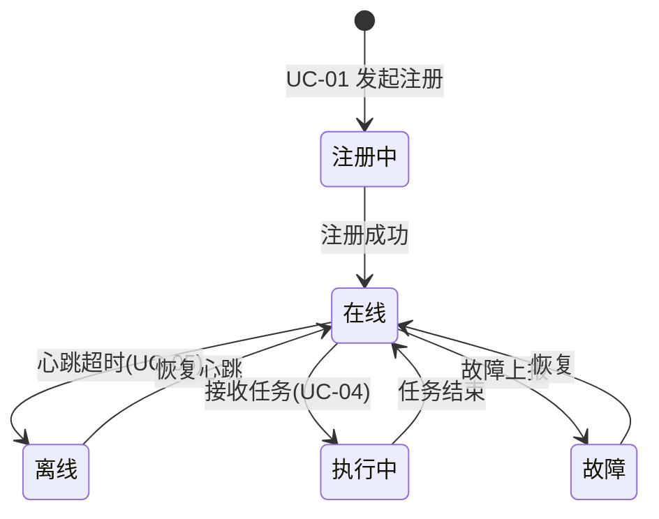

# 无人机-机器狗空地协同巡检集成平台 —— 需求分析文档

| 项目名称 | 无人机-机器狗空地协同巡检集成平台 |
| :--- | :--- |
| 项目类型 | 园区安防空地协同巡检（企业应用集成仿真项目） |
| 文档性质 | 需求分析（参与者驱动） |
| 编制依据 | 小组确认的参与者清单、项目任务书、测试用例 |

> **说明**：本需求文档以【参与者及其目标】为出发点推导用例并划分模块，独立于既有分析材料。标“★”处为待小组最终确认或可选的扩展项。

---

## 1 引言

### 1.1 目的与范围

本文档定义“无人机-机器狗空地协同巡检集成平台”的功能性需求与模块划分。系统面向园区安防场景：**无人机高空巡查发现线索 → 机器狗地面抵近复核**，平台完成设备接入、任务下发、消息流转、数据存储、检索分析与可视化。

- 系统为**软件仿真实践项目**，无实体硬件；无人机、机器狗由**仿真模块**扮演，按真实设备语义接入。
- 平台对外只暴露唯一 Web 入口；仿真设备经**消息中间件**与平台交互，不直连业务接口与数据库。

### 1.2 术语

| 术语 | 含义 |
| :--- | :--- |
| 仿真设备 | 以软件程序扮演的无人机 / 机器狗，作为数据源与指令执行端 |
| 在线状态 | 设备在规定心跳间隔内有上报，否则视为离线 |
| 巡检任务 | 平台向某台 / 某组设备下发的飞行 / 地面复核指令集合 |
| 告警 | 由设备故障、心跳超时或预设规则触发的需关注事件 |
| 台账 | 设备基础档案（编号、类型、区域、状态） |
| 复核 | 机器狗对无人机发现的可疑点位进行现场抵近确认 |

---

## 2 参与者（Actor）

| 编号 | 参与者 | 类型 | 说明 | 主要目标 |
| :--- | :--- | :--- | :--- | :--- |
| A1 | 巡检值班员 | 人（系统主用户） | 安防监控 / 巡检业务日常执行者 | 查看实时态势、创建任务、处置告警、检索分析 |
| A2 | 系统管理员 | 人 | 平台配置与权限管理者 | 设备台账维护、用户与权限管理 |
| A3 | 系统运维人员 | 人 | 中间件与集群运维者 | 集群健康监控、日志查看、备份恢复、Kibana 分析 |
| A4 | 无人机仿真模块 | 外部软件系统 | 仿真无人机的数据源与指令执行端 | 注册接入、上报数据、执行飞行巡检任务 |
| A5 | 机器狗仿真模块 | 外部软件系统 | 仿真机器狗的数据源与指令执行端 | 注册接入、上报数据、执行地面复核任务 |

参与者性质界定：

- **A1、A2、A3 为平台内部使用者**，通过 Web 界面操作；
- **A4、A5 为外部参与者（软硬件系统）**，不登录 Web，仅通过**消息中间件**完成“上报数据”与“接收指令”两类交互；
- 三类人之间通常**职责分离**：值班员只管业务、管理员管配置与账号、运维员管运行。

---

## 3 系统边界与总体用例图

### 3.1 系统边界

```text
             ┌───────────────────────────────────────────────┐
             │         无人机-机器狗空地协同巡检集成平台          │
  值班员 A1 ──┤  ① Web 前端（态势/任务/告警/检索）               │
  管理员 A2 ──┤  ② Nginx 网关（唯一对外入口）                    │
  运维员 A3 ──┤  ③ 业务服务（任务/台账/告警/消费）               │
             │  ④ 存储·检索·消息支撑（Mongo/HDFS/ES/Kafka）    │
             └───────▲───────────────────────────────────────┘
                     │ 消息中间件（上报 / 指令，不直连业务接口）
         ┌───────────┴───────────┐
   A4 无人机仿真模块      A5 机器狗仿真模块   （外部系统参与者）
```

### 3.2 总体用例图（Mermaid 近似；渲染于 Typora / VSCode）


> 说明：Mermaid 无 UML 用例图原生语法，此处用流程图近似表达“参与者—用例”关系；正式报告如需标准符号，可在 draw.io / PlantUML 绘制后插入。

---

## 4 用例清单（总表）

| 编号 | 用例名称 | 主要参与者 | 类型 | 优先级 | 说明 |
| :--- | :--- | :--- | :--- | :--- | :--- |
| UC-01 | 设备注册接入 | A4 / A5 | 外部接入 | 高 | 仿真设备启动后向平台注册（编号、类型、初始状态） |
| UC-02 | 心跳与在线状态上报 | A4 / A5 | 外部接入 | 高 | 周期上报心跳，维持在线状态（含电量/状态字段） |
| UC-03 | 巡检数据上报 | A4 / A5 | 外部接入 | 高 | 上报 GPS、图片元数据 / 传感数据 |
| UC-04 | 接收并执行巡检任务指令 | A4 / A5 | 外部接入 | 高 | 订阅指令，执行并回执结果 |
| UC-05 | 设备离线检测与状态更新 | 系统（后台） | 系统能力 | 高 | 心跳超时判定 → 状态置离线 → 通知 |
| UC-11 | 查看实时态势 | A1 | 人机交互 | 高 | 设备状态、GIS 分布、任务、告警实时刷新 |
| UC-12 | 创建并下发巡检任务 | A1 | 人机交互 | 高 | 选设备 / 区域 / 类型，经消息下发指令 |
| UC-13 | 查看任务执行过程与历史 | A1 | 人机交互 | 高 | 任务进度、执行结果、历史查询 |
| UC-14 | 查看告警及详情 | A1 | 人机交互 | 高 | 告警列表、详情（关联设备 / 位置 / 图片） |
| UC-15 | 处置告警 | A1 | 人机交互 | 高 | 确认 / 指派复核 / 关闭，留处置记录 |
| UC-16 | 检索巡检事件 / 告警 | A1 | 人机交互 | 中高 | 按地点 / 时间 / 告警类型 / 设备检索 |
| UC-17 | 查看统计分析报表 | A1 | 人机交互 | 中 | 告警趋势、设备统计、巡检统计 ★可主要由 Kibana 承担 |
| UC-21 | 设备台账维护 | A2 | 人机交互 | 高 | 设备新增 / 修改 / 停用，维护基础档案 |
| UC-22 | 用户与权限管理 | A2 | 人机交互 | 中 | 用户增删、角色分配（★基础版可简化） |
| UC-23 | 巡检区域与基础字典维护 | A2 | 人机交互 | 低 | 巡检区域、设备分组等配置（★可选） |
| UC-31 | 集群与中间件健康监控 | A3 | 人机交互 | 高 | 各组件运行状态、容器健康查看 |
| UC-32 | 日志查看与排错 | A3 | 人机交互 | 高 | 组件 / 业务日志检索定位 |
| UC-33 | 数据备份与恢复 | A3 | 人机交互 | 中 | HDFS / 数据库备份与恢复演示（★选做） |
| UC-34 | Kibana 检索与统计分析 | A3 | 人机交互 | 低 | 运维视角的检索与仪表盘（★选做） |
| UC-41 | 告警自动生成 | 系统（后台） | 系统能力 | 高 | 依据规则（心跳超时 / 故障 / 上报异常）自动生成告警 |

> 用例间关系（简）：UC-12 由 “UC-11 实时态势” 发起并 **include** “UC-13 任务跟踪” 与消息下发；UC-15 处置“指派复核”时 **include** 向机器狗发起一次 “UC-04 复核指令”；UC-14 展示的告警由 **UC-41** 产生。

---

## 5 核心用例规格（详细描述）

> 模板字段：用例名 / 参与者 / 前置条件 / 主流程 / 备选流 / 后置条件 / 验收要点。未列出的用例以后续详细设计补充。

### UC-12 创建并下发巡检任务

- **参与者**：巡检值班员（A1）
- **前置**：值班员已登录；存在在线可用设备；实时态势页可达
- **主流程**：
  1. 值班员在态势页点击“新建巡检任务”；
  2. 系统列出可选设备（含状态）与区域；
  3. 值班员选择目标设备（无人机 / 机器狗）与任务类型（空中巡查 / 地面复核），填写区域与说明；
  4. 值班员提交；系统生成任务记录并写入存储；
  5. 系统将任务指令投递至消息中间件对应设备指令 topic；
  6. 系统提示“已下发”，任务状态置为“执行中”。
- **备选流**：
  - 所选设备已离线 → 系统阻止下发并提示；
  - 设备回执超时 → 任务停留“执行中”，可重发或取消。
- **后置**：任务状态、下发时间可追踪；执行结果回执可被 UC-13 查询。
- **验收要点**：前端可完整走通“创建→下发”，平台、消息中间件、仿真设备三端日志一致（对应用例 TC-004）。

### UC-03 巡检数据上报

- **参与者**：无人机 / 机器狗仿真模块（A4 / A5）
- **前置**：仿真设备已完成注册（UC-01）且在线；消息中间件 topic 存在
- **主流程**：
  1. 仿真设备按上报周期采集 / 生成一条数据（无人机：GPS+航拍图片元数据；机器狗：传感 + 位置）；
  2. 设备将数据序列化为消息发送至上报 topic；
  3. 业务服务作为消费者接收并校验；
  4. 业务服务将图片文件写入 HDFS、结构化记录写入分布式数据库，并将事件写入检索引擎；
  5. 系统确认消息被持久化，无丢失。
- **备选流**：消息格式 / 序列化异常 → 记入消费失败日志，不阻塞后续消息。
- **后置**：数据可用于实时态势、检索与统计分析。
- **验收要点**：端到端消息可达且持久化（对应用例 TC-003）；图片文件可在 HDFS 查询到（TC-005）。

### UC-04 接收并执行巡检任务指令

- **参与者**：无人机 / 机器狗仿真模块（A4 / A5）
- **前置**：已注册在线；已订阅本设备指令 topic
- **主流程**：
  1. 平台向指令 topic 下发任务消息；
  2. 仿真设备消费消息并解析任务内容；
  3. 设备模拟执行（如按坐标生成巡检轨迹 / 传感读数）；
  4. 设备回执执行结果（成功 / 异常）。
- **备选流**：指令与设备能力不符 → 回执“不支持”。
- **后置**：平台可更新任务状态。
- **验收要点**：设备收到并回执，内容与下发一致（对应 TC-004）。

### UC-15 处置告警

- **参与者**：巡检值班员（A1）
- **前置**：存在未处置告警（来自 UC-41）
- **主流程**：
  1. 值班员打开告警详情（含类型、位置、图片、关联设备）；
  2. 值班员选择处置动作：
     - 直接**确认并关闭**，填写备注；
     - 或**指派复核**：系统向指定机器狗下发一次地面复核指令（include UC-04）；
  3. 系统记录处置人 / 时间 / 结果，告警状态置为“已处置”。
- **备选流**：告警误报 → 关闭并标记“误报”。
- **后置**：处置留痕，可检索。
- **验收要点**：处置动作与“高空发现→地面复核”闭环一致，记录完整（对应 TC-007 / TC-010 链路）。

### UC-11 查看实时态势

- **参与者**：巡检值班员（A1）
- **前置**：已登录
- **主流程**：
  1. 值班员进入态势首页；
  2. 系统以 GIS 地图展示设备分布与状态，列表展示在线 / 离线、电量；
  3. 系统推送实时告警与任务动态；
  4. 值班员可下钻查看单台设备详情。
- **后置**：无（只读）。
- **验收要点**：页面随心跳 / 上报数据自动刷新（对应 TC-002、TC-009）。

### UC-01 设备注册接入

- **参与者**：无人机 / 机器狗仿真模块（A4 / A5）
- **前置**：消息中间件正常；网络可达
- **主流程**：
  1. 仿真设备启动；
  2. 设备发送注册请求 / 注册消息（编号、类型、初始状态）；
  3. 平台校验并在台账登记（或更新），状态置“在线”。
- **备选流**：编号已存在且状态冲突 → 按规则做版本覆盖或拒绝并提示。
- **后置**：设备可在台账与态势页可见。
- **验收要点**：注册后台账出现该设备且类型 / 编号正确（对应 TC-001）。

---

## 6 模块划分

按【参与者 + 用例聚类 + 技术支撑】划分为 7 个业务功能模块 + 4 个技术支撑模块。

### 6.1 业务功能模块

| 模块 | 覆盖用例 | 面向参与者 | 主要职责 | 交付形态 |
| :--- | :--- | :--- | :--- | :--- |
| M1 设备接入与监控 | UC-01/02/03/05、UC-11 | A1、A4、A5 | 设备注册、心跳状态、上报接收、离线检测；实时态势展示 | 仿真模块 + 接入服务 + 前端态势页 |
| M2 巡检任务管理 | UC-12/13、UC-04 | A1、A4、A5 | 任务创建下发、指令投递、执行跟踪、历史查询 | 后端任务服务 + 前端任务页 |
| M3 告警中心 | UC-14/15、UC-41 | A1 | 告警自动生成、展示、处置与留痕 | 后端告警服务 + 前端告警页 |
| M4 检索与统计分析 | UC-16/17、UC-34 | A1、A3 | 事件 / 告警检索、统计报表 | 检索接口 + 前端 + Kibana |
| M5 台账与权限管理 | UC-21/22/23 | A2 | 设备台账、用户角色、基础字典 | 管理后台 |
| M6 运维支撑 | UC-31/32/33 | A3 | 健康监控、日志、备份恢复 | 运维入口 / 脚本 + Kibana |
| M7 可视化大屏 | UC-11（联动） | A1 | GIS 地图、态势大屏整合 | 前端大屏 |

### 6.2 技术支撑模块（跨模块复用）

| 模块 | 职责 | 对应用例 |
| :--- | :--- | :--- |
| T1 消息接入与流转 | topic 规划、生产者消费者、持久化、指令投递 | UC-01/02/03/04/05 |
| T2 分布式存储 | HDFS 大文件；MongoDB 结构化（设备 / 任务 / 告警） | UC-03/12/41 数据落库 |
| T3 检索分析接入 | ES 索引、检索接口、聚合统计 | UC-16/17/34 |
| T4 网关与访问控制 | Nginx 反代、负载均衡、基础安全 | 全局 |

### 6.3 用例 → 模块映射（简表）

```text
A1 值班员：UC-11/12/13/14/15/16/17 ──► M1/M2/M3/M4/M7
A2 管理员：UC-21/22/23          ──► M5
A3 运维员：UC-31/32/33/34       ──► M6/M4(部分)
A4/A5 仿真设备：UC-01/02/03/04 ──► M1/M2（经 T1 消息接入）
系统后台：UC-05/41             ──► M1/M3（自动任务）
```

---

## 7 关键业务概念与规则

### 7.1 设备状态机



### 7.2 任务状态

`已下发` → `执行中` →（`已完成` / `失败` / `已取消`）

### 7.3 告警规则（UC-41 触发来源）

| 触发类型 | 说明 | 建议级别 |
| :--- | :--- | :--- |
| 心跳超时 | 设备超时未上报 → 离线告警 | 一般 |
| 设备故障 | 上报状态字段含故障 | 严重 |
| 上报异常 / 预设规则 | 传感越界、图片缺失等 | 提示 / 一般 ★规则可配置 |

> 告警级别、超时时长等参数 ★ 待小组在详细设计时确定；演示数据请贴合园区安防场景（如“区域入侵 / 可疑目标”类告警类型）。

---

## 8 非功能性需求

| 类别 | 需求 |
| :--- | :--- |
| 性能 | 支撑 ≥10 台仿真设备并发上报，消息消费无明显积压；检索结果可交互 |
| 可靠性 | 消息不丢失、可持久化；心跳超时状态自动更新；告警 / 任务记录完整 |
| 可扩展性 | 按 topic 解耦，可新增设备类型与业务模块；组件可集群化扩展 |
| 易用性 | 值班员可在 1~2 次点击内完成建单 / 处置；界面中文、语义清晰 |
| 安全 | 对外仅暴露网关；用户登录与角色隔离（★基础版可简化为固定账号） |
| 兼容性 | 统一 Docker 镜像固定版本，规避组件版本冲突 |
| 合规 | 如实记录问题与测试结果，不虚构数据 |

---

## 9 后续工作衔接

1. 本用例清单与模块划分可作为**架构设计**（模块服务划分）、**数据库设计**（任务 / 告警 / 设备实体）与**测试用例**（UC 逐条验收）的输入；
2. ★ 待确认：用户权限是否纳入基础版、统计分析由自研前端还是 Kibana 承担、告警类型与阈值清单。
